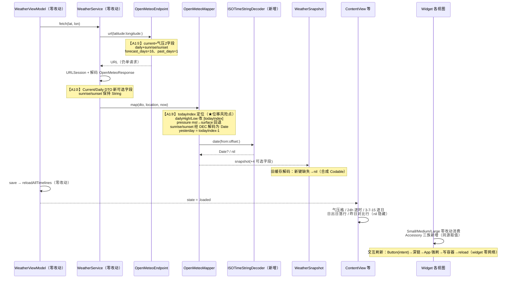

# ARCH · 枳生天气 iOS — A1 增量架构设计（第一批：数据拉满 + 小组件补全）

> 版本：**v1.0**
> 作者：高见远（架构师）
> 日期：2026-09-11
> 上游输入：`PRD-zhisheng-ios-A.md` §3 第一批（A1-1～A1-8，AC-A1-1～23）、`research/open-meteo-capability-verified.md`（主理人实测 200 OK）、现网源码（已实读全部涉及文件）、体例参照 `ARCH-zhisheng-ios-FA-increment.md`
> 性质：**增量设计**，不写代码；工程师可按 §6 任务列表逐条实现并自审。

## 修订记录

| 版本 | 变更 |
|---|---|
| v1.0 | 首版：A1 八项的设计裁定、数据结构、数据流、任务列表（12 条）、风险表、待明确事项 |

---

## 0. 范围

**做**（A1 八项，一次请求拿满，不新增请求次数）：
- 请求扩展：`current` +`pressure_msl,surface_pressure`；`daily` +`sunrise,sunset`；`forecast_days` 7→**16**；新增 **`past_days=1`**。
- 模型扩展（全部可选 + 合成 Codable，旧缓存解码不失败）。
- 主屏：气压指标格 / 逐时 24h / 逐日 3-7-15 三档切换 / 月相区日出日落 / 昨日对比行。
- Widget：`supportedFamilies` 追加 accessory 三族（现三族逐字保留）；A1-7 交互刷新（P2）。
- 主 App：Home Screen 静态快捷方式（P2）。
- 单测增量 ≥ 10 用例。

**不做**（本轮边界）：
- A2/A3 全部内容（空气质量、摘要、生活指数、月出月落、逐日展开、历史、设置页、多语言）。
- 分钟级降水（`minutely_15` 归 A2）。
- `kind`、"跟随 App/固定城市" Intent 结构、App Group key 体系（零改动）。
- `project.yml` / CI 零改动（无新 target、无新依赖；部署目标维持 iOS 17.0）。

---

## 1. 设计裁定（逐项落点与理由）

### 1.0 总裁定：单请求参数对照表

| 参数 | 现值 | A1 后 | 说明 |
|---|---|---|---|
| `current` | 7 字段 | **+`pressure_msl`、`surface_pressure`**（共 9） | A1-1 |
| `hourly` | `temperature_2m,weather_code` | 不变 | A1-2 靠截窗放宽，非加字段 |
| `daily` | 4 字段 | **+`sunrise`、`sunset`**（共 6） | A1-4 |
| `forecast_days` | 显式 `7` | **显式 `16`** | A1-3（延续"显式防漂移"纪律，A-G3 同源） |
| **`past_days`** | 未传 | **显式 `1`** | A1-5；⚠️ 触发 §2.3 最高风险点 |
| `wind_speed_unit` / `timezone` / `timeformat` | `ms` / `auto` / `unixtime` | **逐字不动** | v1.2 裁定不回归 |

### 1.1 A1-1 气压 —— 快照单字段 + mapper 内回退

- DTO：`Current` 追加 `pressure_msl: Double?`、`surface_pressure: Double?`（两个都可选——实测虽恒有值，但 DTO 层保持"键缺失不炸"的既有风格，偏差备案 D-A1）。
- 领域模型：`WeatherSnapshot` 新增**单**字段 `pressureMSL: Double? = nil`，mapper 内 `pressure_msl ?? surface_pressure` 一次回退定值。
  - 理由：AC-A1-1 语义就是"msl 优先、缺则地面"，**领域层不需要知道数据来自哪个字段**；存两个原始值会让 UI 层做第二次回退决策，把数据策略泄漏到视图。注释中写明回退语义。
- UI：`ContentView.metricsSection` 指标格由 2 格改 3 格（风速 / 湿度 / **气压**，`MetricCell` 复用零改动）；`nil → "--"`，绝不显示 0（AC-A1-3）。`LazyVGrid` 2 列布局下第 3 格自动换行，iPhone SE 无溢出风险。

### 1.2 A1-2 逐时 24h —— 只动一个常量

- `OpenMeteoMapper.maxHourlyCount` **12 → 24**。`window(from:now:)` 逻辑零改动（截窗起点规则不变）。
- 主屏 `HourlyStrip`（Core/UI 共用）零改动——横向 ScrollView 按 `points.count` 渲染，24 条自然可滑（AC-A1-4）；不足 24 条按实际渲染（AC-A1-5，mapper 截窗天然保证）。
- **小组件影响面**：`MediumWeatherView` 取 `hourly.prefix(6)`、Small 不取 hourly、Large 已无 hourly——三处**零改动**，满足 AC-A1-6（数据变长、消费端窗口不变）。

### 1.3 A1-3 逐日 15 天 + 3/7/15 切换

- `OpenMeteoMapper.maxDailyCount` **7 → 16**（对齐 `forecast_days=16`；UI 侧再裁剪）。
- `DailyForecastSection` 改造：
  - `@State isExpanded: Bool` → `@State visibleDaysChoice: Int = 3`（3/7/15 三档）；默认 3 天；**不落盘、不进 ViewModel、不进共享容器**——沿用 F-A「展开状态止步于 @State」的结构性隔离（L-9 纪律平移）。
  - 切换控件由胶囊 Button 升级为 3 段选择（`Picker(.segmented)` 或三个胶囊，工程师按视觉统一裁量）；数据不足对应档位时该档禁用/隐藏（`canToggle` 判据改为 `daily.count > 3`）。
  - 展开上限 15：`visibleDays = daily.prefix(choice)`；数组不足 16 按实际渲染（AC-A1-9）。
- **Widget 零改动**：Large 固定 `prefix(3)`（不读任何档位状态——L-9 反向判据继续成立），满足 AC-A1-10。

### 1.4 A1-4 日出日落 —— ⭐ 本批最关键设计点：ISO 字符串时间的隔离解码

**问题本质**：请求带 `timeformat=unixtime` 后，Open-Meteo 的 `daily.sunrise/sunset` **仍是 ISO 本地墙钟字符串**（如 `"2026-09-11T05:53"`，无时区后缀）——它绕过了 unixtime 全局参数。现有"一律 epoch 解码"纪律在此失效，必须建独立路径。

**裁定（四条，缺一不可）**：

1. **独立解码器**：新增 `Core/Logic/ISOTimeStringDecoder.swift`（纯函数 enum），签名 `date(from: String, utcOffsetSeconds: Int) -> Date?`。与 epoch 解码（`Date(timeIntervalSince1970:)`）**禁止混用**——PRD R3；评审时 grep 复核：epoch 解码不触碰 sunrise/sunset 字段，字符串解码不触碰其他时间字段。
2. **时区来源 = 同响应的 `utc_offset_seconds`**（不引入 `TimeZone.current`、不依赖设备时区）：字符串按"该偏移下的墙钟"解释。推荐实现为**手工解析**（按 `T`/`:` 切分出 y-M-d H:m 分量，`DateComponents` + `TimeZone(secondsFromGMT: offset)` 构造），**不用 `DateFormatter`**——formatter 的 locale/宽松解析是不可控面，手工解析失败返回 nil，行为完全确定且可单测。
3. **落点**：解码在 **Mapper** 内完成（`OpenMeteoMapper` 独有 `utc_offset_seconds` 视角）；DTO 只存原始 `String`（`sunrise: [String]?`、`sunset: [String]?`——整键可选，沿 F-A `weather_code: [Int]?` 的 D-1 偏差风格）；**领域模型存 `Date`**，字符串不出 Networking 层。
4. **模型可见性**：`DailyForecast` 追加 `sunrise: Date? = nil`、`sunset: Date? = nil`（**按日存**，而非只在 snapshot 存今天——A2-5「逐日行展开看日落」直接复用，避免二次迁移）；`WeatherSnapshot` 追加 `sunrise: Date? = nil`、`sunset: Date? = nil`（= 今日值，mapper 从今日行拷贝，UI 免索引）。全部可选 + 合成 Codable，旧缓存解码不失败。
- UI：`ContentView.moonSection` 旁新增一行 `日出 HH:mm · 日落 HH:mm`（`WidgetTimeFormatter.hourMinute` 同款格式器在 App 侧另立，两 target 不共享文件——先例见 weekdayShort 注记）；nil 时对应段隐藏（AC-A1-12 的降级面）。

### 1.5 A1-5 昨日对比 —— ⭐ 第二关键设计点：`past_days=1` 造成的「今日索引位移」

**问题本质（本批最高静默回归风险）**：现有 mapper 以 `daily.first`（`temperature_2m_max.first` 等）取**今日**高低温。加 `past_days=1` 后 **`daily[0]` 变成昨天**——若不处理，Hero 区 ↑↓° 会静默显示昨天的值，静态检查抓不到、单测不写就发现不了。

**裁定**：
1. Mapper 内显式定位**今日索引**：利用「`daily.time[i]` = 当地当日 00:00 epoch」的性质，本地日序号 `dayNumber(x) = floor((x.epoch + utcOffset) / 86400)`，取 `todayIndex = daily.time 首个 dayNumber == dayNumber(now) 的下标`；找不到（时钟漂移/边界）→ 回退 `min(1, count-1)`，再兜底 0。**`dailyHigh/dailyLow` 的取值从 `.first` 改为 `[todayIndex]`**，回退链（hourly 窗口 min/max）逐字保留。
2. 昨日 = `todayIndex - 1`（< 0 或数组越界 → nil）。
3. 领域模型：`WeatherSnapshot` 追加 `yesterday: DailyForecast? = nil`（整对象——AC-A1-14/15 同时要昨天的温度与现象，单字段不够）。
4. UI：主屏新增**昨日对比行**（Hero 区下方独立小行，不进指标格）：`较昨天 +2° · 昨天 25°→23°`（温差符号带正负；现象码仅取颜色/图标可后置，AC 未强制）。`yesterday == nil → 整行不渲染`（AC-A1-16）。
5. `DailyForecastSection` 的「今天」标签逻辑（`Calendar.isDateInToday`）在含昨日的数组上天然正确，零改动。

### 1.6 A1-6 锁屏小组件（Accessory 三族）

- `supportedFamilies` 由 `[.systemSmall, .systemMedium, .systemLarge]` **追加** `.accessoryCircular, .accessoryRectangular, .accessoryInline`——**现三族逐字保留**（SC-40/SC-41 只增不减纪律）；`kind` 不动。
- `ZhishengWeatherWidgetEntryView` 的 switch 增补三个 case（`@unknown default` 保留不动，语义不变）。
- 新增三个视图（Widget target 内，样式延续 Theme 但**不用 `widgetBackground`**——accessory 族背景由系统管理，`containerBackground` 调用反而会被忽略/告警）：
  - `AccessoryCircularWeatherView`：温度大字 + 图标（AC-A1-17a）；
  - `AccessoryRectangularWeatherView`：城市 / 温度 + 现象 两行（AC-A1-17b）；
  - `AccessoryInlineWeatherView`：`23° 多云` 单行（AC-A1-17c）。
- **取值纪律**：三视图与现有视图同源——`entry.payload?.snapshot` + `displayCityName`，空态 `--°`/「暂无数据」兜底；归属校验（R-C2）天然继承，无需新逻辑。
- **AOD 可读（AC-A1-19）**：accessory 渲染在锁屏由系统按单色/着色模式重绘，视图内**避免依赖 Theme 深底浅字的对体积**：文字用默认前景色或 `.primary` 层级、图标用 `WeatherSymbol` 现有 hierarchical 渲染即可；真机 AOD 验证列入 §6 回归项（静态不可判）。

### 1.7 A1-7 可交互刷新（P2）—— widget 零网络纪律下的落点裁定

**裁定：`WidgetRefreshIntent`（openAppWhenRun 型）+ 深链 `zhisheng://refresh` + 主 App 强刷路径。**

| 备选 | 结论 | 理由 |
|---|---|---|
| A. Intent 在 widget 进程内直接网络取数 | ❌ 违纪 | 击穿 F-C-8「widget 零网络」结构性防线；widget 进程写共享容器还会与主 App 形成双写者，破坏"主写读"数据所有权模型 |
| B. Intent 仅 `reloadTimelines` | ❌ 无效 | timeline 重生成只重读共享容器，数据没变——刷新按钮变成安慰剂 |
| **C. Intent `openAppWhenRun = true` → 深链 → 主 App 强刷**（采纳） | ✅ | 复用主 App 现有「取数→落盘→`reloadAllTimelines()`」全链路；widget 保持零网络零写入；实现量最小 |

链路：`Button(intent: WidgetRefreshIntent())`（Medium/Large 右上角）→ Intent `perform()` 返回 `.result()` 且 `openAppWhenRun` 拉起主 App → `zhisheng://refresh` 经 `.onOpenURL` 路由 → **调用 `viewModel.refresh()`（绕过 `refreshIfNeeded` 的 15 分钟节流）**——此处必须强刷，否则 freshnessWindow 会吞掉点击。

**AC-A1-21 的诚实降级（偏差备案 D-A2）**：「刷新中显示转圈占位」在跨进程链路下不成立——Intent `perform()` 在拉起 App 后即返回，系统按钮 loading 只覆盖毫秒级。iOS 17 的可交互组件本质无法跨进程展示主 App 的取数进度。落地面：按钮点击后 App 到前台（用户看见主屏刷新态即是最真实的进度反馈）；失败时小组件仍显示旧数据 +「更新于 HH:mm」，不变脏。**建议向产品回传此口径**，若坚持纯组件内 loading，只能回退到备选 A（违纪），不建议。

### 1.8 A1-8 快捷方式（P2）—— 静态快捷项 + 轻量路由

- Info.plist 声明 `UIApplicationShortcutItems` 三项（static）：刷新 / 搜索城市 / 设置。
- **落点偏差备案 D-A3**：「设置」页 A3 才存在。裁定 A1 三项 = **刷新**（强刷，复用 1.7 深链）/ **搜索城市**（进 CityListView 聚焦搜索）/ **设置**（暂路由城市列表页根，A3 设置页就绪后改一行路由）——AC-A1-23 的"落点正确"以本节定义为准。
- 处理机制：SwiftUI 纯 `@main` App 收不到 quick action 回调，需在 `ZhishengWeatherApp` 挂 `@UIApplicationDelegateAdaptor` 引入**最小 AppDelegate**（仅实现 `windowScene(_:performActionFor:)`），转发给新增 `AppRouter`（`@Observable`，主 App target，持有 `enum Route` 并发布）；ContentView 观察路由执行跳转/强刷。App target 内改动，Core 纪律无关。
- 深链基建共享：1.7 的 `zhisheng://refresh` 需同步注册 `CFBundleURLTypes`（scheme `zhisheng`），A1-8 的快捷项内部也走 `AppRouter` 同一套路由枚举——两功能共用一个路由出口，避免出现两套跳转机制。

---

## 2. 数据结构与接口（签名级）

### 2.1 模型变更总表（全部可选 + 合成 Codable；禁 payloadVersion；禁手写 `init(from:)`）

| 类型 | 字段 | 类型 | A1 项 | 兼容性 |
|---|---|---|---|---|
| `OpenMeteoResponse.Current` | `pressure_msl` | `Double?` | A1-1 | DTO 不落盘；键缺失不炸 |
| `OpenMeteoResponse.Current` | `surface_pressure` | `Double?` | A1-1 | 同上 |
| `OpenMeteoResponse.Daily` | `sunrise` | `[String]?` | A1-4 | D-1 风格（整键可选） |
| `OpenMeteoResponse.Daily` | `sunset` | `[String]?` | A1-4 | 同上 |
| `DailyForecast` | `sunrise` / `sunset` | `Date?` ×2 | A1-4 | 按日存；旧缓存键缺失 → nil |
| `WeatherSnapshot` | `pressureMSL` | `Double?` | A1-1 | mapper 已回退 msl→surface |
| `WeatherSnapshot` | `sunrise` / `sunset` | `Date?` ×2 | A1-4 | 今日值；UI 直取 |
| `WeatherSnapshot` | `yesterday` | `DailyForecast?` | A1-5 | nil → 对比行隐藏 |

> 注：`WeatherSnapshot.placeholder`（Widget 侧）需同步补这 4 个新参数的示例值或使用默认 nil——**推荐省略走默认值**，编译零扰动。

### 2.2 新增解码器（Core/Logic/ISOTimeStringDecoder.swift，新增）

```swift
enum ISOTimeStringDecoder {
    /// "2026-09-11T05:53"（当地墙钟，无时区后缀）→ Date。
    /// utcOffsetSeconds 来自同一响应根级字段；解析失败/格式不符 → nil。
    /// 手工分量解析，不用 DateFormatter；与 epoch 解码路径完全隔离（PRD R3）。
    static func date(from string: String, utcOffsetSeconds: Int) -> Date?
}
```

### 2.3 Mapper 内部新增（私有，签名级）

```swift
enum OpenMeteoMapper {
    static let maxHourlyCount = 24   // 12 → 24（A1-2）
    static let maxDailyCount = 16    // 7  → 16（A1-3）

    // map(_ response:location:now:) 公开签名不变；内部新增：
    //   ① todayIndex 定位（dayNumber(now) 对齐，回退 min(1,count-1)→0）
    //   ② dailyHigh/dailyLow 取值 .first → [todayIndex]（回退链逐字保留）
    //   ③ pressureMSL = current.pressure_msl ?? current.surface_pressure
    //   ④ sunrise/sunset = daily[todayIndex] 的字符串经 ISOTimeStringDecoder(offset) 解码
    //   ⑤ yesterday = todayIndex-1 行（<0 → nil）
    private static func todayIndex(in daily: OpenMeteoResponse.Daily,
                                   utcOffsetSeconds: Int, now: Date) -> Int?
}
```

---

## 3. 数据流时序（新字段从 endpoint 到 UI）



**关键点**：
1. 新字段唯一入口是 Mapper；UI/Widget/共享容器只消费 snapshot。
2. `past_days=1` 的全部影响被**收敛在 mapper 的 todayIndex 一处**；下游（Hero ↑↓、逐日区块、Widget Large prefix(3)）对"数组多了一行昨天"无感知——但 Large 的 `prefix(3)` 语义从"今天起 3 天"变为"昨天起 3 天的第 1~3 行"？**不**：Large 直接取 `snapshot.daily`——⚠️ 该数组来自 mapper `dailyForecasts(from:)` 的全量映射，**含昨天**。裁定：mapper 的 `dailyForecasts` 输出**从 todayIndex 起截取**（`Array(all[startIndex...].prefix(maxDailyCount))`），保证「snapshot.daily[0] 恒为今天」的全仓既有语义不变——否则 F-A 逐日区块、Large、A2 摘要全部要逐个适配位移。这是本设计第三处必守点。

---

## 4. 任务列表（按实现顺序，可直接派工）

| # | 任务 | 文件（相对 `ZhishengWeatherIOS/`） | 依赖 | 优先级 | 验收要点 |
|---|---|---|---|---|---|
| T01 | Endpoint 扩展 | `Core/Networking/OpenMeteoEndpoint.swift`、`ZhishengWeatherTests/OpenMeteoEndpointTests.swift` | — | P0 | current=9 字段、daily=6 字段、`forecast_days=16`、`past_days=1`；`wind_speed_unit=ms`/`timezone=auto`/`timeformat=unixtime` 逐字不动；测试断言全部参数（AC-A1-1/7/11/14 的请求面） |
| T02 | DTO 扩展 | `Core/Models/OpenMeteoResponse.swift`、`ZhishengWeatherTests/OpenMeteoDecodingTests.swift` | — | P0 | Current +2 可选 Double；Daily +`sunrise/sunset: [String]?`；键缺失/null 元素解码成功不炸（D-A1） |
| T03 | ISO 时间解码器 | `Core/Logic/ISOTimeStringDecoder.swift`（**新增**）、`ZhishengWeatherTests/ISOTimeStringDecoderTests.swift`（**新增**） | — | P0 | 手工分量解析 + offset 时区；用例：正常值、跨日 `"T23:xx"`+offset、闰日格式、坏串/空串 → nil、offset 正负两向；**与 epoch 解码零交叉**（评审 grep） |
| T04 | 领域模型加字段 + 兼容测试 | `Core/Models/DailyForecast.swift`、`Core/Models/WeatherSnapshot.swift`、`ZhishengWeatherTests/WeatherSnapshotCacheCompatTests.swift` | T02, T03 | P0 | §2.1 表全部字段（默认值 nil，占位符/既有测试零扰动）；**旧 JSON（无 4 个新键）解码成功且新字段全 nil、其余值不变**；往返编解码等值；禁 payloadVersion/手写 init(from:) |
| T05 | Mapper 扩展 | `Core/Networking/OpenMeteoMapper.swift`、`ZhishengWeatherTests/OpenMeteoMapperTests.swift` | T01–T04 | P0 | maxHourlyCount=24 / maxDailyCount=16；**todayIndex 定位 + dailyHigh/Low 改索引 + daily 输出自今日起截**（§3 关键点 3，三处必守点）；pressure 回退；sunrise/sunset 注入；yesterday 提取；`now` 注入纪律不变。用例 ≥7：past_days 位移后 Hero 取今日值、yesterday=昨日行、无 past_days（旧路径回归）todayIndex=0、pressure msl 缺 → surface、字符串坏值 → sunrise nil、daily 输出首行=今天 |
| T06 | 主屏：气压格 + 逐时 24h | `ZhishengWeather/ContentView.swift` | T05 | P1 | 指标格 2→3 格（气压 hPa 1 位小数，nil→`--`）；逐时区可滑 24 条；不足按实际渲染；SE 375pt 无横向溢出（AC-A1-2/3/4/5） |
| T07 | 主屏：逐日 3/7/15 | `ZhishengWeather/DailyForecastSection.swift` | T05 | P1 | 三档切换（默认 3、不落盘不进 ViewModel）；档位 > 数据量时禁用/隐藏；不足 16 按实际渲染（AC-A1-8/9）；「今天」标签在含昨日数组上正确 |
| T08 | 主屏：日出日落 + 昨日对比 | `ZhishengWeather/ContentView.swift`、`ZhishengWeather/YesterdayComparisonSection.swift`（**新增**，可并入 ContentView 由工程师裁量） | T05 | P1 | 月相区旁 `日出 HH:mm · 日落 HH:mm`（nil 段隐藏）；对比行 `较昨天 ±N° · 昨天 ↑↓°`（yesterday nil → 整行隐藏）（AC-A1-12/15/16） |
| T09 | Widget Accessory 三族 | `ZhishengWeatherWidget/ZhishengWidgetBundle.swift`、`ZhishengWeatherWidget/AccessoryWeatherViews.swift`（**新增**，或三小文件） | T05 | P1 | `supportedFamilies` 追加三族且**现三族逐字保留**（SC 纪律）；EntryView switch 增补三 case + `@unknown default` 保留；三视图空态兜底、**不用 widgetBackground**；`kind`/Intent/Provider 零改动（AC-A1-17/18） |
| T10 | A1-7 交互刷新（P2） | `ZhishengWeatherWidget/WidgetRefreshIntent.swift`（**新增**）、`ZhishengWeatherWidget/MediumWeatherView.swift`、`ZhishengWeatherWidget/LargeWeatherView.swift`、`ZhishengWeather/ZhishengWeatherApp.swift`、`Config/ZhishengWeather-Info.plist`（CFBundleURLTypes） | T09 | P2 | Intent `openAppWhenRun`、widget 内**零网络零写入**（grep 复核）；深链 `zhisheng://refresh` → `viewModel.refresh()` **绕过 15min 节流**；D-A2 口径已备案（AC-A1-20/21） |
| T11 | A1-8 快捷方式（P2） | `Config/ZhishengWeather-Info.plist`（UIApplicationShortcutItems）、`ZhishengWeather/AppDelegate.swift`（**新增**，最小实现）、`ZhishengWeather/AppRouter.swift`（**新增**）、`ZhishengWeather/ZhishengWeatherApp.swift`、`ZhishengWeather/ContentView.swift` | T10 | P2 | 三静态项（刷新/搜索/设置）；AppRouter 统一路由（与 T10 深链共用）；设置项暂路由城市列表（D-A3）；冷启动直达（AC-A1-22/23） |
| T12 | 全量回归与自审 | 无新文件 | T01–T11 | P1 | ① `qa-static-check.sh` 通过（Core 禁用项、双 target）；② 全部测试绿（A1 新增 ≥10 用例：气压字段、字符串解码、past_days 边界、accessory 数据源）；③ 对照 AC-A1-1~23 逐条静态核对产出自审记录；④ **真机待办**：AOD 下 accessory 可读（AC-A1-19）、覆盖安装旧缓存兼容（R-A1）、supportedFamilies 扩后已有组件不被移除（R-A2）、刷新按钮真机链路（R-A6） |

**依赖说明**：T01/T02/T03 互不依赖可并行；T04 依赖 T02/T03；T05 是数据链路汇聚点；T06–T08（App 侧）与 T09（Widget 侧）可并行；T10 依赖 T09（按钮落点）；T11 与 T10 共享路由基建故排后；T12 收口。

---

## 5. 测试设计（新增 ≥10 用例）

| 文件 | 用例要点 |
|---|---|
| `ISOTimeStringDecoderTests`（新） | 正常解析；offset 正/负两向正确；无 `T` 分隔/非数字/空串 → nil；跨日墙钟 + 大 offset |
| `OpenMeteoEndpointTests` | `forecast_days=16`、`past_days=1`、current/daily 新字段全集断言；旧参数不回归 |
| `OpenMeteoDecodingTests` | pressure 双键解码；`sunrise: [String]` 正常/null 元素/键缺失；整响应缺 daily 不炸（回归） |
| `OpenMeteoMapperTests` | past_days 位移后 dailyHigh/Low=今日（★）；yesterday 提取与 nil 边界；daily 输出首行=今天；pressure 回退链；sunrise/sunset 经解码注入、坏串→nil；hourly 24 条截窗 |
| `WeatherSnapshotCacheCompatTests` | 旧 JSON 无 4 个新键 → 解码成功全 nil；新 JSON 往返等值 |

命名沿用 `testXxxWhenYyy`、`@testable import ZhishengWeather`、纯构造不联网。

---

## 6. 风险表

| # | 风险 | 等级 | 缓解 |
|---|---|---|---|
| R-A1 | **旧缓存解码**：4 个新键进共享容器 JSON | 🔴 高 | 全部可选 + 合成 Codable（F-A-9 同款结构性保证）；T04 静态用例锁死；真机覆盖安装列交付后待办 |
| R-A2 | `supportedFamilies` 扩族后系统对**已添加组件**的保留性 | 🟡 中 | 只增不减 + `kind` 逐字不动；真机验证"旧组件未被移除"（静态不可判） |
| R-A3 | **todayIndex 位移污染 Hero**（§3 关键点）：`daily.first` 惯性沿用 → 高低温静默变昨日值 | 🔴 高 | T05 用例★显式断言；评审 grep `temperature_2m_max.first` 零残留；§3 关键点 3 的"daily 自今日起截"同时锁死下游 |
| R-A4 | ISO 解码引入 formatter/locale 不可控面 | 🟡 中 | 手工分量解析 + 显式 offset；不用 `DateFormatter`/`TimeZone.current`；独立单测全覆盖 |
| R-A5 | payload 膨胀（16 天 daily + 24h hourly） | 🟢 低 | 字段未增序列（仅 sunrise/sunset 字符串），JSON 增量约数 KB；UserDefaults 量级安全 |
| R-A6 | 交互刷新跨进程时序：App 未完成取数 widget 已重载 | 🟡 中 | 主 App 取数后才 `reloadAllTimelines`（现链路天然保证）；widget 侧失败态显示旧数据+时间戳；真机演练飞行模式路径 |
| R-A7 | Accessory 在单色渲染模式下 Theme 颜色失效/不可读 | 🟡 中 | 视图用系统前景色层级而非硬编码 Theme 亮色；AOD 真机验证（AC-A1-19）列待办 |
| R-A8 | AppDelegate 引入后与 `@MainActor` App 结构的并发摩擦 | 🟢 低 | 最小 AppDelegate 只做转发；`AppRouter` 标 `@MainActor`；沿 F-B 对 default 参数隔离坑的既有经验 |

---

## 7. 待明确事项

1. **无阻塞性待明确**。参数集（主理人已拍板一次拿满）、字段命名、三档切换形态、accessory 布局、Intent 落点（本文件 §1.7 裁定）、快捷方式落点偏差（D-A3）均已闭环。
2. **偏差备案（供主理人追认）**：D-A1（DTO 气压双键可选）、D-A2（AC-A1-21 跨进程 loading 降级口径）、D-A3（设置快捷项暂路由）。
3. **留真机（静态不可解，挂 T12 待办）**：AOD 可读性、覆盖安装兼容、旧组件保留性、刷新链路演练。
4. **A2 前瞻确认**：`DailyForecast` 按日存 sunrise/sunset、daily 自今日起截两项设计已为 A2-5/摘要引擎铺路，无需二次迁移。

---

*本文件只新增，未改动任何 `.swift` / `project.yml` / CI / PRD / 其他 ARCH 文档；未执行 git 写操作。*


---

## ⚠️ 修正记录（run37 / 2026-09）

**§1.4 原论断有误**：本文档原写"请求带 `timeformat=unixtime` 后，
Open-Meteo 的 `daily.sunrise/sunset` **仍是 ISO 本地墙钟字符串**"。

**真机实测（2026-09-15 起）**：该参数下 `daily.sunrise/sunset`
返回的是 **epoch 整数**，例如 `sunrise: [1789422908]`、`sunset: [1789467833]`。
原 DTO 声明 `[String?]?` → 真机 JSON 解码 100% 抛 `typeMismatch`
→ 主屏恒显示"格式问题"，而 CI 单测因 Stub 用 ISO 字符串而全绿（测试盲区）。

**现行实现**：
- DTO 字段改为 `[FlexibleTime?]?`（`Core/Models/OpenMeteoResponse.swift`），
  `FlexibleTime` 对 epoch 数字与 ISO 字符串双态容忍；
- Mapper 归一：`.epoch` → `Date(timeIntervalSince1970:)`；
  `.iso` → `ISOTimeStringDecoder`（保留为部分部署的兜底路径）；
- 回归用例：`OpenMeteoDecodingTests.testEpochFormSunriseDecodesAndMaps`、
  `testMixedFormSunTimesDecodePerElement`，
  `OpenMeteoMapperTests.testEpochFormSunTimesNormalizeToDate`、
  `testEpochFormAppliesToDailyRows`。

**教训**：设计文档对第三方 API 行为的断言必须经**真实响应**验证，
不能只靠单测 Stub（Stub 与实现同源假设 = 同源盲区）。
