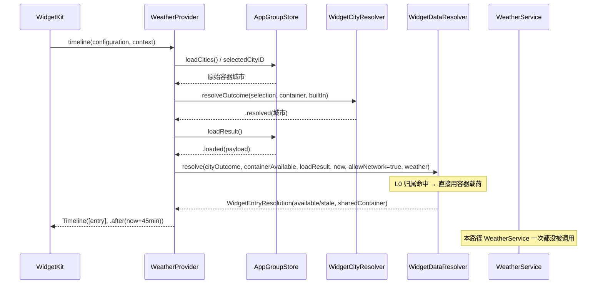
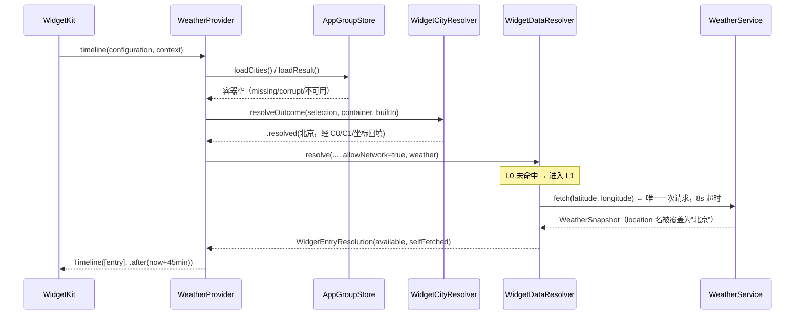
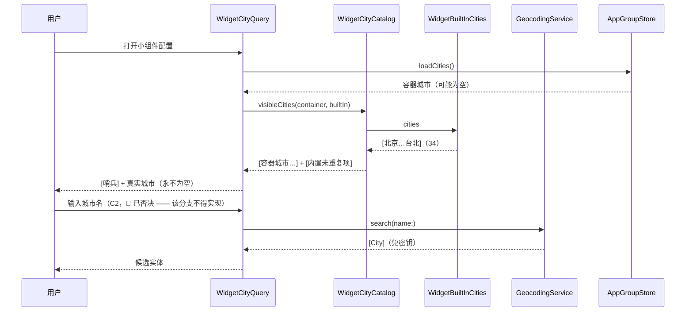
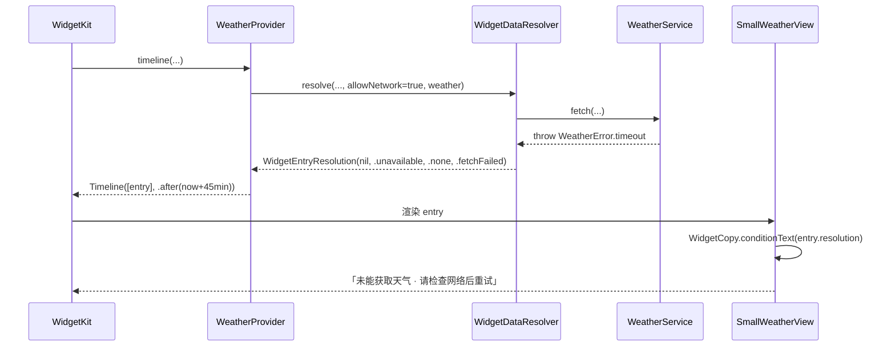

# ARCH：小组件自力取数（Widget Self-Sufficiency）

> 目标：让 **ZhishengWeatherWidget** 在「共享容器永远拿不到数据」的构建上，仍能显示
> 用户**主动选择**的城市的**真实天气**，且绝不冒充、绝不静默默认。
>
> 交付物：本文档是唯一交付物（设计稿）。**不含 Swift 代码改动**。
> 类图 / 时序图以 Mermaid 内嵌于本文（本任务提交纪律只允许提交本文件一个路径，
> 故**不**另建 `docs/class-diagram.mermaid` / `docs/sequence-diagram.mermaid`——
> 那会破坏「暂存区只有本文档」的自查约束）。
>
> 基线：`ios` 分支，本文写于提交 `ad57f21` 之后。

---

## 0. 取代声明（Supersedes）

本文档**取代**以下两处「Widget 没有网络」的陈述；**实施者必须同步更新这两处文件头注释**
（删除或改写该前提，并注明被 `ARCH-zhisheng-ios-widget-selfsufficiency.md` 取代）：

1. `Core/Logic/WidgetPayloadStatus.swift` 文件头：
   > 「背景（本轮要求 6）：Widget **没有网络**。……」
2. `ZhishengWeatherWidget/WeatherProvider.swift` 文件头：
   > 「……**全程无网络、无同步阻塞调用**（UserDefaults 读为可接受本地 IO）。」

**追加一处必须同步**（任务书未点名，但同理，见 §3-事实更正 C）：
3. `ZhishengWeatherWidget/WidgetCityIntent.swift` 文件头：
   > 「⚠️ 禁联网（F-C-8 / AC-C8）：本文件所有方法只允许经 AppGroupStore 读本地共享容器；
   > 不含任何网络类型引用 —— T06 静态自查项（grep 网络符号零命中）。」

   —— 🔴 **该「禁联网」纪律**不**因 C2 收窄，必须原样保留为绝对规则。**
   本文件 §1.4 的 `废弃-3` 一度把它收窄为「仅 C2 允许联网」，该收窄**已被 team lead
   否决并撤回**（详见本文 §21「裁定记录」）。故本文件头**不删不改**上面这条陈述，
   实施者**不得**在同一类型内新增任何联网方法。

---

## 1. 背景：为什么这是**结构性死亡**，而不是可降级项

### 1.1 P-19（已核实，见 `docs/CI-pitfalls.md` §九）

CI 以 `CODE_SIGNING_ALLOWED=NO` 出**完全未签名**的 IPA（`.github/workflows/ios.yml`
第 64–99 行）。未签名 → 无 provisioning → 两个 target 的 entitlements
（App Group `group.com.zhisheng.weather`，见 `Config/*.entitlements`）**从不生效** →
主 App 与 Widget 扩展各拿一个**互相隔离**的沙盒容器 → 小组件读到的永远是空 →
真机小组件**永远显示「暂无数据」**。

### 1.2 更狠一层：App Group 需要付费账号

Apple 官方「Supported capabilities (iOS)」表中，`App groups` 只挂在
**ADP / ADEP** 两列；**免费 Apple ID 列无勾**。本项目是**侧载自用**，故
「修签名让 App Group 生效」这条路要求：付费开发者账号（$99/年）+ 两个 App ID
都开 capability + 出覆盖两个 bundle id 的 profile + 侧载工具（SideStore / AltStore 等）
**保留 entitlements**。这是**外部依赖 + 持续成本**，不是一次代码改动。

**结论：现有「主题件读取 App Group 共享容器」的架构，在本产品的分发渠道上结构性死亡。**
小组件必须能在**容器永久为空**的前提下独立取到数据。

### 1.3 现有失效链条（逐条复述，作为设计前提）

1. `ZhishengWeatherWidget/WidgetCityIntent.swift` 的
   `WidgetCityQuery.suggestedEntities()` 返回 `[哨兵] + 共享容器里的城市`；
   容器空 → **配置界面里一个真实城市都没有**（代码第 80–86 行，且刻意**不走**
   `loadReadOnly` 的 `initial()` 兜底，避免「防御性北京」进入候选）。
   `entities(for:)` 对不在列表的 id 也回退哨兵（第 90–99 行）。
2. `Core/Logic/WidgetCityResolver.swift`：`.followApp` → `directory.selectedCity`。
3. `ZhishengWeatherWidget/WeatherProvider.swift` 的 `makeEntry` **四步全是纯本地读**，
   文件头明写「全程无网络」。
4. 三者叠加 → 小组件永久空态。

### 1.4 被证伪的前提（**显式废弃**）

| # | 位置 | 原陈述 | 处置 |
|---|------|--------|------|
| 废弃-1 | `Core/Logic/WidgetPayloadStatus.swift` 文件头 | 「Widget **没有网络**」 | **废弃**。理由：App Group 在本分发渠道不可用 → 唯一数据来源只剩自力取数。 |
| 废弃-2 | `ZhishengWeatherWidget/WeatherProvider.swift` 文件头 | 「全程无网络、无同步阻塞调用」 | **废弃**。同上。 |
| 废弃-3 | `ZhishengWeatherWidget/WidgetCityIntent.swift` 文件头 | 「禁联网（F-C-8 / AC-C8）…… grep 网络符号零命中」 | **不废弃**（原「收窄」已撤回）：**AC-C8 原样有效；C2（配置路径联网）否决**。该文件头注释**保持绝对禁联网**，不得新增任何联网方法。详见 §21「裁定记录（team lead，2026-09-17）」。 |

这就是 **P-18「同源盲区」的又一例**：单测注入自己的独立 suite（读写同进程同容器），
与实现共享了「容器一定可用」这个**错误假设**，所以 CI 全绿、真机全白。

---

## 2. 事实核对：我读到的代码 vs 任务书陈述

> 任务书要求「有与代码不符的直接指出，不要迁就」。以下逐条给出**我实际读到的代码**
> 与结论。**核心分歧在 §2-B**，它改变了一条设计前提。

### A. 已核实一致 ✅

- P-19：`ios.yml` 确以 `CODE_SIGNING_ALLOWED=NO` 出未签名 IPA；entitlements 文件存在但不会生效。一致。
- `suggestedEntities()` = `[哨兵] + 容器城市`，且**刻意不用** `initial()` 兜底（代码注释自陈）。一致 → 容器空时选择器**确实**只剩哨兵。
- `entities(for:)` 对未知 id 回退哨兵。一致。
- `WeatherProvider.makeEntry` 四步纯本地、无 `await`。一致。
- Core 同时挂在主 App 与 Widget 两个 target（`project.yml` 的 `sources` 都含 `path: Core`）。一致 → Widget 内可直接用 `WeatherService`，**无需改 `project.yml`**。

### B. 需要更正 ❗（会改变一条设计前提）

任务书 §「更彻底的失效链条」第 2 条说：

> `Core/Logic/WidgetCityResolver.swift`：`.followApp` → `directory.selectedCity`
> —— 容器空 → nil。

**这不准确。** 实际代码里，`makeEntry` 传给 resolver 的 `directory` 是
`CityDirectory.loadReadOnly(from: store)`（`WeatherProvider.swift` 第 89 行），而
`loadReadOnly` 在 `.missing` / `.corrupt` 时返回 **`CityDirectory.initial()`**
（`CityDirectory.swift` 第 253–259 行），即 **`[北京] + 选中北京`**，且
`initial()` **不读** `store.selectedCityID`。

因此，在「容器空」的真机上实际发生的是：

- `directory.selectedCity` = **`City.beijingDefault`（非 nil）**；
- 于是 `city` = 北京，`entry.displayCityName` = **"北京"**（`WeatherEntry.displayCityName`
  第 36 行 = `city?.name ?? …`）；
- payload 为 nil → `status = .missing` → 视图渲染 **「北京 / 暂无数据」**。

**这不影响本设计的结论，反而坐实了任务的必要性，但有两个后果必须纳入设计：**

1. 任务书中「小组件连城市名都没有，永久空态」**不成立**。真实症状是
   **「北京 / 暂无数据」**——这与 P-19 记录的真机现象（「永远显示『暂无数据』」）一致，
   也与「主 App 正常、小组件空白数据」一致。
2. 更严重的是：**小组件把「防御性北京」当成用户城市静默显示了**。
   用户从未选过北京，widget 却顶着「北京」的标题。这正是**决策 #4 明令禁止的
   「静默替换成别的城市」**（虽然没冒充**数据**，但冒充了**城市归属**）。
   → **本设计必须一并修掉这个「幽灵北京」**：`.followApp` 在容器**真的空**时
   应解析为 **无城市**（走「请配置城市」诚实空态），**而不是**注入 `initial()` 的北京。

   ⚠️ 影响面：`WidgetCityResolver.resolve(_:directory:)` 的输入语义将改为
   「**原始**容器城市目录」，不再接受 `loadReadOnly` 的 `initial()` 兜底产物。
   详见 §7.2。

### C. 需要追加的更正 ❗（🔴 **已被 §21 裁定推翻**）

`WidgetCityIntent.swift` 文件头的「禁联网 / grep 网络符号零命中」**不需要**、也**不允许**被打破。

> 原文写「在 C2 落地后**必然被打破**，须按 §0 的处置收窄」—— **该处置已撤回**：
> C2（配置路径联网）被 team lead 否决，AC-C8 原样有效（含真机判据 F-C-8），
> 文件头**保持绝对禁联网**，不得新增任何联网方法。见 §21「裁定记录（team lead，2026-09-17）」。

---

## 3. 团队既定决策（照写，补充理由）

> 以下为 team-lead 已裁定项，**不推翻**，括号内为本架构补充的理由。

1. **小组件允许联网**。废弃 §1.4 的两条「没有网络」前提。
   （理由：App Group 在本产品分发渠道上不可用；这是**唯一**能在容器永久为空时
   拿到真实数据的路径；且不引入任何凭据成本。）
2. **数据阶梯（缓存优先 + 自愈）**：
   **L0 共享容器**（本地、快、零配额，命中即用，现状语义不变）→
   **L1 自力取数** → **L2 如实空态 + 可操作文案**。
3. **城市阶梯**：
   **C0 共享容器城市目录** → **C1 内置城市目录**（Core 常量，保证选择器永不为空）。
   ~~**C2 免密钥的地理编码搜索**（用户在小部件配置界面输入城市名）~~ —— 🔴 **C2 已否决**
   （§21）：配置路径严禁联网（AC-C8 / F-C-8）；替代方案见 §21.3。
4. **绝不静默替换成别的城市**。本项目有明确的诚实纪律（见 `WeatherEntry.swift`
   注释与 `WidgetPayloadResolver` 第 4 条判定）：没有城市必须渲染**如实的、可操作的**
   空态，**绝不**偷偷回落到北京。C1 是让用户**主动选**到真实城市，不是替用户默认。
   （→ 连带修掉 §2-B 的「幽灵北京」。）
5. **自力取数必须原样复用 `WeatherService`**，零新增映射代码、
   **不得新增第二个请求或第二个端点**。
6. **所有新逻辑放 `Core/`**：`ZhishengWeatherTests` 只依赖主 App target
   （`project.yml` 的 `ZhishengWeatherTests.dependencies` 只有 `ZhishengWeather`），
   **Widget target 不进测试包** → 写在 Widget target 里的逻辑 CI 无法单测
   （P-18 同源盲区）。故新逻辑必须是 Core 里的**纯函数 / 可注入**形态。

---

## 4. 设计总览：两条正交阶梯

```
城市阶梯（决定"显示谁"）              数据阶梯（决定"显示什么"）
  C0 共享容器城市目录                     L0 读取共享容器载荷（本地、零配额）
      │ 未命中                               │ 未命中（missing/corrupt/不可用/归属不符）
      ▼                                      ▼
  C1 内置城市目录（Core 常量，永不为空）   L1 自力取数（复用 WeatherService，至多 1 次请求）
      │ 未命中（怪值）                        │ 失败
      ▼                                      ▼
  如实空态（请配置城市，绝不默认）           L2 如实空态 + 可操作文案

  ※ C2 地理编码搜索已否决（§21）：**配置路径严禁联网**（AC-C8 / F-C-8）。
```

**正交性**：城市阶梯产出 `City?`，数据阶梯产出 `payload + status + source`。
二者在 Provider 里交汇，最终收敛为 **一个 Core 值** `WidgetEntryResolution`，
由视图消费（文案由 Core 的 `WidgetCopy` 单一真源给出）。

---

## 5. 新逻辑落位：文件清单

> 纪律：**一切判定进 Core**（可单测），Widget target 只做「取值 + 映射 + 渲染」。
> 判定为「必须新增 / 必须修改」的文件逐条列出。

### 5.1 新增（全部在 `Core/`）

| 文件 | 职责 | 形态 |
|------|------|------|
| `Core/Logic/WidgetBuiltInCities.swift` | C1 内置城市目录（常量数组） | `enum` + `static let cities: [City]` |
| `Core/Logic/WidgetCityCatalog.swift` | 城市目录的**纯**合并 / 查找 / 坐标回填；`WidgetCitySelection` 值类型 | `enum` + `static func`（纯函数） |
| `Core/Logic/WidgetEntryResolution.swift` | `WidgetDataSource` + `WidgetEmptyReason` + `WidgetEntryResolution` + `WidgetCityOutcome` | 纯数据类型 |
| `Core/Logic/WidgetDataResolver.swift` | 数据阶梯编排（注入 `WeatherProviding` + 容器状态 + `now`） | `enum` + `static func … async` |
| `Core/Logic/WidgetCopy.swift` | 各状态**中文文案单一真源**（仿 `FaultDomain.message(for:)`） | `enum` + `static func`（纯函数） |

### 5.2 修改

| 文件 | 改动 |
|------|------|
| `Core/Logic/WidgetCityResolver.swift` | 新增按 `WidgetCitySelection + 原始容器 + 内置目录` 的解析入口；新增「规范坐标 id → City」回填；`Mode` 保留 |
| `ZhishengWeatherWidget/WeatherEntry.swift` | 载荷改为持有 `WidgetEntryResolution`；`payload`/`city`/`payloadStatus`/`displayCityName` 改为**转发计算属性**（视图调用点零改动） |
| `ZhishengWeatherWidget/WeatherProvider.swift` | `makeEntry` 变 `async`；`snapshot` 仅 L0；`timeline` 单次阶梯；注入了「短超时 URLSession」的 `WeatherService` |
| `ZhishengWeatherWidget/WidgetCityIntent.swift` | `suggestedEntities()` / `entities(for:)` 接入 **C1** 目录（纯本地读）；~~新增字符串搜索方法（C2 联网）~~ 🔴 **已否决**（§21），**不得实现** |
| `ZhishengWeatherWidget/{Small,Medium,Large,Accessory}WeatherView*.swift` | 文案改走 `WidgetCopy`；新增可操作提示行渲染 |
| `ZhishengWeatherTests/WidgetCityResolverTests.swift` | 适配新解析入口（见 §11 必查项 #5） |

### 5.3 明确**不**改

- `project.yml`（Core 已在两个 target）。
- `Config/*.entitlements`（App Group 保留；修签名是另一条独立路径，不在本设计内）。
- `Core/Networking/WeatherService.swift` / `OpenMeteoEndpoint.swift`（**原样复用**，
  不改一行；超时通过**注入的 URLSession** 实现，见 §9）。
- `SharedWeatherPayload` / `WeatherSnapshot` / `City` 的编码形状（不改字段，见 §10）。

---

## 6. 数据阶梯：改后的 `makeEntry` 形状与伪代码

### 6.1 `makeEntry` 从 sync → async

现签名：

```swift
private func makeEntry(date: Date, configuration: WidgetCitySelectionIntent) -> WeatherEntry
```

新签名：

```swift
private func makeEntry(date: Date,
                       configuration: WidgetCitySelectionIntent,
                       allowNetwork: Bool) async -> WeatherEntry
```

**谁 catch？** —— **Core 的 `WidgetDataResolver` 内部 catch**（最贴近判定处）；
`WeatherProvider` **不 catch**，因为它**不抛**。
`AppIntentTimelineProvider` 的 `timeline` / `snapshot` 签名本身**非 throwing**，
所以「失败收敛」必须是**返回值**而非异常：

- `WeatherService.fetch` 抛 `WeatherError` → `WidgetDataResolver` 内 `do/catch`
  → 归类为 `WidgetEmptyReason.fetchFailed`（或 `.cityHasNoData`，若为 `dataMissing`）。
- **禁止** `try!` / 让错误冒泡出 `timeline` / 返回空 `Timeline`。

### 6.2 完整伪代码（Provider 层）

```swift
// WeatherProvider.swift

private static let widgetSession: URLSession = {
    let cfg = URLSessionConfiguration.ephemeral
    cfg.timeoutIntervalForRequest = 8      // §9
    cfg.timeoutIntervalForResource = 8
    cfg.waitsForConnectivity = false       // 绝不等待，widget 有执行预算
    return URLSession(configuration: cfg)
}()

private let weather: WeatherProviding   // 注入；默认 WeatherService(session: widgetSession)

// ── timeline：单次阶梯，最多 1 次网络请求 ────────────────────────────────
func timeline(for configuration: WidgetCitySelectionIntent,
              in context: Context) async -> Timeline<WeatherEntry> {
    let now = Date()
    let resolution = await makeResolution(configuration: configuration,
                                          now: now,
                                          allowNetwork: true)   // ← 只调一次
    let refreshDate = now.addingTimeInterval(45 * 60)

    let entries: [WeatherEntry]
    if WidgetRuntime.isIOS17OrLater {
        entries = [WeatherEntry(date: now, resolution: resolution,
                                backgroundStyle: configuration.backgroundStyle)]
    } else {
        // iOS 16 兼容：两条目复用**同一份** resolution（不再二次读容器、绝不再取数）。
        entries = [
            WeatherEntry(date: now, resolution: resolution,
                         backgroundStyle: configuration.backgroundStyle),
            WeatherEntry(date: now.addingTimeInterval(30 * 60), resolution: resolution,
                         backgroundStyle: configuration.backgroundStyle)
        ]
    }
    return Timeline(entries: entries, policy: .after(refreshDate))
}

// ── snapshot：只走 L0（画廊/瞬时预览，避免昂贵 IO）──────────────────────
func snapshot(for configuration: WidgetCitySelectionIntent,
              in context: Context) async -> WeatherEntry {
    let resolution = await makeResolution(configuration: configuration,
                                          now: Date(),
                                          allowNetwork: false)  // ← 不联网
    return WeatherEntry(date: Date(), resolution: resolution,
                        backgroundStyle: configuration.backgroundStyle)
}

// ── 唯一组装入口 ────────────────────────────────────────────────────────
private func makeResolution(configuration: WidgetCitySelectionIntent,
                            now: Date,
                            allowNetwork: Bool) async -> WidgetEntryResolution {
    // ① 城市阶梯（纯本地，永不联网）
    let container = WidgetContainerSnapshot(
        cities: rawContainerCities(),                 // missing/corrupt → []，**不注入北京**
        selectedID: store.selectedCityID,
        containerAvailable: AppGroupStore.isSharedContainerAvailable)
    let selection = WidgetCitySelection(id: configuration.city.id,
                                        name: configuration.city.name,
                                        subtitle: configuration.city.subtitle)
    let cityOutcome = WidgetCityResolver.resolveOutcome(selection: selection,
                                                        container: container,
                                                        builtIn: WidgetBuiltInCities.cities)
    // ② 数据阶梯（L0 本地 → L1 取数 → L2 空态）
    return await WidgetDataResolver.resolve(
        cityOutcome: cityOutcome,
        containerAvailable: container.containerAvailable,
        loadResult: store.loadResult(),
        now: now,
        allowNetwork: allowNetwork,
        weather: weather)
}
```

> `rawContainerCities()`：把 `store.loadCities()` 的三态**原样**映射为
> `[City]`（`.loaded(c)` → `c`；`.missing` / `.corrupt` → `[]`）。
> **禁止**在此处调用 `CityDirectory.initial()`（那是「幽灵北京」的来源）。

### 6.3 Core：`WidgetDataResolver.resolve` 伪代码

```swift
// Core/Logic/WidgetDataResolver.swift
enum WidgetDataResolver {

    static func resolve(cityOutcome: WidgetCityOutcome,
                        containerAvailable: Bool,
                        loadResult: AppGroupStore.PayloadLoadResult,
                        now: Date,
                        allowNetwork: Bool,
                        weather: WeatherProviding,
                        staleThreshold: TimeInterval = StalePolicy.defaultThreshold)
        async -> WidgetEntryResolution {

        // ── L0：共享容器 ───────────────────────────────────────────────
        if case .loaded(let payload) = loadResult,
           let city = cityOutcome.city,
           city.id == City.makeID(latitude: payload.snapshot.location.latitude,
                                  longitude: payload.snapshot.location.longitude) {
            // 归属命中：**即便过旧也照发**（保持现状语义：有数据就渲染，只标注）。
            let status: WidgetPayloadStatus =
                StalePolicy.isStale(lastUpdated: payload.updatedAt, now: now,
                                    threshold: staleThreshold) ? .stale : .available
            return WidgetEntryResolution(city: city, payload: payload,
                                         status: status,
                                         dataSource: .sharedContainer,
                                         emptyReason: nil)
        }

        // ── L0 未命中：分「无城市」与「有城市」两条 ─────────────────────
        guard let city = cityOutcome.city else {
            // 容器空且是 followApp / 坐标无法回填 → 无城市。**不取数**。
            return WidgetEntryResolution(city: nil, payload: nil,
                                         status: .missing,
                                         dataSource: .none,
                                         emptyReason: .noCity)
        }

        guard allowNetwork else {
            // 快照路径：仅 L0。容器不可用 → 共享数据不可用；否则暂无数据。
            let reason: WidgetEmptyReason =
                containerAvailable ? .noCachedData : .sharedContainerDown
            return WidgetEntryResolution(city: city, payload: nil,
                                         status: containerAvailable ? .missing : .unavailable,
                                         dataSource: .none, emptyReason: reason)
        }

        // ── L1：自力取数（原样复用 WeatherService；至多一次请求）────────
        do {
            var snapshot = try await weather.fetch(latitude: city.latitude,
                                                   longitude: city.longitude)
            // 城市名覆盖：WeatherService 把 location 写成「当前位置」，由上层覆盖
            //（对齐 WeatherViewModel.swift 第 244 行；否则小组件城市名错误）。
            snapshot.location = city.locationInfo
            let payload = SharedWeatherPayload(
                snapshot: snapshot,
                updatedAt: now,                                 // 刚取回 → 必新鲜
                timeZoneIdentifier: city.timeZoneIdentifier)     // D-4 时刻时区
            return WidgetEntryResolution(city: city, payload: payload,
                                         status: .available,
                                         dataSource: .selfFetched,
                                         emptyReason: nil)
        } catch let error as WeatherError {
            // dataMissing 与「传输失败」必须分开（文案不同）。
            if case .dataMissing = error {
                return WidgetEntryResolution(city: city, payload: nil,
                                             status: .missing, dataSource: .none,
                                             emptyReason: .cityHasNoData)
            }
            return WidgetEntryResolution(city: city, payload: nil,
                                         status: .unavailable, dataSource: .none,
                                         emptyReason: .fetchFailed)
        } catch {
            return WidgetEntryResolution(city: city, payload: nil,
                                         status: .unavailable, dataSource: .none,
                                         emptyReason: .fetchFailed)
        }
    }
}
```

### 6.4 entry 是否需要新字段？

**需要**，但**不是**「数据来源」这一个孤立字段，而是把三样东西一起随 entry 下发：

| 字段 | 类型 | 作用 |
|------|------|------|
| `payloadStatus` | `WidgetPayloadStatus`（**复用，不改 case**） | 有无 / 新旧（视图既有 `==` 判定继续可用） |
| `dataSource` | `WidgetDataSource`（**新增**） | 来源：`.sharedContainer` / `.selfFetched` / `.none`（诊断 + 测试断言；视图可选标注） |
| `emptyReason` | `WidgetEmptyReason?`（**新增**） | 空态的**可操作原因**，驱动诚实文案 |

**是否要在 UI 上标注「数据来自小组件自力取数」？** —— **不需要面向用户的额外标注**。
理由：自力取数的数据是**真实且刚取回的**（`updatedAt = now`），「更新于 HH:mm」already
如实反映取数时刻，无任何需要打星号的折扣。`dataSource` 的存在价值是
**可测性 + 可诊断性**（单测断言阶梯走到了哪一级），而非 UI 文案。

`WeatherEntry` 改造（保持视图调用点零改动）：

```swift
struct WeatherEntry: TimelineEntry {
    let date: Date
    let resolution: WidgetEntryResolution              // ← 唯一存储
    var backgroundStyle: WidgetBackgroundStyle = .glass

    // 转发（既有视图 `entry.payload` / `entry.city` / `entry.payloadStatus` /
    // `entry.displayCityName` 全部继续编译）
    var payload: SharedWeatherPayload? { resolution.payload }
    var city: City? { resolution.city }
    var payloadStatus: WidgetPayloadStatus { resolution.status }
    var displayCityName: String? { resolution.city?.name ?? resolution.payload?.snapshot.location.name }
}
```

> `WeatherEntry` 是 `TimelineEntry`，**非 Codable**、系统每次重新调用 provider 重建，
> 因此**加字段安全**（无持久化兼容问题）。

---

## 7. 城市阶梯 C0 / C1 / C2（🔴 C2 已否决，见 §21）

### 7.1 `WidgetContainerSnapshot` 与解析优先级（**纯函数**）

```swift
// Core/Logic/WidgetCityCatalog.swift
struct WidgetContainerSnapshot: Equatable, Sendable {
    var cities: [City]          // 原始容器城市；missing/corrupt → []
    var selectedID: String?
    var containerAvailable: Bool
}
```

`WidgetCityResolver.resolveOutcome(selection:container:builtIn:) -> WidgetCityOutcome`：
**分辨率优先级（写死，实现与测试不得各自解读 —— P-13 纪律）**：

```
0. selection.id == followAppID                 → .followApp 分支
1. 若 id 在**城市目录**中命中                  → .resolved(该城市，全量元数据)
   目录口径 = WidgetCityCatalog.city(forID:container:builtIn:)：
   **容器项优先**（用户自己在 App 里加的、元数据更全），容器未命中才落到内置目录 C1。
   内置目录的意义：用户可能就是从「从不联网的内置列表」里选的 →
   内置城市**永不算「被删除」**。
2. 否则（两条目录都不命中）→ **按「信息是否可得」分层**（AC-C5，B 组回归修复）：
   a. container.containerAvailable == true     → **回退 .followApp 语义**
      （容器可用 ⇒ 信息可得 ⇒ 该记录确已不存在：用户在主 App 删了它）
      **不做坐标回填**（否则会继续显示、并继续为一个已删除的城市取数）
   b. container.containerAvailable == false    → 若 id 可解析为规范坐标 "%.2f,%.2f"
      → .resolved(坐标回填 City(name: selection.name, …))
      （容器不可用 ⇒ 无法得知是否被删除；未签名侧载下这是 .fixed 唯一的存活路径）
3. 否则                                         → .needsConfiguration   （不冒充、不默认）

.followApp 分支（与上面 2a **共用**同一实现 `followAppOutcome`，避免两处各自解读）：
  a. container.selectedID 在 container.cities 中命中 → .resolved(该城市)
  b. 否则（容器空 / 选中失效）                        → .needsConfiguration
     ⚠️ **绝不**注入 CityDirectory.initial() 的北京（修 §2-B 幽灵北京）
```

> **注意（B 组回归修复，本节规则已二次修订）**：`.fixed(id)` 未命中两条目录时**是否回退**，
> 取决于**容器是否可用**（= 信息是否可得），而不是「固定优先级」：
> - **容器可用** ⇒ 该记录**确已不存在**（用户在主 App 主动删了它）⇒ 按 **AC-C5** 回退
>   `.followApp` 语义（跟随 App；App 侧也无有效选中 → `.needsConfiguration`）。
>   初版曾在此**无条件坐标回填** → 结果是「已被删除的城市」继续被显示、并继续取数
>   （真机可复现），与 AC-C5 直接冲突 —— 已修。
> - **容器不可用**（未签名侧载 / entitlements 失效）⇒ **无法得知**是否被删除
>   ⇒ 才允许**坐标回填**。回填的是**用户确实选过**的坐标，属「保住实例可用」，
>   不是「替用户决定城市」。
>
> **与决策 #4 的关系（勿混淆）**：决策 #4 禁止的是**静默替换**——在**信息不可得**时
> 擅自换成另一个城市（旧实现正是在容器空时静默退到北京）。AC-C5 的回退发生在
> **信息可得**时（用户的删除动作是可知事实），且回退目标是**用户自己的 App 选中**，
> 属「如实跟随」，不是「冒充」。故两者不冲突。
>
> **为什么不「容器不可用也一律回退 followApp」**：容器不可用时 App 侧同样读不到任何
> 城市 → 回退只会让实例**永久空态**，而用户明明选过城市。那不是诚实，是坏掉。

### 7.2 ⚠️ 为什么不能再用 `CityDirectory.loadReadOnly`

`loadReadOnly` 的三态兜底是 `CityDirectory.initial()`（北京），这是**主 App** 的首启语义，
**不适用于 widget**（widget 不该替用户决定城市）。故：
- **新增** `rawContainerCities()`（§6.2）取原始容器城市；
- `WidgetCityResolver` 的输入从 `CityDirectory` 改为 `WidgetContainerSnapshot`；
- 旧的 `resolve(_ mode:directory:)` 及 `Mode` 可按需保留或删除
  （**若删除，必须同步适配 `WidgetCityResolverTests`，见 §11-必查项 #5**）。

### 7.3 C1 内置城市目录（形态 / 文件 / 数量 / 顺序）

- **文件**：`Core/Logic/WidgetBuiltInCities.swift`（Core，随两个 target 编译）。
- **形态**：**Swift 常量数组**（`static let cities: [City]`）——**不用 plist**。
  理由：plist 要跨两个 target 配资源、且**解析失败是运行期静默**；
  Swift 常量是**编译期检查**、零资源配置、`@testable import` 直接可测。
- **数量与内容**：**34 座**（4 直辖市 + 27 省会/自治区首府 + 3 港澳台）。逐条列出，
  避免实施者臆造坐标（WGS84，保留 2 位小数，与 `City.makeID` 一致）：

  | 名 | lat | lon | country | admin1 | tz |
  |----|-----|-----|---------|--------|----|
  | 北京 | 39.90 | 116.41 | 中国 | 北京 | Asia/Shanghai |
  | 上海 | 31.23 | 121.47 | 中国 | 上海 | Asia/Shanghai |
  | 天津 | 39.13 | 117.20 | 中国 | 天津 | Asia/Shanghai |
  | 重庆 | 29.56 | 106.55 | 中国 | 重庆 | Asia/Shanghai |
  | 石家庄 | 38.04 | 114.51 | 中国 | 河北 | Asia/Shanghai |
  | 太原 | 37.87 | 112.55 | 中国 | 山西 | Asia/Shanghai |
  | 呼和浩特 | 40.84 | 111.75 | 中国 | 内蒙古 | Asia/Shanghai |
  | 沈阳 | 41.80 | 123.43 | 中国 | 辽宁 | Asia/Shanghai |
  | 长春 | 43.82 | 125.32 | 中国 | 吉林 | Asia/Shanghai |
  | 哈尔滨 | 45.80 | 126.53 | 中国 | 黑龙江 | Asia/Shanghai |
  | 南京 | 32.06 | 118.80 | 中国 | 江苏 | Asia/Shanghai |
  | 杭州 | 30.25 | 120.17 | 中国 | 浙江 | Asia/Shanghai |
  | 合肥 | 31.82 | 117.23 | 中国 | 安徽 | Asia/Shanghai |
  | 福州 | 26.07 | 119.30 | 中国 | 福建 | Asia/Shanghai |
  | 南昌 | 28.68 | 115.86 | 中国 | 江西 | Asia/Shanghai |
  | 济南 | 36.65 | 117.12 | 中国 | 山东 | Asia/Shanghai |
  | 郑州 | 34.75 | 113.63 | 中国 | 河南 | Asia/Shanghai |
  | 武汉 | 30.59 | 114.31 | 中国 | 湖北 | Asia/Shanghai |
  | 长沙 | 28.23 | 112.94 | 中国 | 湖南 | Asia/Shanghai |
  | 广州 | 23.13 | 113.26 | 中国 | 广东 | Asia/Shanghai |
  | 南宁 | 22.82 | 108.32 | 中国 | 广西 | Asia/Shanghai |
  | 海口 | 20.04 | 110.32 | 中国 | 海南 | Asia/Shanghai |
  | 成都 | 30.57 | 104.07 | 中国 | 四川 | Asia/Shanghai |
  | 贵阳 | 26.65 | 106.63 | 中国 | 贵州 | Asia/Shanghai |
  | 昆明 | 25.04 | 102.71 | 中国 | 云南 | Asia/Shanghai |
  | 拉萨 | 29.65 | 91.14 | 中国 | 西藏 | Asia/Shanghai |
  | 西安 | 34.34 | 108.94 | 中国 | 陕西 | Asia/Shanghai |
  | 兰州 | 36.06 | 103.83 | 中国 | 甘肃 | Asia/Shanghai |
  | 西宁 | 36.62 | 101.78 | 中国 | 青海 | Asia/Shanghai |
  | 银川 | 38.49 | 106.23 | 中国 | 宁夏 | Asia/Shanghai |
  | 乌鲁木齐 | 43.83 | 87.62 | 中国 | 新疆 | Asia/Shanghai |
  | 香港 | 22.32 | 114.17 | 中国 | 香港特别行政区 | Asia/Hong_Kong |
  | 澳门 | 22.20 | 113.54 | 中国 | 澳门特别行政区 | Asia/Macau |
  | 台北 | 25.03 | 121.57 | 中国 | 台湾省 | Asia/Taipei |

  - **第一项与 `City.beijingDefault` 坐标同源**（`LocationInfo.beijing`，全表禁止第二套
    默认坐标），但**不整值复用**：`City.beijingDefault` 按契约 `timeZoneIdentifier == nil`
    （`WeatherTimeFormatterTests` 用它验证「城市无时区 → 回退设备时区」这条既有行为），
    而本表纪律是**条目一律携带 IANA 时区** —— 两者是**分开的性质**（坐标同源 ≠ 整值等同），
    故首项走同形的 `make(LocationInfo.beijing.…, timeZone: "Asia/Shanghai")`。
    测试须断言首项 **id / name 与 `City.beijingDefault` 相等**；**不得**断言
    `cities.contains(City.beijingDefault)`（整值比较会因 `timeZoneIdentifier` 而失败）。
  - 全部 id 已人工比对**互不重复**（2 位小数），且**无一等于 `followAppID`**（测试兜底，§12）。

- **选择器顺序**（`suggestedEntities()`，纯函数部分下沉到 Core，见 §7.5）：
  `[哨兵] + 容器城市（App 内顺序）+ 内置城市中**不在容器里**的（C1 顺序）`。
  **哨兵恒为第一项**（硬要求）。

### 7.4 C2 地理编码搜索 —— 🔴 **已否决（team lead，2026-09-17）**

> **本节失效。** C2（在配置解析路径里发起地理编码搜索）**违反 AC-C8**
> （「配置解析必须纯本地读，禁止在配置解析里发起网络请求」，`PRD-zhisheng-ios-P1.md`
> §4.4(a)，挂真机判据 F-C-8），**已由 team lead 否决**。`WidgetCityQuery`
> **不得**符合字符串搜索协议、**不得**实现城市名搜索方法、**不得**引用任何联网 service。
>
> 替代方案（内置目录扩容至地级市 / 「当前位置」配置项）见 §21「裁定记录」。
>
> 以下为**历史设计**（保留以便追溯，**不得实施**）：
>
> - 曾计划复用 Core 既有地理编码 service（免密钥、中文安全、`language=zh`、`format=json`）。
> - 曾计划落点：`WidgetCityQuery` 增加字符串搜索协议一致性，实现城市名搜索方法
>   `try await <geocoding service>().search(name: string)` → `map(WidgetCityEntity.make)`。
> - ⚠️ 该设计依赖的真机前提 A9（配置界面进程能否联网）**本仓无法验证**（唯一编译门禁
>   是 CI，不能跑真机），而带不可验证的卡死风险违明文禁令不成立 —— 这正是否决理由之一。

### 7.5 使 C1（含坐标回填）可被 CI 单测：把「合并 / 查找」下沉到 Core

`WidgetCityEntity` 定义在 **Widget target**，Core 无法引用它 → 因此 Core 只能处理
**`City` 层**的纯逻辑，Widget 侧只做 1 行 `map`：

```swift
// Core/Logic/WidgetCityCatalog.swift （纯函数，CI 可测）
enum WidgetCityCatalog {
    /// 选择器可见城市：容器在前（保持顺序），内置中未出现的追加在末。
    static func visibleCities(container: [City], builtIn: [City]) -> [City]
    /// 按 id 查找（容器优先，其次内置）。
    static func city(forID id: String, container: [City], builtIn: [City]) -> City?
    /// 规范坐标 id → City（"%.2f,%.2f" 往返稳定）。
    static func city(fromCanonicalID id: String, name: String) -> City?
}
```

```swift
// Widget target（薄映射，逻辑已在 Core）
func suggestedEntities() async throws -> [WidgetCityEntity] {
    let container = rawContainerCities()
    return [.followApp] + WidgetCityCatalog.visibleCities(container: container,
                                                          builtIn: WidgetBuiltInCities.cities)
                                  .map(WidgetCityEntity.make)
}

func entities(for identifiers: [String]) async throws -> [WidgetCityEntity] {
    let container = rawContainerCities()
    return identifiers.map { id in
        guard id != WidgetCityEntity.followAppID else { return .followApp }
        if let city = WidgetCityCatalog.city(forID: id, container: container,
                                             builtIn: WidgetBuiltInCities.cities) {
            return WidgetCityEntity.make(city)
        }
        // 坐标回填（兼容历史 C2 实例）：非目录项但合法坐标 id → 用坐标串作确定性名称（见 §11-必查项 #7）
        if let city = WidgetCityCatalog.city(fromCanonicalID: id, name: id) {
            return WidgetCityEntity.make(city)
        }
        return .followApp
    }
}
```

---

## 8. 状态模型裁定（含**必查项**）

### 8.1 必查项结论：`WidgetPayloadStatus` 的使用侧**不是穷尽 switch**

任务书要求「必须查」。我**逐一核实**了 `WidgetPayloadStatus` 的全部使用点（`git grep` 全仓，
排除 `_joblog*.txt` / `_watch_joblog.txt` 日志文件）。

> ⚠️ **本表已按实现上线后的真实形态重测**。初版测于设计期，列的是**视图直接做 `==` 判断**
> 的旧形态 —— 那是**已经作废**的前提（`WidgetCopy` 落地后视图不再比较本枚举）。
> 重测口径：`git grep -rn "WidgetPayloadStatus" --include=*.swift`。

| 文件 | 行 | 用法 | 是否 switch |
|------|----|------|-------------|
| `Core/Logic/WidgetPayloadStatus.swift` | 36 | 定义 | — |
| `Core/Logic/WidgetPayloadStatus.swift` | 54 | `WidgetPayloadResolution.status` 字段 | — |
| `Core/Logic/WidgetEntryResolution.swift` | 98 | 收敛值 `status` 字段 | — |
| `Core/Logic/WidgetDataResolver.swift` | 86, 97, 106, 123, 156, 162 | **构造赋值**（`status:` 传参） | — |
| `Core/Logic/WidgetCopy.swift` | 84 | `resolution.status == .stale` | **否（`==` 比较）** |
| `ZhishengWeatherWidget/WeatherEntry.swift` | 66 | `var payloadStatus: … { resolution.status }`（**纯转发，无判断**） | — |
| `ZhishengWeatherWidget/WeatherEntry.swift` | 100 | 预览占位构造（`status: .available`） | — |
| `ZhishengWeatherTests/WidgetPayloadStatusTests.swift` | 全 | `XCTAssertEqual(status, .xxx)` | **否** |
| `ZhishengWeatherTests/WidgetCopyTests.swift` | 35, 122 | 构造 + 表驱动断言 | **否** |

**结论**：全仓**零** `switch` 语句消费 `WidgetPayloadStatus`（`LoadResult` 侧的
`switch` 与它无关）。因此，**加 case 今天能编过 CI**；但加 case 之后**没有任何渲染路径
会消费它** —— 视图文案已全部下沉到 `WidgetCopy`，新 case 只会变成一个**静默无效果**的
死状态（详见 §8.2 理由 2）。

### 8.2 裁定：**不**给 `WidgetPayloadStatus` 加 case；改用**正交字段**

**裁定：保持 `WidgetPayloadStatus` 的 case 集合不变**（`available` / `stale` /
`missing` / `unavailable`），新增两个**正交**概念：

- `WidgetDataSource`（来源）：`.sharedContainer` / `.selfFetched` / `.none`
- `WidgetEmptyReason`（空因）：`.noCity` / `.noCachedData` / `.sharedContainerDown` /
  `.fetchFailed` / `.cityHasNoData`

**理由（逐条）**：

1. **语义正交**：`WidgetPayloadStatus` 是**单轴**（载荷的存在性 + 新鲜度）；
   自力取数引入的是**来源**轴，与新鲜度**正交**。把来源硬塞进同一枚举会造出
   `availableFromWidget` / `staleFromWidget` 之类**笛卡尔膨胀**，且 `stale` 与
   `selfFetched` 逻辑上互斥却无法在类型上表达。
2. **新 case 不会渲染错文案，但会变成「静默无效果」的死状态**：`WidgetPayloadStatus`
   目前**零穷尽 `switch`**，且视图文案已全部下沉到 `WidgetCopy` —— 实际读取点只剩
   `Core/Logic/WidgetCopy.swift:84` 的 `status == .stale` 一处（`WeatherEntry.swift:66`
   的同名属性纯转发、无判断）。因此：
   - **原文「加 case 会静默落到 else 分支、渲染错文案」已作废**（视图不再比较本枚举，
     见 §8.1 重测表）；该理由**不再成立**，不得再引用；
   - 但新 case **没有任何渲染路径消费它** → 编译通过、CI 全绿、真机上该状态**永不显示**，
     即一个**静默无效果**的死状态 —— 加它等于没加，故裁定不变。
   把新语义放独立字段，可**在 CI 单测里逐条断言**（Core 纯函数），不依赖 Widget 渲染，
   也不会退化成死状态。
3. **文案单一真源**：新增 `WidgetCopy`（Core 纯函数，仿 `FaultDomain.message(for:)`）承担
   全部面向用户的空态 / 标注文案；视图**不再 `switch` / `==` 拼文案**，
   从根上消除「跨 target 穷尽 switch」这一类风险。

> **兜底纪律**：若未来确需给 `WidgetPayloadStatus` 加 case，**必须先**为它落实消费路径 ——
> 要么把新 case 接进 `WidgetCopy`（文案真源），要么把 `WidgetCopy.swift:84` 那个
> `== .stale` 消费点改为**穷尽 `switch`**；否则新 case 就是一个**静默无效果**的死状态。

---

## 9. 超时与执行预算

| 项 | 取值 | 理由 |
|----|------|------|
| 请求超时 `timeoutIntervalForRequest` | **8 秒** | 小组件时间线预算有限；8s 足够一次 Open-Meteo 请求（正常 <1s），又能快速失败转入 L2。 |
| 资源超时 `timeoutIntervalForResource` | **8 秒** | 与上一致，避免重定向/慢链路拖长。 |
| `waitsForConnectivity` | **false** | 无网络时**立即失败**，绝不挂起等待（等待会吃光执行预算）。 |
| 外层硬上限 | **10 秒**（`withThrowingTaskGroup` 与 `Task.sleep` 竞速） | 兜住「URLSession 超时未如期触发」的极端情况（`WeatherService` 内部 catch 的是 `URLError.timedOut`）。超时 → 取消等待 → L2 `.fetchFailed`。 |
| 每轮 timeline 请求数 | **0 或 1** | L0 命中 → 0；L0 未命中且有城市 → 1；无城市 → 0。 |
| `snapshot(for:)` | **0 请求** | 画廊 / 瞬时预览，只走 L0（§6.2）。 |
| iOS 16 双条目 | **不额外取数** | 两条目复用**同一份** resolution（旧实现会二次读容器；改为不二次读、更不二次取数）。 |

**「不拖垮时间线」的三重保障**：
1. 短超时 + `waitsForConnectivity=false` → 单次 IO 有界（≤8s，硬上限 10s）。
2. 每轮**至多一次**请求，且**仅**在 L0 完全未命中时发起 → 常见路径（容器有数据）**零网络**。
3. `snapshot` 不联网 → 系统抢占式请求（画廊、瞬时展示）不触发网络。

**失败语义**：任何失败**不抛**，收敛为 `WidgetEntryResolution(payload: nil, emptyReason: …)`；
`Timeline` 照常返回（哪怕只有一个空态条目）。**绝不**返回 `[]`（会触发系统异常渲染）。

---

## 10. 配置界面的向后兼容

**关键事实**：`WidgetCityEntity` 是 `Codable`，由**系统**按 per-instance 持久化。
升级前已配置的实例，系统里存的是**旧的** `{id, name, subtitle}`。
且 `id` 本身已是 `City.makeID` 产物 `"%.2f,%.2f"`（或哨兵 `"follow-app"`）。

**裁定：保持 `WidgetCityEntity` 的存储形状不变**（`id` / `name` / `subtitle` 三个字段，
不加、不减）。**理由**：

1. **`id` 已足够确定行为**：解析所需的坐标就在 id 字符串里（§7.1 步骤 **2b** 的**坐标回填**，
   `name` 用于显示，`subtitle` 仅用于去歧义。旧实体天然满足。
2. **加字段虽兼容但无必要**：本仓已有「可选字段 + 合成 Codable + 默认 nil → 旧 JSON 解码
   不失败」的成熟范式（`City.isFavorite`、`SharedWeatherPayload.timeZoneIdentifier`）。
   **但**本轮无需新字段，就**不加**——最小暴露面。
3. **确定性行为**（升级后旧实例的表现，逐条写死）：

   | 旧实例的 id | 新行为 |
   |-------------|--------|
   | `"follow-app"` | `.followApp`：容器有选中城市 → 显示之；容器空 → **无城市**（「请配置城市」，不再是幽灵北京）。 |
   | 命中容器目录的城市 id | 正常（L0/L1 阶梯）。 |
   | 命中**内置**目录的城市 id | **新增能力**：旧实例若恰配了内置城市（以前会因容器查不到而回退），现能**正确解析**；且内置城市**永不算「被删除」**（用户可能就是从未联网的内置列表里选的）。 |
   | 未命中两条目录 + **容器可用** | **回退「跟随 App」语义**（AC-C5）：跟随 App 当前选中；App 侧也无有效选中 → `.needsConfiguration`。**不做坐标回填** —— 回填会让小组件继续显示、并继续为一个**已被用户删除的城市**取数（B 组回归修复，真机可复现）。 |
   | 未命中两条目录 + **容器不可用** | **坐标回填**：用 id 解析坐标 + 旧实体携带的 `name` 重建 City → 正常取数。容器不可用 = **无法得知**是否被删除，故不能按 AC-C5 判为「已删除」；未签名侧载下这是 `.fixed` 实例**唯一**的存活路径。 |
   | 既非目录项、又非合法坐标（怪值） | `.needsConfiguration`（如实空态，**不**静默改城市）。 |

4. **`entities(for:)` 的编辑态回显**：必须同步接入 C1（§7.5），否则
   「用内置城市配置的实例」在编辑界面会**错误回显为哨兵**（系统只按 id 查回实体）。
   这是**必查项**之一（§11-#7）。
5. **已知限制（登记为假设 A10）**：C2（坐标回填，**仅容器不可用分支**）路径拿不到 `timeZoneIdentifier`
   （旧实体无此字段）→ 时刻渲染回退**设备时区**（`WidgetTimeFormatter.timeZone(for:)`
   的既有安全行为，绝不硬编码偏移）。对绝大多数中国城市（`Asia/Shanghai`）与设备时区
   一致，影响可忽略。如日后确需精确，再以**可选字段**方式追加（不破坏兼容）。

---

## 11. 实施前必查项清单（交给实施者，逐条打勾）

| # | 必查项 | 命令 / 方法 | 期望 |
|---|--------|-------------|------|
| 1 | `WidgetPayloadStatus` 消费侧**无穷尽 switch**（本设计不加 case，但纪律须常在） | `grep -rn "WidgetPayloadStatus" ZhishengWeatherIOS --include=*.swift` 后逐个看上下文 | 只有 `==` / 定义 / 赋值；**零 switch** |
| 2 | Core 仍挂在 **Widget** target | 看 `project.yml` 的 `ZhishengWeatherWidget.sources` | 含 `- path: Core` |
| 3 | 测试**只**依赖主 App target | 看 `project.yml` 的 `ZhishengWeatherTests.dependencies` | 只有 `- target: ZhishengWeather` → **新逻辑必须全在 Core** |
| 4 | `AppGroupStore.isSharedContainerAvailable` 的调用点 | `grep -rn "isSharedContainerAvailable"` | 仅 Provider / VM；解析函数里以**注入的 Bool** 使用，不直接调用 |
| 5 | 若删除旧 `WidgetCityResolver.resolve(_:directory:)` | `grep -rn "resolve(.followApp\|resolve(.fixed\|mode(forEntityID" ZhishengWeatherTests` | `WidgetCityResolverTests` 须同步适配（保留旧重载则零改动） |
| 6 | `WeatherEntry(date:payload:city:)` 既有调用点 | `grep -rn "WeatherEntry(" ZhishengWeatherWidget` | 仅 `WeatherProvider`（placeholder/snapshot/makeEntry）→ 改 `resolution` 版本 |
| 7 | `entities(for:)` 是**唯一**的配置回显路径 | `grep -rn "entities(for"` | 仅 `WidgetCityQuery`；须接入 **C1** 目录（否则内置城市实例回显成哨兵） |
| 8 | 内置城市 id 自查 | 见 §12 测试用例 | 互不重复、无 `followAppID`、`City.makeID` 往返稳定 |
| 9 | `snapshot(for:)` 返回类型兼容「不取数」 | 看 `WeatherProvider.snapshot` 签名 | `async -> WeatherEntry`，可返回 L0 结果 |
| 10 | 无任何测试直接调 `WeatherProvider.makeEntry` | `grep -rn "makeEntry" ZhishengWeatherTests` | 零命中（`makeEntry` 是 private，逻辑在 Core） |
| 11 | 未引入第二个端点 / 第二次请求 | 看 `WidgetDataResolver` 全文 | 只有一次 `weather.fetch(latitude:longitude:)` |
| 12 | 未触碰 `project.yml` / `entitlements` | `git status` | 本设计不涉及 |

---

## 12. 测试矩阵（Core 纯函数；遵守 P-18：**注入**而非模拟）

> 铁律：测试**不得手工模拟实现的假设**，必须调用真实函数，把
> **容器状态 / 取数结果 / 时刻**全部作为**参数注入**。取数用 `Fake WeatherProviding`
> （注入 `Result`），容器状态用 `WidgetContainerSnapshot` 字面量 +
> `AppGroupStore(defaults: 临时 suite)`，时刻用固定 `Date`。

### 12.1 `WidgetBuiltInCities`（新）

| 用例 | 断言 |
|------|------|
| 非空 | `cities.count == 34`（或 ≥30） |
| 首项与北京同源 | 首项 `id` / `name` 等于 `City.beijingDefault` 的（**不得**整值相等：`City.beijingDefault` 契约上 `timeZoneIdentifier == nil`，而本表条目一律带 IANA 时区） |
| id 唯一 | `Set(cities.map(\.id)).count == cities.count` |
| 无哨兵冲突 | 无 `cities.contains { $0.id == WidgetCityResolver.followAppID }` |
| 坐标合法 | 每项 `(-90...90).contains(lat) && (-180...180).contains(lon)` |
| 有城市名 | 每项 `!name.isEmpty` |

### 12.2 `WidgetCityCatalog`（新，纯函数）

| 用例 | 输入 → 断言 |
|------|-------------|
| 合并去重保序 | container=[A,B], builtIn=[B,C] → `[A,B,C]`（B 不重复，内置 C 追加） |
| 容器优先 | 同 id 城在两侧 → 返回**容器**项（全量元数据） |
| 坐标回填 | `city(fromCanonicalID: "30.25,120.17", name: "x")?.id == "30.25,120.17"` |
| 坐标回填·负值/边界 | `"-33.87,151.21"` 往返稳定；`"abc"` / `"1,2,3"` / `"200,0"` → nil |
| 查找优先级 | `city(forID:)` 容器命中 → 容器；否则内置；否则 nil |

### 12.3 `WidgetCityResolver.resolveOutcome`（新入口）

| 用例 | 输入 → 期望 |
|------|-------------|
| followApp·容器有选中 | container=[北京,杭州] sel=杭州 → `.resolved(杭州)` |
| **followApp·容器空 → 无城市**（不再幽灵北京） | container=[], sel=nil → `.needsConfiguration` |
| **followApp·容器空但有内置目录 → 仍无城市** | container=[], builtIn=[…34] → `.needsConfiguration`（C1 只经**主动选择**生效） |
| fixed·命中容器 | → `.resolved(容器城市)` |
| fixed·命中内置 | container=[], builtIn=[北京…] → `.resolved(内置北京)` |
| fixed·未命中两条目录 + **容器可用** → 回退跟随 App（AC-C5） | container=[北京,杭州] sel=杭州, id="31.30,120.58"（苏州，不在目录）→ `.resolved(杭州)`；**并断言 ≠ 苏州** |
| fixed·未命中 + 容器可用 + App 无有效选中 | container=[北京] sel=nil, id="31.30,120.58" → `.needsConfiguration` |
| fixed·未命中两条目录 + **容器不可用** → 坐标回填 | container=[], available=false, id="30.25,120.17", selection.name="自定义" → `.resolved(name == "自定义")` |
| fixed·怪值 + 容器不可用 | id="no,such", available=false → `.needsConfiguration`（**容器不可用**才检验得到「非法坐标不可回填」，容器可用时会先按 AC-C5 回退） |
| 哨兵互斥 | `followAppID` 永不与合法坐标 id 相等 |

### 12.4 `WidgetDataResolver.resolve`（新，**本设计的核心**）

| # | 用例 | 注入 → 期望 |
|---|------|-------------|
| 1 | L0 新鲜命中 | `loadResult=.loaded(owned, updatedAt: now-60)`, container=ok → `payload 非空, .available, .sharedContainer`；**断言 Fake 取数未被调用** |
| 2 | L0 过旧命中 | `updatedAt: now - (threshold+1)` → `payload 非空, .stale, .sharedContainer`；Fake 未调用 |
| 3 | L0 缺 + 取数成功 | `loadResult=.missing`, city=北京, Fake=成功 → `.available, .selfFetched`；**断言 `payload.snapshot.location.name == "北京"`（城市名覆盖）且 `timeZoneIdentifier == city.tz`** |
| 4 | **容器不可用 + 取数成功 → 自愈** | `containerAvailable=false`, `loadResult=.loaded(...)`（假设私有容器有脏数据？）→ 仍走 L1 → `.available, .selfFetched`（**关键：不得为 `.unavailable`**） |
| 5 | 损坏 + 取数成功 | `loadResult=.corrupt` → `.available, .selfFetched` |
| 6 | 归属不符 + 取数成功 | 容器载荷属杭州、目标北京 → `.available, .selfFetched`（不再冒充，也不再空） |
| 7 | 缺 + 取数失败（传输） | Fake 抛 `.timeout` / `.network` → `payload nil, .unavailable, .fetchFailed` |
| 8 | 缺 + 取数失败（无数据） | Fake 抛 `.dataMissing` → `payload nil, .missing, .cityHasNoData` |
| 9 | **无城市 → 不取数** | `cityOutcome=.needsConfiguration` → `.missing, .noCity`；**断言 Fake 未被调用**（即使 `allowNetwork=true`） |
| 10 | 快照路径（`allowNetwork=false`） | 有城市 + 容器空 → `.noCachedData`；容器不可用 → `.sharedContainerDown`；**断言 Fake 未被调用** |
| 11 | L0 命中优先级 | 容器有过期数据 + 取数本可成功 → **仍用容器数据**（`.stale, .sharedContainer`），Fake 未调用（配额纪律） |

> 用例 #4/#6 是**自愈**的正题（P-19 的直接对治）；#9/#11 是**配额/诚实**的正题。

### 12.5 `WidgetCopy`（新，纯函数）

- 对**每个可达**的 `(status, emptyReason)` 组合断言中文文案（见 §13 表）。
- 不可达组合：定义为「不出现」——测试可断言函数对任意输入**不崩、不返回空串**
  （兜底 `default` 分支返回通用「暂无数据」，**但需在文档注明这是兜底不可达**）。

### 12.6 旧实体兼容（结构，非单测）

- `WidgetCityEntity` 存档形状未变 → 兼容性由**结构**保证（无需单测）。
- **可测**的部分：给定**旧实体携带的 id 字符串**，`WidgetCityCatalog.city(forID:…)`
  / `city(fromCanonicalID:…)` 的确定性行为（已覆盖于 §12.2/§12.3）。

---

## 13. 诚实文案（中文单一真源 · `WidgetCopy`）

沿用项目现有口吻（「暂无数据」「共享数据不可用」「可能已过期」）。

| 状态 | `status` | `dataSource` | `emptyReason` | 现象行 `conditionText` | 时间位 `updateText` | 可操作提示 `hintText` |
|------|----------|--------------|---------------|------------------------|---------------------|-----------------------|
| 正常 | `.available` | 任意 | `nil` | WMO 现象描述 | `更新于 HH:mm` | —（无） |
| 过旧 | `.stale` | `.sharedContainer` | `nil` | WMO 现象描述 | `更新于 HH:mm · 已过期` | — |
| 无城市 | `.missing` | `.none` | `.noCity` | `暂无数据` | `暂无数据` | `长按小组件 → 编辑，选择城市` |
| 快照无缓存 | `.missing` | `.none` | `.noCachedData` | `暂无数据` | `暂无数据` | `稍候将自动获取` |
| 容器不可用（快照） | `.unavailable` | `.none` | `.sharedContainerDown` | `共享数据不可用` | `共享数据不可用` | `稍候将自动获取` |
| 取数失败 | `.unavailable` | `.none` | `.fetchFailed` | `未能获取天气` | `未能获取天气` | `请检查网络后重试` |
| 城市无数据 | `.missing` | `.none` | `.cityHasNoData` | `该城市暂无天气数据` | — | `换一个城市试试` |

- 文案**只**从 `WidgetCopy` 出；视图**禁止**再各自拼句（消除第二处真源）。
- `conditionText` 有数据时复用既有 `WMOCodeMapper.description(for:)`（不新增映射）。
- Accessory 族（锁屏）空间小：`hintText` 可省略，仅显示 `conditionText`；`updateText` 不渲染。
- ⚠️ **`hintText` 硬规则**（本表的判据，改动提示行前逐条过）：
  **凡是提示用户去做一个「在当前分发渠道上无法改变该状态」的动作，就是错的文案**
  —— 自问「照做，这个状态会不会变好？」。本产品的渠道是**未签名侧载** → App Group
  容器**永不可用** → 一切「去开主 App / 等主 App 写数据」类的建议**都不可能生效**。
  据此的三处结论（均为文案层，行为零改动）：
  - `.noCity` → 「长按小组件 → 编辑，选择城市」：侧载上「编辑实例选具体城市」是**唯一**
    绕开容器的路径（内置 34 城目录直接命中）。**不**用「点按小部件」—— 点按只打开主 App，
    容器仍读不到，改不了本态。
  - `.noCachedData` / `.sharedContainerDown` → 「稍候将自动获取」，**不索取任何用户动作**：
    二者只出现在 `snapshot`（`allowNetwork == false`）的瞬时 / 预览渲染，城市已解析、
    只是这一路不联网 → 随后 timeline 的 L1 自会取回（**自愈**）。尤其
    `.sharedContainerDown` 的前置条件就是「城市**已**解析」（无城市走 `.noCity`），
    再让用户去选城市等于让他重做刚做过的事。
  - `.fetchFailed`（检查网络）/ `.cityHasNoData`（换城市）保留：两条都是用户照做**能**改善的动作。
- **禁止写回**的历史文案：「打开主 App 取数后自动显示」「请在主 App 中打开一次天气」
  （原文案在侧载渠道上不可能生效，属错建议）。
- CI 已锁：`WidgetCopyTests.testNoWidgetCopyRowEverAsksUserToOpenTheMainApp` 断言
  提示行 / 现象位 / 时间位**一律不含「App」字样**（大小写都拦）。

---

## 14. 配额核算

### 14.1 每次刷新的请求数

| 路径 | 请求数 |
|------|--------|
| L0 命中（容器有归属数据，无论新旧） | **0** |
| L0 未命中 + 有城市 | **1** |
| 无城市 / 快照路径 | **0** |

### 14.2 每天请求数（单实例上限）

- 时间线策略 `.after(now + 45min)` → 系统刷新频率上限 ≈ `24×60/45 ≈ 32`。
- 每次主 App 成功取数触发 `WidgetCenter.reloadAllTimelines()`（`WeatherViewModel.swift` 第 271 / 428 行），
  每次 → 1 次时间线生成。
- **单实例最坏**：`≤ 32 + N`（N = 当日主 App 取数次数）。多实例（用户放 M 个小组件）线性 × M，但
  多数实例 L0 命中（同一份容器数据）→ 实际多在 0 次。
- 结论：量级为**每天数十次**，远低于 Open-Meteo 免费额度。

### 14.3 **不引入加权倍数**（逐参数审计）

本路径**只**调用 `OpenMeteoEndpoint.url(latitude:longitude:)`（`/v1/forecast`），参数为：
`latitude`、`longitude`、`current`（13 字段）、`hourly`（3 字段）、`daily`（7 字段）、
`minutely_15`（2 字段）、`forecast_minutely_15=8`、`wind_speed_unit=ms`、
`forecast_days=16`、`past_days=1`、`timezone=auto`、`timeformat=unixtime`。

**其中不含**任何加权参数：**无** `models=`、**无** ensemble（`ensemble-api`）、
**无** seasonal、**无** climate 的**多模式**参数。

| 已知倍数 | 来源端点 | 本路径是否使用 |
|----------|----------|----------------|
| climate 多模式 ≈1844.5× | 气候档案端点（`ClimateProfileEndpoint`） | **否** |
| ensemble 4.0× | `EnsembleEndpoint` | **否** |
| seasonal 1.3× | 季节端点 | **否** |

→ **本路径权重 = 1×**（一次调用 = 一个计费单位）。

> 注：该请求体较重（含 16 天逐日 + 15min 降水），但**约束 #5 明令「原样复用，不得新增
> 第二个请求 / 第二个端点」**，故接受该体积。体积优化列为**未来项**（不在本轮）。

---

## 15. 前提登记表（本设计依赖的假设 · 逐条如何被证伪）

仿 `docs/handover/open-meteo-capability-verified.md` 风格。

| # | 假设 | 依据 | **如何证伪** |
|---|------|------|--------------|
| A1 | App Group 在未签名侧载构建上不可用（容器永久空） | P-19 记录 + Apple capability 表 | 用**保留 entitlements** 的签名侧载（SideStore/AltStore）→ 若小组件能读到主 App 写入的容器，则 A1 被证伪（此时可走「修签名」旁路，但本设计仍成立、无害） |
| A2 | Widget 扩展可直接发起 `URLSession` 网络请求（无需额外 entitlement） | iOS 平台常识 | 真机观察小组件是否显示真实数据 / 抓包 / 代理日志；若小组件请求被系统拒绝 → 证伪，需改方案 |
| A3 | `WeatherService` 单次请求即可（无隐含第二次请求） | 读 `WeatherService.fetch` 全文 | 抓包统计：一次 `fetch` 只应出现**一条** `api.open-meteo.com/v1/forecast` 请求 |
| A4 | `OpenMeteoEndpoint` 无加权参数（权重 1×） | §14.3 逐参数审计 | 对照 Open-Meteo 计费文档 + 响应头 / 用量页；若发现 `models` 类参数 → 证伪 |
| A5 | Core 在 Widget target 可编译（`WeatherService` 可达） | `project.yml` sources | CI 构建 Widget target；若报「找不到符号」→ 证伪（但不需改 `project.yml`，因为 Core 已在） |
| A6 | Widget 时间线预算容忍 8s 网络调用 | WidgetKit 预算常识 | 真机观察刷新频率是否被系统惩罚；若惩罚 → 下调超时（§9） |
| A7 | `City.makeID`（2 位小数）对内置 34 城**无碰撞** | §7.3 人工比对 | §12.1 的 id 唯一性测试；若碰撞 → 调整坐标或去重策略 |
| A8 | 小组件**不**需要把自力取数结果**写回**容器 | 设计选择（避免与主 App 写竞态、避免无谓写） | 若产品要求「主 App 复用小组件取到的数据」→ 该假设需重新评估（当前不做） |
| A9 | ~~C2 搜索在小部件配置界面可达且能联网~~ | —— | 🔴 **已作废**：C2 已否决（§21），配置路径严禁联网；本假设不再需要验证。 |
| A10 | C2 坐标回填路径回退设备时区可接受 | 中国单一时区 + 设备时区常识 | 真机在**异地时区**设备上配置中国城市，观察「更新于」时刻；若偏差 → 改为在 `WidgetCityEntity` 追加**可选** `timeZoneIdentifier`（兼容） |
| A11 | 全仓对 `WidgetPayloadStatus` **零穷尽 switch** | §8.1 逐文件核对 | 重跑必查项 #1；若出现 switch → 本设计的「不加 case」策略须连带把该 switch 改穷尽 |

---

## 16. 验收标准

### 16.1 CI（编译 + 单测）

- `xcodebuild test`（`-scheme ZhishengWeather`，`CODE_SIGNING_ALLOWED=NO`）**全绿**；
  新 Core 测试（§12）全部通过。
- **不得**以「代码已写完」当作完成——CI 只证明「能编译、Core 逻辑对」，
  **不证明**真机小组件可用（P-19 纪律）。

### 16.2 真机（侧载未签名 IPA）

在**共享容器完全为空**的构建上（即当前 CI 产物）：

1. 用户在小组件配置界面能**选到一个真实城市**（C1 内置目录不再为空 → 选择器至少含
   哨兵 + 34 城）。
2. 选中某城后，小组件显示该城市的**真实天气**（L1 自力取数成功）。
3. 城市名正确（= 所选城市，**不是**「当前位置」、**不是**幽灵北京）。
4. 断网时：显示**如实、可操作**的空态（「未能获取天气 · 请检查网络后重试」），**不**留白、
   **不**显示别城数据。
5. 升级前已配置的旧实例：行为符合 §10 的确定性表（尤其**不再**出现幽灵北京）。

> 真机验收清单**必须**含「跨进程共享读写」用例（P-19 规约），即便本设计不依赖它。

---

## 17. 文件头注释同步清单（实施者必做）

- [ ] `Core/Logic/WidgetPayloadStatus.swift`：删除「Widget 没有网络」段落，改为引用本文档。
- [ ] `ZhishengWeatherWidget/WeatherProvider.swift`：删除「全程无网络、无同步阻塞调用」，
      改写为「L0 本地优先；L0 未命中时 L1 自力取数（至多 1 次、8s 有界）；L2 如实空态」。
- [x] `ZhishengWeatherWidget/WidgetCityIntent.swift`：**保持**「禁联网（F-C-8 / AC-C8）」
      **绝对规则**（原文曾要求「把禁联网收窄为仅 C2 允许联网」—— **该要求已撤回**，见 §21）。
      该文件**只允许纯本地读**，不得出现任何联网 service 引用、也不得符合字符串搜索协议。
      由 `qa-static-check.sh` SC-40b 守住（**性质锚定**：扫 widget 目录中除 timeline provider
      外的每一个 `.swift`，不再锚在 `WidgetCityIntent.swift` 这个文件名上）。
- [ ] `ZhishengWeatherWidget/WeatherEntry.swift`：注明 `payload` 语义新增「可来自自力取数」。

---

## 18. 类图（Mermaid）

```mermaid
classDiagram
    class City {
        +String id
        +String name
        +Double latitude
        +Double longitude
        +String timeZoneIdentifier
        +String country
        +String admin1
        +Bool isCurrentLocation
        +makeID(latitude, longitude) String
        +beijingDefault City
        +locationInfo LocationInfo
    }
    class WidgetCitySelection {
        +String id
        +String name
        +String subtitle
    }
    class WidgetContainerSnapshot {
        +[City] cities
        +String selectedID
        +Bool containerAvailable
    }
    class WidgetCityOutcome {
        <<enum>>
        resolved(City)
        needsConfiguration
        +city City?
    }
    class WidgetBuiltInCities {
        <<enum>>
        +[City] cities
    }
    class WidgetCityCatalog {
        <<enum>>
        +visibleCities(container, builtIn) [City]
        +city(forID, container, builtIn) City?
        +city(fromCanonicalID, name) City?
    }
    class WidgetCityResolver {
        <<enum>>
        +String followAppID
        +mode(forEntityID) Mode
        +resolveOutcome(selection, container, builtIn) WidgetCityOutcome
    }
    class WidgetDataSource {
        <<enum>>
        sharedContainer
        selfFetched
        none
    }
    class WidgetEmptyReason {
        <<enum>>
        noCity
        noCachedData
        sharedContainerDown
        fetchFailed
        cityHasNoData
    }
    class WidgetEntryResolution {
        +City city
        +SharedWeatherPayload payload
        +WidgetPayloadStatus status
        +WidgetDataSource dataSource
        +WidgetEmptyReason emptyReason
    }
    class WidgetDataResolver {
        <<enum>>
        +resolve(cityOutcome, containerAvailable, loadResult, now, allowNetwork, weather) WidgetEntryResolution
    }
    class WidgetCopy {
        <<enum>>
        +conditionText(resolution) String
        +updateText(resolution, timeZone) String
        +hintText(resolution) String
        +cityText(resolution) String?
    }
    class WeatherProviding {
        <<protocol>>
        +fetch(latitude, longitude) WeatherSnapshot
    }
    class WeatherService {
        <<actor>>
        -URLSession session
        +fetch(latitude, longitude) WeatherSnapshot
    }
    class AppGroupStore {
        +loadResult() PayloadLoadResult
        +loadCities() CitiesLoadResult
        +selectedCityID String
    }
    class WeatherEntry {
        +Date date
        +WidgetEntryResolution resolution
        +WidgetBackgroundStyle backgroundStyle
        +payload SharedWeatherPayload?
        +city City?
        +payloadStatus WidgetPayloadStatus
        +displayCityName String?
    }
    class WeatherProvider {
        +timeline(...) Timeline~WeatherEntry~
        +snapshot(...) WeatherEntry
        -makeResolution(..., allowNetwork) WidgetEntryResolution
    }
    class WidgetCityQuery {
        +suggestedEntities() [WidgetCityEntity]
        +entities(for) [WidgetCityEntity]
        +defaultResult() WidgetCityEntity
    }
    class WidgetCityEntity {
        +String id
        +String name
        +String subtitle
        +make(City) WidgetCityEntity
    }

    WidgetBuiltInCities --> City
    WidgetCityCatalog ..> City
    WidgetCityResolver ..> WidgetCityOutcome
    WidgetCityResolver ..> WidgetCityCatalog
    WidgetCityOutcome --> City
    WidgetEntryResolution --> City
    WidgetEntryResolution --> WidgetDataSource
    WidgetEntryResolution --> WidgetEmptyReason
    WidgetEntryResolution ..> WidgetPayloadStatus
    WidgetDataResolver ..> WidgetCityOutcome
    WidgetDataResolver ..> WidgetEntryResolution
    WidgetDataResolver ..> WeatherProviding
    WidgetDataResolver ..> AppGroupStore
    WeatherService ..|> WeatherProviding
    WidgetCopy ..> WidgetEntryResolution
    WeatherEntry --> WidgetEntryResolution
    WeatherProvider ..> WidgetDataResolver
    WeatherProvider ..> WeatherEntry
    WeatherProvider ..> WeatherService
    WeatherProvider ..> AppGroupStore
    WidgetCityQuery ..> WidgetCityCatalog
    WidgetCityQuery ..> WidgetBuiltInCities
    WidgetCityQuery ..> WidgetCityEntity
    WidgetCityEntity ..> City
```



---

## 19. 时序图（Mermaid）

### 19.1 时间线生成（L0 命中 → 零网络）



### 19.2 自力取数（L0 未命中 → L1，至多 1 次请求）



### 19.3 配置界面（C1 非空；🔴 C2 搜索已否决，见 §21）

> ⚠️ 下图中的地理编码搜索分支（C2）**已否决**（配置路径严禁联网）。当前配置界面
> 只有 C0（容器城市）+ C1（内置 34 城）：`[哨兵] + 真实城市`，永不为空，且**零网络**。



### 19.4 取数失败 → L2 如实空态



---

## 20. 与既有文档的关系

- **取代**：`Core/Logic/WidgetPayloadStatus.swift` 与
  `ZhishengWeatherWidget/WeatherProvider.swift` 文件头「Widget 没有网络」的陈述（§0）。
- **补充**：`docs/CI-pitfalls.md` P-19（本设计是 P-19 的**架构级对治**：
  不修签名，而是让小组件不再依赖 App Group）。
- **承接**：`docs/handover/open-meteo-capability-verified.md`（自力取数复用的
  `/v1/forecast` 能力已实测可用、免密钥）。geocoding 能力仍由**主 App** 使用
  （`CityListView` / `CitySearchModel`），但**不再用于小组件配置路径**（C2 已否决，§21）。
- **纪律承接**：P-18 同源盲区（新逻辑全在 Core、测试注入而非模拟）、
  P-13（优先级写死，见 §7.1）、P-06（Widget 视图非隔离，Core 纯函数不依赖 MainActor）。

---

## 21. 裁定记录（team lead，2026-09-17）：C2 否决

### 21.1 裁定

**AC-C8 原样有效；C2（在配置解析路径里发起联网）否决。**

- `ZhishengWeatherWidget/WidgetCityIntent.swift` 中的字符串搜索方法
  （城市名 → 联网地理编码 → 实体映射）**删除**；
- `WidgetCityQuery` 去掉字符串搜索协议的一致性声明（改回仅符合基础 `EntityQuery`）；
- 本文件 §1.4 的 `废弃-3`（把 AC-C8 收窄为「仅 C2 允许联网」）**撤回**为「**不废弃**」。

### 21.2 三条理由

1. **越权收窄**：`废弃-3` 把一条**已批准、且挂真机判据（F-C-8）**的 AC 单方面收窄成
   「仅某方法允许联网」。收窄一条 AC 属 **AC 拥有者（PM）** 的权限，
   架构师 / 实现者无权自行废止。
2. **不可验 + 真实卡死风险**：F-C-8 只能在**真机**验（飞行模式 + 断 App Group 下编辑界面
   不卡死），而本仓唯一编译门禁是 CI，验不了真机。同时 `URLSession` 默认超时 **60s**，
   在小部件配置界面的执行预算下是**真实卡死风险** —— 带着不可验证的卡死风险去违一条
   明文禁令，不成立。
3. **C2 非必要条件**：`suggestedEntities()` 已是「**哨兵 + 容器城市 + 内置目录（34 城）**」，
   去掉 C2 后配置界面**照样有 34 个真实城市可选**。C2 只是额外多给了「搜任意城市」。

### 21.3 替代方案（**不是**简单砍掉功能）

> ⚠️ 以下两项**本文档只做设计记录，不在本任务内实现**（另派人在 PM 定稿后实施）。

- **方案 A：内置目录扩容（C1 扩容）**
  把 `Core/Logic/WidgetBuiltInCities.swift` 从 34 座（省会级）扩到**地级市量级**。
  仍是**编译期 Swift 常量**（纯本地读、零执行预算风险、天然合规），覆盖任意中国城市，
  替代 C2 的「搜到任意城市」能力。
- **方案 B：「当前位置」配置项（推荐）**
  定位在 **timeline provider** 路径解析（该路径**允许**联网 / 定位），**不在**配置路径。
  定位**不是 entitlement 门禁能力**（只需 Info.plist 用途说明）：主 App 已有
  `NSLocationWhenInUseUsageDescription`，widget 侧需加 `NSWidgetWantsLocation` →
  未签名侧载产物下可用。对侧载自用场景，这比「打字搜索」更好：不用打字、不联网、
  不被 AC-C8 管到，且直接命中「看我在哪儿的天气」。

### 21.4 L1（timeline 自力取数）**保留不动**

AC-C8 明文限定在「**配置解析**」。SC-40 原始注释与 SC-40b 补强都明确把
**timeline 取数**排除在外（那是**允许**的）。故 `ZhishengWeatherWidget/WeatherProvider.swift`
的取数逻辑**不改**。
