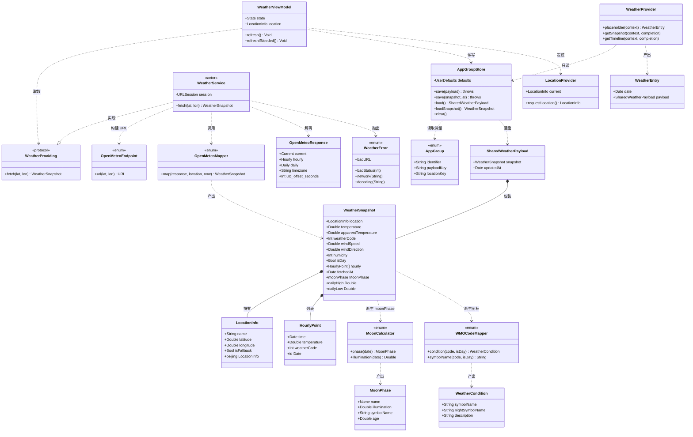
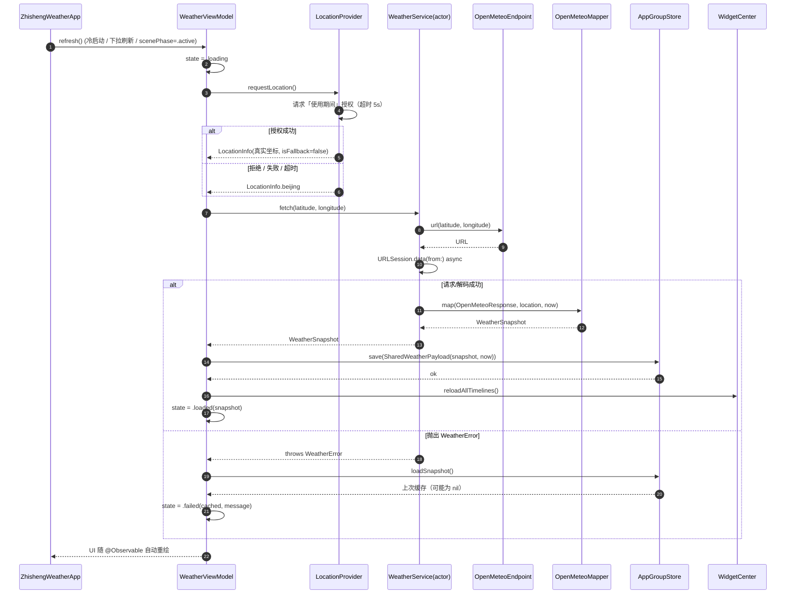
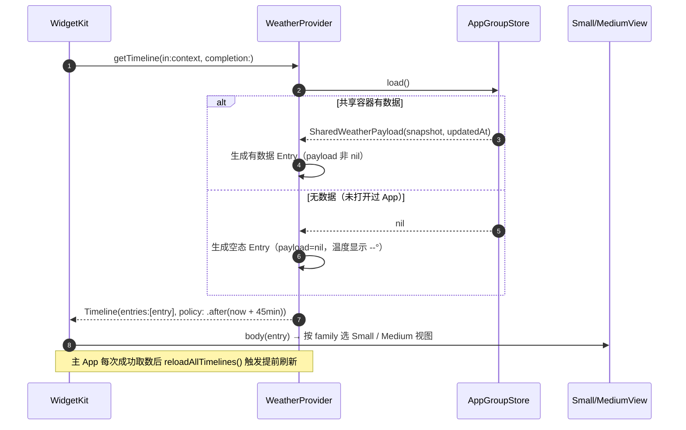
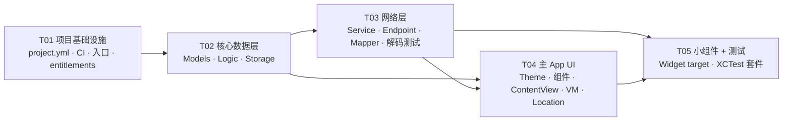

# 系统架构设计与任务分解：枳生天气 · iOS 版（MVP 第一里程碑）

> 版本：v1.2（含 R-D8 / R-D9a / R-D9b / R-CI / **R-AVAIL** 修订，见文末「修订记录」）
> 作者：高见远（架构师）
> 日期：2026-09-11
> 上游输入：`deliverables/software-company/PRD-zhisheng-ios.md`（第 4 节需求池 11 条 P0、第 5 节线框为设计边界）
> 代码根目录：`C:\Users\Lenovo\WorkBuddy\2026-09-10-23-21-44\ZhishengWeatherIOS\`

---

## 0. 设计总览（一页速览）

| 项 | 结论 |
|---|---|
| 交付物 | iOS 工程（主 App + WidgetKit 扩展 + XCTest），由 CI 产出**未签名 IPA** |
| 语言 / UI | Swift 5.9+ / SwiftUI（`@Observable`） |
| 最低版本 | iOS 17.0 |
| 工程生成 | **XcodeGen**（`project.yml` → CI 上 `xcodegen generate` → `.xcodeproj` 进 `.gitignore`） |
| 第三方依赖 | **0 个**（纯系统框架） |
| 架构模式 | 轻量 **MVVM + 分层 Core**；Core 源码被 App 与 Widget 两个 target 同时编译，实现"一份逻辑、两处复用" |
| 数据共享 | **App Group** `group.com.zhisheng.weather`，`UserDefaults(suiteName:)` 存 JSON |
| 数据源 | Open-Meteo `api.open-meteo.com/v1/forecast`（`current` + `hourly` + `daily` + `timezone=auto` + `timeformat=unixtime`） |
| 核心类型数 | 12 个（4 模型 + 3 纯逻辑 + 3 网络 + 2 存储） |
| 文件总数 | **42 个**（39 源文件/配置 + 3 张图） |
| 任务数 | **5 个**（T01～T05，按依赖顺序） |

---

## 1. 实现方案与框架选型

### 1.1 核心难点与应对

| # | 难点 | 应对策略 |
|---|---|---|
| D1 | **Windows 无法编译 iOS**，连 `.xcodeproj` 都建不出来 | 手写 `project.yml`（YAML 文本），CI 的 `macos-14` runner 上 `xcodegen generate`；`.xcodeproj` 不入库 |
| D2 | **App 与 Widget 是独立进程、独立沙盒** | 统一走 App Group：主 App 写、Widget 只读；`UserDefaults(suiteName:)` + `Codable` JSON |
| D3 | **纯逻辑必须能在 macOS runner 上测**（无真机、无签名） | MoonCalc / WMO 映射 / Codable / AppGroupStore 全部做成**无 UI、无网络**的纯函数/可注入类，`xcodebuild test` 跑模拟器 |
| D4 | **未签名 IPA 打包** | `xcodebuild archive` 时 `CODE_SIGNING_ALLOWED=NO`，再手工拼 `Payload/<App>.app` → `zip` 成 `.ipa`，绕开需要签名的 `exportArchive` |
| D5 | **小组件刷新预算受限** | Timeline policy 用 `.after(+45min)`，不用 `.atEnd`；主 App 前台刷新成功后 `WidgetCenter.reloadAllTimelines()` |
| D6 | **Open-Meteo 时间字段时区歧义** | 请求加 `timeformat=unixtime`，时间以 epoch 秒返回，直接 `Date(timeIntervalSince1970:)`，规避 ISO8601 无时区解析坑 |

### 1.2 框架选型与理由

| 领域 | 选型 | 理由 |
|---|---|---|
| UI | **SwiftUI** | WidgetKit 强制 SwiftUI；原项目 Compose 声明式范式可平移 |
| 状态 | **`@Observable`（Observation 框架）** | iOS 17 原生，替代 `ObservableObject` 样板，配合 `@State` 使用 |
| 并发 | **Swift Concurrency（`async/await`）** | 对 `URLSession` 一等公民支持，无回调地狱 |
| 网络 | **`URLSession` + `async`** | 无第三方依赖要求；`urlSession.data(from:)` 一行取数 |
| 解析 | **`Codable`** | 强类型、零依赖、易测 |
| 定位 | **CoreLocation** | 系统框架；"使用期间"授权 |
| 存储 | **`UserDefaults(suiteName:)`** | App Group 场景最轻量，JSON 体积小（约 2–6 KB） |
| 小组件 | **WidgetKit（StaticConfiguration）** | MVP 不需要 AppIntent 配置，静态配置更简单 |
| 测试 | **XCTest** | 系统自带，CI 无需额外依赖 |
| 工程生成 | **XcodeGen** | Windows 友好（写 YAML 不写 pbxproj），避免 `.xcodeproj` 合并冲突 |

**明确排除**：Alamofire / KMP / SPM 外部包 / SwiftData（MVP 数据量小，`UserDefaults` 足够）/ AppIntentConfiguration（P1）。

### 1.3 架构模式与分层

采用**轻量 MVVM + 共享 Core 层**，而非 Clean Architecture（MVP 不需要 UseCase/Repository 双层抽象）：

```
┌───────────────────────────── 主 App target ─────────────────────────────┐
│  View (SwiftUI)  ──观察──▶  WeatherViewModel (@Observable, @MainActor)   │
│                                    │        │                            │
│                          LocationProvider   │                            │
└────────────────────────────────────┼────────┼────────────────────────────┘
                                     ▼        ▼
┌─────────────────────── Core（App + Widget 共用编译）────────────────────┐
│  Networking:  WeatherService (actor) ─▶ OpenMeteoEndpoint / Mapper       │
│  Storage:     AppGroupStore ─▶ AppGroup(常量)                            │
│  Logic:       MoonCalculator / WMOCodeMapper   （纯函数，可测）           │
│  Models:      WeatherSnapshot / HourlyPoint / LocationInfo / Payload     │
│  UI(共用):    Theme / 小组件与主屏复用的小组件视图                        │
└─────────────────────────────────────────────────────────────────────────┘
                                     ▲ 只读
┌────────────────────────  Widget target ─────────────────────────────────┐
│  WeatherProvider(TimelineProvider) ─▶ AppGroupStore.load() ─▶ Small/Medium│
└─────────────────────────────────────────────────────────────────────────┘
```

**关键决策：Core 不建独立 target，而是把 `Core/` 源码目录同时挂到 App 与 Widget 两个 target 的 `sources` 里。**
- 好处：满足"仅 3 个 target"的约束；无需 framework 嵌入/签名配置；Windows 侧 CI 更简单。
- 代价：Core 内不得引用仅主 App 可用的 API（如 `UIApplication`），代码纪律上需遵守（见第 7 节）。

### 1.4 目录结构树

```
ZhishengWeatherIOS/
├── project.yml                     # XcodeGen 工程定义（唯一工程真源）
├── .gitignore                      # 忽略 *.xcodeproj / DerivedData / build
├── README.md                       # 构建与真机安装说明
├── .github/workflows/ios.yml       # CI：macos-14 生成工程 → 测试 → 出未签名 IPA
├── Config/                         # 签名/清单/权限（非源码，被 target 引用）
│   ├── ZhishengWeather.entitlements
│   ├── ZhishengWeatherWidget.entitlements
│   ├── ZhishengWeather-Info.plist
│   └── ZhishengWeatherWidget-Info.plist
├── Core/                           # ★ App + Widget 共用
│   ├── Models/
│   ├── Logic/
│   ├── Storage/
│   ├── Networking/
│   └── UI/{Theme.swift, Components/}
├── ZhishengWeather/                # 主 App target
├── ZhishengWeatherWidget/          # 小组件 target
├── ZhishengWeatherTests/           # XCTest target
└── docs/                           # class-diagram.mermaid / sequence-diagram.mermaid / sequence-diagram-widget.mermaid
```

---

## 2. 文件列表及职责

> 共 **42 个文件**（含 3 张 mermaid 图）。标记 `[共用]` 者会同时被 App 与 Widget 编译。

### 2.1 根目录与配置（8）

| # | 相对路径 | 职责 |
|---|---|---|
| 1 | `project.yml` | XcodeGen 唯一工程真源：3 target、sources、entitlements、App Group、deployment target |
| 2 | `.gitignore` | 忽略 `*.xcodeproj`、`build/`、`DerivedData/`、`*.ipa`、`.DS_Store` |
| 3 | `README.md` | 说明工程生成方式、CI 触发、未签名 IPA 的 sideload 步骤 |
| 4 | `.github/workflows/ios.yml` | CI 流水线：生成工程 → `xcodebuild test` → archive → 拼未签名 IPA → 上传 artifact |
| 5 | `Config/ZhishengWeather.entitlements` | 主 App 的 App Group 权限（`group.com.zhisheng.weather`） |
| 6 | `Config/ZhishengWeatherWidget.entitlements` | Widget 的 App Group 权限（同上，必须一致） |
| 7 | `Config/ZhishengWeather-Info.plist` | 主 App 清单：显示名「枳生天气」、`NSLocationWhenInUseUsageDescription`、`UILaunchScreen` |
| 8 | `Config/ZhishengWeatherWidget-Info.plist` | Widget 清单：`NSExtension` 字典**只含** `NSExtensionPointIdentifier=com.apple.widgetkit-extension`（**不得**写 `NSExtensionPrincipalClass`，理由见下） |

> ⚠️ **R-D8 修正（v1.1，原 v1.0 要求有误，已回退）**
> v1.0 曾要求 Widget 清单写 `NSExtensionPrincipalClass = $(PRODUCT_MODULE_NAME).ZhishengWidgetBundle`。**该要求是错的，已删除**。理由：
> 1. `ZhishengWidgetBundle` 是 `@main struct … : WidgetBundle`，**Swift struct 不符合 `NSObject`、不会注册进 ObjC 运行时**，`NSClassFromString("…ZhishengWidgetBundle")` 恒为 nil；
> 2. `NSExtensionPrincipalClass` 属于 **ObjC 扩展**的加载机制；WidgetKit 扩展入口由 `@main` 合成的 `main()` 提供，**系统不读该键**——Apple 官方 "Widget Extension" 模板的 `NSExtension` 字典**本就只有 `NSExtensionPointIdentifier` 一个键**；
> 3. 危害面：该键写错**编译期不报错、CI 也不失败**，仅在真机「长按桌面 → 添加组件」时才暴露。
>
> 🔴 **验证前置（必须真机执行，CI 无法覆盖）**：安装后长按桌面 → 添加组件 → **应能搜到「枳生天气」且 Small / Medium 均可添加并正常显示**。若搜不到、或添加后空白，则说明在本 SDK 下该键确有作用，需回退本改动（把 `NSExtensionPrincipalClass` 加回）。此项为自签名 sideload 场景的必测项，勿跳过。

### 2.2 Core / Models（5 个，`[共用]`）

| # | 相对路径 | 职责 |
|---|---|---|
| 9 | `Core/Models/LocationInfo.swift` | 城市名 + 经纬度 + `isFallback`；静态 `LocationInfo.beijing` |
| 10 | `Core/Models/HourlyPoint.swift` | 单个逐小时点：`time`/`temperature`/`weatherCode`，`Identifiable` |
| 11 | `Core/Models/WeatherSnapshot.swift` | 领域主模型；`dailyHigh`/`dailyLow` 为**存储属性**（来自 `daily[0]`），仅 `moonPhase` 为派生计算属性 |
| 12 | `Core/Models/OpenMeteoResponse.swift` | Open-Meteo 原始 DTO（`Codable`，`timeformat=unixtime` 后 `time` 为 `Int`） |
| 13 | `Core/Models/SharedWeatherPayload.swift` | 共享容器载荷：`{ snapshot, updatedAt }`，App Group 存储的落盘结构 |

### 2.3 Core / Logic（3 个，`[共用]`）

| # | 相对路径 | 职责 |
|---|---|---|
| 14 | `Core/Logic/WMOCodeMapper.swift` | WMO 0–99 码 → SF Symbol（含夜版）+ 中文现象名；未知码兜底 |
| 15 | `Core/Logic/MoonPhase.swift` | 月相值对象：名称枚举、照亮比例、SF Symbol、月龄 |
| 16 | `Core/Logic/MoonCalculator.swift` | 纯函数月相算法（不依赖网络/UI），输入 `Date` → `MoonPhase` |

### 2.4 Core / Storage（2 个，`[共用]`）

| # | 相对路径 | 职责 |
|---|---|---|
| 17 | `Core/Storage/AppGroup.swift` | 集中定义 App Group ID 与所有共享 key 常量（唯一真源） |
| 18 | `Core/Storage/AppGroupStore.swift` | App Group 读写（`UserDefaults` **可注入**，便于单测）；`save/load/clear` |

### 2.5 Core / Networking（4 个，`[共用]`）

| # | 相对路径 | 职责 |
|---|---|---|
| 19 | `Core/Networking/WeatherProviding.swift` | 协议 + `WeatherError` 枚举（便于注入 Fake 做单测） |
| 20 | `Core/Networking/OpenMeteoEndpoint.swift` | 拼装 URL（`current`/`hourly`/`daily`/`timezone=auto`/`timeformat=unixtime`） |
| 21 | `Core/Networking/OpenMeteoMapper.swift` | 纯函数：DTO → `WeatherSnapshot`（含小时对齐、字段裁剪、空值兜底） |
| 22 | `Core/Networking/WeatherService.swift` | `actor`，`URLSession` + `async` 取数 → 解码 → 映射 → 抛 `WeatherError` |

### 2.6 Core / UI（4 个，`[共用]`）

| # | 相对路径 | 职责 |
|---|---|---|
| 23 | `Core/UI/Theme.swift` | 深色磷光配色（背景/荧光绿/青色/次级文字）、字号常量 |
| 24 | `Core/UI/Components/WeatherSymbol.swift` | 依据码 + 昼夜渲染 SF Symbol 的通用小视图 |
| 25 | `Core/UI/Components/MetricCell.swift` | 指标格（图标 + 数值 + 单位/文字），主屏 2 列网格用 |
| 26 | `Core/UI/Components/HourlyStrip.swift` | 逐小时横向条（列宽 56pt），主屏与 Medium 组件复用 |

### 2.7 主 App target（4 个）

| # | 相对路径 | 职责 |
|---|---|---|
| 27 | `ZhishengWeather/ZhishengWeatherApp.swift` | `@main` 入口，注入 `WeatherViewModel`，监听 `scenePhase` 回前台刷新 |
| 28 | `ZhishengWeather/ContentView.swift` | 主屏：`ScrollView` + 6 区块（顶部栏/Hero/指标格/逐小时/月相/页脚）+ 下拉刷新 |
| 29 | `ZhishengWeather/WeatherViewModel.swift` | `@Observable @MainActor`；编排取数、落盘、刷新 Widget、缓存降级 |
| 30 | `ZhishengWeather/LocationProvider.swift` | CoreLocation 封装：请求"使用期间"授权 → 坐标 → 失败回落北京 |

### 2.8 Widget target（5 个）

| # | 相对路径 | 职责 |
|---|---|---|
| 31 | `ZhishengWeatherWidget/ZhishengWidgetBundle.swift` | `@main WidgetBundle`，注册天气小组件 |
| 32 | `ZhishengWeatherWidget/WeatherEntry.swift` | `TimelineEntry`：`date` / `payload?` |
| 33 | `ZhishengWeatherWidget/WeatherProvider.swift` | `TimelineProvider`：placeholder/snapshot/getTimeline（`.after(+45min)`） |
| 34 | `ZhishengWeatherWidget/SmallWeatherView.swift` | Small 153×153：城市/图标/大字温度/现象/时间；空态 `--°` |
| 35 | `ZhishengWeatherWidget/MediumWeatherView.swift` | Medium 338×153：左栏同 Small + 体感，右栏 4–6 小时趋势 |

### 2.9 测试 target（4 个）

| # | 相对路径 | 职责 |
|---|---|---|
| 36 | `ZhishengWeatherTests/MoonCalculatorTests.swift` | 已知满月/新月日期误差 ≤ 1 天；照亮比例边界 0/1 |
| 37 | `ZhishengWeatherTests/WMOCodeMapperTests.swift` | 抽样码映射正确；未知码兜底不崩溃 |
| 38 | `ZhishengWeatherTests/OpenMeteoDecodingTests.swift` | 内联 JSON 解码 + 映射为 `WeatherSnapshot` 字段对齐 |
| 39 | `ZhishengWeatherTests/AppGroupStoreTests.swift` | 注入临时 suite：存→读往返、时间戳、清空 |

### 2.10 文档（3）

| # | 相对路径 | 职责 |
|---|---|---|
| 40 | `docs/class-diagram.mermaid` | 类图（第 3.2 节同源） |
| 41 | `docs/sequence-diagram.mermaid` | 主 App 取数→落盘→刷新小组件 时序图（第 4.1 节同源） |
| 42 | `docs/sequence-diagram-widget.mermaid` | 小组件 Timeline 生成与渲染 时序图（第 4.2 节同源） |

---

## 3. 数据结构与接口

### 3.1 核心类型签名（Swift）

```swift
// ── Core/Models/LocationInfo.swift ─────────────────────────────
struct LocationInfo: Codable, Equatable, Sendable {
    var name: String
    var latitude: Double
    var longitude: Double
    var isFallback: Bool

    static let beijing = LocationInfo(name: "北京",
                                      latitude: 39.9042,
                                      longitude: 116.4074,
                                      isFallback: true)
}

// ── Core/Models/HourlyPoint.swift ──────────────────────────────
struct HourlyPoint: Codable, Equatable, Identifiable, Sendable {
    var time: Date
    var temperature: Double
    var weatherCode: Int
    var id: Date { time }
}

// ── Core/Models/WeatherSnapshot.swift ──────────────────────────
// 【R-D9b / A2 裁定，v1.1】dailyHigh / dailyLow 为【存储属性】，取自 daily[0]；
// 仅当 daily 缺失 / 长度不足时，由 OpenMeteoMapper 回退 hourly 窗口 min/max。
// moonPhase 仍为【计算属性】（不参与 Codable）。
struct WeatherSnapshot: Codable, Equatable, Sendable {
    var location: LocationInfo
    var temperature: Double          // ℃
    var apparentTemperature: Double  // ℃ 体感
    var weatherCode: Int             // WMO
    var windSpeed: Double            // m/s
    var windDirection: Double        // 0–360 度
    var humidity: Int                // %
    var isDay: Bool
    var hourly: [HourlyPoint]        // 已按 now 起截取，≤ 12 条
    var dailyHigh: Double            // 今日最高温 ℃（存储；daily[0]，缺失时回退 hourly 窗口 max）
    var dailyLow: Double             // 今日最低温 ℃（存储；daily[0]，缺失时回退 hourly 窗口 min）
    var fetchedAt: Date

    // 派生（不参与 Codable 存储，计算得出）
    var moonPhase: MoonPhase { MoonCalculator.phase(for: fetchedAt) }
}

// ── Core/Models/SharedWeatherPayload.swift ─────────────────────
struct SharedWeatherPayload: Codable, Equatable, Sendable {
    var snapshot: WeatherSnapshot
    var updatedAt: Date
}

// ── Core/Models/OpenMeteoResponse.swift ────────────────────────
// 【R-D9b / A2 裁定，v1.1】新增 Daily 块；daily 为可选（缺失时映射层回退）。
struct OpenMeteoResponse: Codable, Sendable {
    struct Current: Codable, Sendable {
        let time: Int                    // epoch 秒（timeformat=unixtime）
        let temperature_2m: Double
        let relative_humidity_2m: Int
        let apparent_temperature: Double
        let weather_code: Int
        let wind_speed_10m: Double
        let wind_direction_10m: Double
        let is_day: Int                  // 0/1
    }
    struct Hourly: Codable, Sendable {
        let time: [Int]
        let temperature_2m: [Double]
        let weather_code: [Int]
    }
    struct Daily: Codable, Sendable {
        let time: [Int]
        let temperature_2m_max: [Double]
        let temperature_2m_min: [Double]
    }
    let timezone: String
    let utc_offset_seconds: Int
    let current: Current
    let hourly: Hourly
    let daily: Daily?                    // 可选：未请求/旧缓存时为 nil
}

// ── Core/Logic/WMOCodeMapper.swift ─────────────────────────────
struct WeatherCondition: Equatable, Sendable {
    let symbolName: String       // 日间 SF Symbol
    let nightSymbolName: String  // 夜间 SF Symbol
    let description: String      // 中文现象名
}

enum WMOCodeMapper {
    static func condition(for code: Int, isDay: Bool) -> WeatherCondition
    static func symbolName(for code: Int, isDay: Bool) -> String
}

// ── Core/Logic/MoonPhase.swift ─────────────────────────────────
struct MoonPhase: Codable, Equatable, Sendable {
    enum Name: String, Codable, Sendable {
        case newMoon        = "朔月"
        case waxingCrescent = "娥眉月"
        case firstQuarter   = "上弦月"
        case waxingGibbous  = "盈凸月"
        case fullMoon       = "满月"
        case waningGibbous  = "亏凸月"
        case lastQuarter    = "下弦月"
        case waningCrescent = "残月"
    }
    let name: Name
    let illumination: Double   // 0.0 – 1.0
    let symbolName: String     // SF Symbol: moonphase.*
    let age: Double            // 月龄（天）
}

// ── Core/Logic/MoonCalculator.swift ────────────────────────────
enum MoonCalculator {
    static func phase(for date: Date) -> MoonPhase
    static func illumination(for date: Date) -> Double   // 0–1
}

// ── Core/Storage/AppGroup.swift ────────────────────────────────
enum AppGroup {
    static let identifier = "group.com.zhisheng.weather"
    static let payloadKey = "zs.weather.payload"
    static let locationKey = "zs.weather.location"   // 最近一次查询坐标（P1 复用）
}

// ── Core/Storage/AppGroupStore.swift ───────────────────────────
final class AppGroupStore {
    private let defaults: UserDefaults
    private let encoder = JSONEncoder()
    private let decoder = JSONDecoder()

    /// defaults 可注入：生产传 suiteName，测试传临时 suite
    init(defaults: UserDefaults? = UserDefaults(suiteName: AppGroup.identifier))

    func save(_ payload: SharedWeatherPayload) throws
    func save(snapshot: WeatherSnapshot, at date: Date) throws
    func load() -> SharedWeatherPayload?
    func loadSnapshot() -> WeatherSnapshot?
    var updatedAt: Date? { get }
    func clear()
}

// ── Core/Networking/WeatherProviding.swift ─────────────────────
enum WeatherError: Error, Equatable, Sendable {
    case badURL
    case badStatus(Int)
    case network(String)
    case decoding(String)
}

protocol WeatherProviding: Sendable {
    func fetch(latitude: Double, longitude: Double) async throws -> WeatherSnapshot
}

// ── Core/Networking/OpenMeteoEndpoint.swift ────────────────────
enum OpenMeteoEndpoint {
    static func url(latitude: Double, longitude: Double) -> URL?
}

// ── Core/Networking/OpenMeteoMapper.swift ──────────────────────
enum OpenMeteoMapper {
    /// 【R-D9a，v1.1】签名以 §7.3「now 注入」原则 + 主理人裁定为准，
    /// **取代本文件 v1.0 的 `map(_:location:)` 旧签名**（原签名与 §7.3 自相矛盾）。
    /// 纯函数：DTO + 定位 + now → 领域模型；hourly 截取 now 起前 12 条；
    /// dailyHigh/Low 优先取 daily[0]，缺失时回退 hourly 窗口 min/max。
    static func map(_ response: OpenMeteoResponse,
                    location: LocationInfo,
                    now: Date) -> WeatherSnapshot
}

// ── Core/Networking/WeatherService.swift ───────────────────────
actor WeatherService: WeatherProviding {
    init(session: URLSession = .shared, now: @escaping @Sendable () -> Date = Date.init)
    func fetch(latitude: Double, longitude: Double) async throws -> WeatherSnapshot
}

// ── 主 App：ZhishengWeather/LocationProvider.swift ─────────────
@MainActor
final class LocationProvider: NSObject, CLLocationManagerDelegate {
    private(set) var current: LocationInfo = .beijing
    func requestLocation() async -> LocationInfo   // 授权/失败/超时 → .beijing
}

// ── 主 App：ZhishengWeather/WeatherViewModel.swift ─────────────
@MainActor
@Observable
final class WeatherViewModel {
    enum State: Equatable {
        case loading
        case loaded(WeatherSnapshot)
        case failed(cached: WeatherSnapshot?, message: String)
    }
    private(set) var state: State = .loading
    private(set) var location: LocationInfo = .beijing

    init(service: WeatherProviding = WeatherService(),
         store: AppGroupStore = AppGroupStore(),
         locationProvider: LocationProvider = LocationProvider())

    func refresh() async          // 冷启动 / 下拉刷新
    func refreshIfNeeded() async  // 回到前台
}

// ── Widget：ZhishengWeatherWidget/WeatherEntry.swift ───────────
// 【R-D9c，v1.1】原 `var isStale: Bool { payload == nil }` 为死代码，已删除；
// 空态判定统一由视图侧 `entry.payload == nil` 直接判断。
struct WeatherEntry: TimelineEntry {
    let date: Date
    let payload: SharedWeatherPayload?
}
```

### 3.2 类图（Mermaid）



---

## 4. 关键流程时序

### 4.1 主 App：取数 → 映射 → 落盘 → 刷新小组件



### 4.2 小组件：Timeline 生成与渲染



---

## 5. 任务列表（有序，按依赖）

> 5 个任务，每个 ≥3 文件；T01 为项目基础设施（配置 + 入口 + CI 合一）。
> **工程师按 T01 → T05 顺序实现；除 T01 外，各任务尽量只强依赖前序必要任务。**

### T01 · 项目基础设施与工程生成 — P0

| 项 | 内容 |
|---|---|
| **源文件** | `project.yml`、`.gitignore`、`README.md`、`.github/workflows/ios.yml`、`Config/ZhishengWeather.entitlements`、`Config/ZhishengWeatherWidget.entitlements`、`Config/ZhishengWeather-Info.plist`、`Config/ZhishengWeatherWidget-Info.plist`、`ZhishengWeather/ZhishengWeatherApp.swift`、`docs/{class-diagram,sequence-diagram,sequence-diagram-widget}.mermaid` |
| **依赖** | 无 |
| **关键点** | ① `project.yml` 定义 3 target（app / app-extension / bundle.unit-test），App 与 Widget 均挂 `Core/` 目录；② 两个 target 都要 `CODE_SIGN_ENTITLEMENTS` 指向各自 entitlements 且 App Group 一致；③ Widget 清单 `NSExtension` **只含** `NSExtensionPointIdentifier = com.apple.widgetkit-extension`，**不得写 `NSExtensionPrincipalClass`**（Swift struct 不进 ObjC 运行时、系统不读该键；理由见 §2.1 R-D8）；④ CI 中 `brew install xcodegen` → `xcodegen generate`；⑤ archive 用 `CODE_SIGNING_ALLOWED=NO CODE_SIGNING_REQUIRED=NO CODE_SIGN_IDENTITY=""` → 拼 `Payload/` → `zip` 成 IPA → `actions/upload-artifact`；⑥ CI shell 禁 `… | head -n1`、destination 锁 `OS=latest`（见 §7.8 R-CI）；⑦ **真机验证前置**：长按桌面→添加组件须能搜到「枳生天气」且 Small/Medium 可添加（CI 覆盖不到，见 §2.1） |

### T02 · 核心数据层与纯逻辑 — P0

| 项 | 内容 |
|---|---|
| **源文件** | `Core/Models/{LocationInfo,HourlyPoint,WeatherSnapshot,OpenMeteoResponse,SharedWeatherPayload}.swift`、`Core/Logic/{WMOCodeMapper,MoonPhase,MoonCalculator}.swift`、`Core/Storage/{AppGroup,AppGroupStore}.swift`（共 10 个） |
| **依赖** | T01 |
| **关键点** | ① 全部 `Codable + Equatable + Sendable`；② `AppGroupStore` 的 `UserDefaults` 必须**可注入**；③ `MoonCalculator` 为纯函数，无 `Date()` 内部调用（`now` 由外部传入）；④ WMO 映射覆盖 0–99 常用码 + 未知兜底 |

### T03 · 网络层（取数 / URL / 映射） — P0

| 项 | 内容 |
|---|---|
| **源文件** | `Core/Networking/{WeatherProviding,OpenMeteoEndpoint,OpenMeteoMapper,WeatherService}.swift`、`ZhishengWeatherTests/OpenMeteoDecodingTests.swift`（共 5 个） |
| **依赖** | T02 |
| **关键点** | ① URL 参数必须含 `current`、`hourly`、`timezone=auto`、`timeformat=unixtime`；② `hourly` 截取 `now` 起 ≤12 条；③ 所有失败路径收敛为 `WeatherError`，严禁 `fatalError`/强制解包；④ 解码测试用内联 JSON 字符串，不联网 |

### T04 · 主 App UI 层（主题 / 组件 / 主屏 / 视图模型） — P0

| 项 | 内容 |
|---|---|
| **源文件** | `Core/UI/Theme.swift`、`Core/UI/Components/{WeatherSymbol,MetricCell,HourlyStrip}.swift`、`ZhishengWeather/ContentView.swift`、`ZhishengWeather/WeatherViewModel.swift`、`ZhishengWeather/LocationProvider.swift`（共 7 个） |
| **依赖** | T02、T03 |
| **关键点** | ① 严格对齐第 5 节线框的 6 区块层级与视觉权重；② `WeatherViewModel` 为 `@Observable @MainActor`，编排"取数→落盘→`reloadAllTimelines()`→缓存降级"；③ `LocationProvider` 需有 5s 超时回落，绝不循环弹窗；④ iPhone SE（375pt）无横向溢出 |

### T05 · 小组件与测试套件 — P0

| 项 | 内容 |
|---|---|
| **源文件** | `ZhishengWeatherWidget/{ZhishengWidgetBundle,WeatherEntry,WeatherProvider,SmallWeatherView,MediumWeatherView}.swift`、`ZhishengWeatherTests/{MoonCalculatorTests,WMOCodeMapperTests,AppGroupStoreTests}.swift`（共 8 个） |
| **依赖** | T02、T03、T04 |
| **关键点** | ① 一个 widget 通过 `supportedFamilies([.systemSmall, .systemMedium])` 支持两种尺寸；② 必须用 `.containerBackground`（iOS 17）；③ 空态/单色/着色渲染模式均可读；④ 测试覆盖月相误差 ≤1 天、WMO 兜底、App Group 往返（用临时 suite） |

### 任务依赖图



| 任务 | 优先级 | 依赖 | 文件数 |
|---|---|---|---|
| T01 项目基础设施与工程生成 | P0 | — | 12 |
| T02 核心数据层与纯逻辑 | P0 | T01 | 10 |
| T03 网络层 | P0 | T02 | 5 |
| T04 主 App UI 层 | P0 | T02, T03 | 7 |
| T05 小组件与测试套件 | P0 | T02, T03, T04 | 8 |

---

## 6. 依赖包列表

**预期为空，已确认：本项目不引入任何第三方依赖。**

| 类别 | 使用的系统框架 | 说明 |
|---|---|---|
| UI | `SwiftUI` | 主屏 + 小组件视图 |
| 小组件 | `WidgetKit` | `TimelineProvider` / `TimelineEntry` / `containerBackground` |
| 定位 | `CoreLocation` | `CLLocationManager`「使用期间」授权 |
| 网络 | `Foundation`（`URLSession` + `async/await`） | 取数 |
| 解析 | `Foundation`（`Codable`/`JSONDecoder`） | DTO 与领域模型 |
| 存储 | `Foundation`（`UserDefaults`） | App Group 共享容器 |
| 状态 | `Observation`（`@Observable`） | iOS 17 原生 |
| 测试 | `XCTest` | 单元测试 |

**仅 CI 侧工具**（非 App 依赖）：`xcodegen`（`brew install`）。无 SPM / CocoaPods / Carthage 清单文件。

---

## 7. 共享知识 / 跨文件约定

### 7.1 命名规范

| 对象 | 规范 | 示例 |
|---|---|---|
| 类型 | `UpperCamelCase` | `WeatherSnapshot` |
| 方法/属性 | `lowerCamelCase` | `apparentTemperature` |
| 常量（App Group key） | `lowerCamel` + 前缀 `zs.` | `"zs.weather.payload"` |
| Bundle ID | `com.zhisheng.weather`（主）/ `com.zhisheng.weather.widget`（扩展） | — |
| App Group ID | `group.com.zhisheng.weather` | — |
| 显示名 | 「枳生天气」 | `CFBundleDisplayName` |

### 7.2 跨层纪律（**Core 目录内的硬约束**）

- `Core/**` 会被 **App 与 Widget 两个 target 同时编译**，因此：
  - ❌ 禁止 `import UIKit` / 使用 `UIApplication` / `@UIApplicationDelegateAdaptor`；
  - ✅ 仅用 `SwiftUI` / `WidgetKit` / `Foundation` / `CoreLocation` 中两端皆可用的 API；
  - 需要主 App 专有 API 的代码（如 `scenePhase` 编排）一律放 `ZhishengWeather/` 目录。

### 7.3 日期与时区

| 场景 | 约定 |
|---|---|
| 请求参数 | `timezone=auto`（跟随坐标时区）**且** `timeformat=unixtime` |
| 解析 | 所有时间字段为 epoch 秒（`Int`），`Date(timeIntervalSince1970:)` 转换，**不做字符串解析**（规避 ISO8601 无偏移歧义） |
| 存储 | `JSONEncoder` 默认 `Date` 编码为 `Double`（epoch）；读侧用同一 `JSONDecoder` |
| 展示 | 统一用设备本地时区 `DateFormatter`（`HH:mm` / `M月d日`） |
| `now` 注入 | 所有涉及"当前时间"的纯函数（`MoonCalculator`、`OpenMeteoMapper` 截窗）**必须把 `now` 作为参数传入**，禁止内部调 `Date()`，以保证可测 |

### 7.4 单位换算与取值

| 量 | 单位 | 来源 | 展示 |
|---|---|---|---|
| 温度 / 体感 | ℃ | `temperature_2m` / `apparent_temperature` | 四舍五入为整数 `"23°"` |
| 风速 | m/s | `wind_speed_10m` | `String(format: "%.1f", …)` + `" m/s"` |
| 风向 | 度 → 中文 | `wind_direction_10m` | 16 方位或 8 方位中文（北/东北/东…） |
| 湿度 | % | `relative_humidity_2m` | 整数 + `"%"` |
| 照亮比例 | 0–1 | `MoonPhase.illumination` | `Int(round(x*100))` + `"%"` |

### 7.5 可选值策略

- **禁止** `!` 强制解包与 `try!`（除 `AppGroupStore` 内部已知安全路径，也需 `do/catch` 兜底）。
- DTO 字段与数组长度不齐时，`OpenMeteoMapper` 取三者最小长度对齐，缺失补 `nil` 剔除，**不崩溃**。
- 网络层统一 `throws WeatherError`；VM 捕获后进入 `.failed(cached:message:)`，UI 用缓存 + "更新于 HH:mm" 降级。
- VM 初始化时先 `store.loadSnapshot()` 预填，保证**冷启动 0 网络也能出内容**。

### 7.6 App Group key 集中定义

所有共享 key 只在 `Core/Storage/AppGroup.swift` 定义，其他文件一律引用常量，禁止散落字符串字面量：

```swift
enum AppGroup {
    static let identifier = "group.com.zhisheng.weather"
    static let payloadKey = "zs.weather.payload"
    static let locationKey = "zs.weather.location"
}
```

### 7.7 错误与日志

- `WeatherError` 为唯一网络/解析错误类型，`Equatable` 便于测试断言。
- MVP 用 `print` 或 `os.Logger`（`os` 框架，两端可用）输出取数失败原因，不引入日志库。

### 7.8 硬性纪律（CI 侧 + 跨版本/跨平台）

本节的纪律与「风格建议」不同：**违反其中任何一条，都会在 CI 或真机上产生失败，而且多数不会在改动点当场报错。**

#### 7.8.1 CI 侧约定

- 工作流文件名固定 `.github/workflows/ios.yml`；触发方式：`workflow_dispatch` + `push`（main）。
- 固定 runner `macos-14`；显式锁定 Xcode 版本（避免漂移）。
- `.xcodeproj` **不入库**，由 CI 每次生成；本地 Windows 只维护 `project.yml`。
- 产物：`ZhishengWeather-unsigned.ipa` + 测试结果，均以 `actions/upload-artifact` 上传。

**🔴 R-CI 硬纪律（v1.1 新增，QA 判定为「全流水线最可能首次即挂」的位置）**

1. **禁止在 `set -o pipefail` 的 shell 里写 `… | head -n1`**。`head` 读满一行即退出并关闭管道，上游会收到 **SIGPIPE（退出码 141）**，pipefail 会把整条管道判为失败 → step 直接挂。要「取第一行」请改用 **`grep -m1`**（让上游自己停下），或显式 `|| true` 兜底后另行判空。
2. **模拟器 `-destination` 必须锁 `OS=latest`**，例如 `-destination 'platform=iOS Simulator,name=iPhone 15,OS=latest'`。否则当 runner 上机型存在、但可用运行时低于 `IPHONEOS_DEPLOYMENT_TARGET`（iOS 17.0）时，destination 同样匹配失败、`xcodebuild` 报错退出。
3. （沿用）`xcodebuild test` 建议补 `-resultBundlePath build/TestResults.xcresult`，否则上传测试结果的 artifact step 永远匹配不到文件（见评估报告 M2）。

#### 7.8.2 跨版本纪律：`#available` 只能兜住「运行时缺失」（v1.2 新增）

> **本条为 R-AVAIL 纪律，来源见文末修订记录。它记录的是本项目一次真实事故的教训：曾把 `IPHONEOS_DEPLOYMENT_TARGET` 由 17.0 下调到 16.0，结果主 App 直接编译失败、CI 必红。**

**核心命题**：

> 🔴 **任何涉及 `#available` 的兼容处理，必须先判定被保护的 API 属于「运行时缺失」还是「编译期缺失」。只有前者能用 `#available` 兜住。**

| 缺失类型 | 含义 | 不满足版本要求时的表现 | `#available` 能否兜住 |
|---|---|---|---|
| **运行时缺失** | 该 API 的**符号**在低版本系统上不存在，但**编译期可见**（声明为 `@available(iOS 17, *)` 的普通 API） | 编译器不报错；运行时走到该分支则崩溃/无效，需靠 `#available` 分流 | ✅ **能** |
| **编译期缺失** | 该 API **在编译期就参与语法或语义解析**（宏展开、重载决议、类型检查），低版本下不成立 | 🔴 **编译期直接报错**（`'X' is only available in iOS 17.0 or newer`） | ❌ **不能** —— `#available` 是运行时判断，**语法上无法包裹宏、也无法影响重载决议** |

**本项目实测对照表**：

| API | 缺失类型 | `#available` 能否兜住 | 证据 |
|---|---|---|---|
| `.containerBackground(for: .widget)` | **运行时** | ✅ 能 | `ZhishengWeatherWidget/WidgetBackground.swift` 用 `if #available(iOS 17.0, *)` 双写；iOS 16 退回 `padding + background()`，**编译通过** |
| `@Observable` 宏 | 🔴 **编译期**（宏展开） | ❌ **不能** | 宏声明为 `@available(macOS 14, iOS 17, watchOS 10, tvOS 17, *)`；部署目标 16.0 下 `WeatherViewModel.swift` **编译失败** |
| `.onChange(of:) { _, new in }` 双参闭包 | 🔴 **编译期**（重载决议） | ❌ **不能** | 双参重载 iOS 17 才存在；部署目标 16.0 下重载决议失败，`ZhishengWeatherApp.swift` **编译失败** |

**⚠️ 反向纪律（最重要的一条）**：

> 🔴 **若把部署目标下调到某版本，必须全量搜一遍该版本之后新增的「宏 / 属性包装器」与「重载签名变更」—— 它们不会以编译错误的形式出现在「你改的那几个文件」里，而是散落在你没碰的文件中。**
>
> 换言之：**编译器不会告诉你「还有哪些文件没改」。** 编译器只会把错报在它恰好编译到的第一个文件上，而**你对「哪些 API 受版本影响」的认知盲区，编译器无法替你补全**。
>
> 本项目的实例：任务 B 的作者正确地把 Widget 侧 `containerBackground` 做了双写兼容（他改的文件全部正确），但**完全没意识到主 App 的 `@Observable` 与 `.onChange` 双参也在受影响范围内**——因为它们在他没打开的文件里。他最终靠**人工写注释自陈**（`project.yml` 第 29–39 行的「遗留不确定项」）才留下了线索，属侥幸。

**执行清单（下调部署目标前，逐项打勾）**：

| # | 动作 | 命令 / 方法 |
|---|---|---|
| 1 | 全量搜索**宏与属性包装器**（`@` 开头） | `grep -rn "@Observable\|@Model\|@Bindable\|@Entry\|@Previewable" --include=*.swift .` |
| 2 | 全量搜索**重载签名变更**（双参闭包是重灾区） | `grep -rn "onChange(of:.*) { *_,\|onChange(of:.*, *{" --include=*.swift .` |
| 3 | 全量搜索**版本相关的新修饰符 / 新类型** | 已知清单：`containerBackground` / `ContentUnavailableView` / `SwiftData` / `symbolEffect` / `NavigationStack`(16+) / `scrollPosition` |
| 4 | 逐项确定**缺失类型**（运行时 or 编译期） | 查该 API 的声明；**凡带 `@attached`/`@freestanding` 的宏、或需重载决议的 API，一律归为编译期** |
| 5 | 编译期缺失项：**评估改造量**，不要只改 `project.yml` | 例：`@Observable` → `ObservableObject` + `@Published`（且视图侧 `@State`→`@StateObject` 需同步改） |
| 6 | **在 CI 上验证**（不能只靠本地） | 部署目标变更**必须**跑一次完整 `xcodebuild test`；`xcodegen generate` 成功 ≠ 编译成功 |

> 📌 **决策边界**：若「编译期缺失」项的改造量 > 下调版本带来的收益，**应当放弃下调部署目标**，而不是硬改代码。本项目即据此**保持 17.0**（详见 `ARCH-zhisheng-ios-signing.md` §4.5.4 与 `project.yml` 的技术决策记录）。

**与其它纪律的关系**：

| 纪律 | 关系 |
|---|---|
| R-CI（§7.8.1） | R-AVAIL 的**现象**会在 CI 上暴露（`xcodebuild test` 编译失败），但**根因**在版本兼容判断，不在 CI 脚本 → 两条纪律互补，不可互替 |
| R-D8（§2.1） | 同属「编译期不报错、只在真机暴露」类；R-D8 是 **plist 键**层面，R-AVAIL 是 **API 版本**层面 |
| R-D9a（§3.1） | 同属「文档与实现漂移」类；R-AVAIL 补充的是**认知盲区**类（不是漂移，是漏项） |

---

## 8. 待明确事项（Assumptions & Open Questions）

| # | 事项 | 我的假设（已据此设计，若不符请回退） |
|---|---|---|
| A1 | **月相算法基准** | 采用天文学常用"平均朔望月 29.530588 天 + 已知新月锚点（2000-01-06 18:14 UTC）"近似算法，AC 要求误差 ≤1 天，满足；不引入外部星历表 |
| A2 | **高/低温来源【已裁定 v1.1】** | **采纳 `daily` 参数**：URL 追加 `daily=temperature_2m_max,temperature_2m_min`；`WeatherSnapshot.dailyHigh/dailyLow` 为**存储属性**，取 `daily[0]`；仅当 `daily` 缺失/长度不足时由 `OpenMeteoMapper` 回退 hourly 窗口 min/max。理由：线框 ↑22°↓15° 语义是「今日高低温」，12 小时前向窗口在凌晨会漏掉午后高温，语义错误。 |
| A3 | **风向中文分级** | 采用 8 方位（北/东北/东/东南/南/西南/西/西北）；若需 16 方位再加 |
| A4 | **测试宿主** | 单测 target 依赖主 App target，`@testable import ZhishengWeather` 访问 Core 类型；**AppGroupStore 测试用 `UserDefaults(suiteName: "zs.test.\(UUID())")` 临时 suite**，不依赖真实 App Group entitlement（测试 bundle 无该权限） |
| A5 | **Widget 空态** | Small 温度位显示 `--°`，图标位用 `questionmark` 兜底，文案「暂无数据」，时间位留空 |
| A6 | **`project.yml` 中 `DEVELOPMENT_TEAM`** | 未签名构建留空（`""`）；P1 做签名时改为 `$(TEAM_ID)` 从 secret 注入 |
| A7 | **App Group 一致性的验证方式** | 无法在 Windows 本地验证；以"两个 entitlements 文件内容一致 + CI 构建通过"为准，真机首次安装后由用户目视确认小组件能读到数据 |

---

## 附录 A：`project.yml` 参考骨架（T01 直接可用）

```yaml
name: ZhishengWeather
options:
  bundleIdPrefix: com.zhisheng
  deploymentTarget:
    iOS: "17.0"
  createIntermediateGroups: true

settings:
  base:
    MARKETING_VERSION: "0.1.0"
    CURRENT_PROJECT_VERSION: "1"
    SWIFT_VERSION: "5.9"
    IPHONEOS_DEPLOYMENT_TARGET: "17.0"
    ENABLE_USER_SCRIPT_SANDBOXING: NO
    DEVELOPMENT_TEAM: ""

targets:
  ZhishengWeather:
    type: application
    platform: iOS
    sources:
      - path: ZhishengWeather
      - path: Core
    settings:
      base:
        PRODUCT_BUNDLE_IDENTIFIER: com.zhisheng.weather
        INFOPLIST_FILE: Config/ZhishengWeather-Info.plist
        CODE_SIGN_ENTITLEMENTS: Config/ZhishengWeather.entitlements
        GENERATE_INFOPLIST_FILE: NO
        TARGETED_DEVICE_FAMILY: "1,2"
    dependencies:
      - target: ZhishengWeatherWidget
        embed: true

  ZhishengWeatherWidget:
    type: app-extension
    platform: iOS
    sources:
      - path: ZhishengWeatherWidget
      - path: Core
    settings:
      base:
        PRODUCT_BUNDLE_IDENTIFIER: com.zhisheng.weather.widget
        INFOPLIST_FILE: Config/ZhishengWeatherWidget-Info.plist
        CODE_SIGN_ENTITLEMENTS: Config/ZhishengWeatherWidget.entitlements
        SKIP_INSTALL: YES
        GENERATE_INFOPLIST_FILE: NO

  ZhishengWeatherTests:
    type: bundle.unit-test
    platform: iOS
    sources:
      - path: ZhishengWeatherTests
    settings:
      base:
        PRODUCT_BUNDLE_IDENTIFIER: com.zhisheng.weather.tests
        GENERATE_INFOPLIST_FILE: YES
    dependencies:
      - target: ZhishengWeather
```

## 附录 B：CI 关键步骤（`.github/workflows/ios.yml` 骨架）

```yaml
name: iOS Build
on:
  workflow_dispatch:
  push:
    branches: [ main ]

jobs:
  build:
    runs-on: macos-14
    timeout-minutes: 45
    steps:
      - uses: actions/checkout@v4

      - name: Lock Xcode
        uses: maxim-lobanov/setup-xcode@v1
        with:
          xcode-version: '15.4'

      - name: Install XcodeGen
        run: brew install xcodegen

      - name: Generate Xcode project
        run: xcodegen generate --spec project.yml

      # ⚠️ 取模拟器必须用 grep -m1（不要 `… | head -n1`）：head 提前退出会令
      #    上游 grep 收到 SIGPIPE(141)，在 set -o pipefail 下整条管道判失败。
      - name: Pick an available iPhone simulator
        id: sim
        run: |
          set -euo pipefail
          DEVICE=$(xcrun simctl list devices available \
            | grep -m1 -Eo 'iPhone [0-9]+( Pro Max| Pro| Plus| mini)?' || true)
          if [ -z "$DEVICE" ]; then DEVICE="iPhone 15"; fi
          echo "device=$DEVICE" >> "$GITHUB_OUTPUT"
          echo "Selected simulator: $DEVICE"

      - name: Run unit tests (simulator)
        run: |
          xcodebuild test \
            -project ZhishengWeather.xcodeproj \
            -scheme ZhishengWeather \
            -destination "platform=iOS Simulator,name=${{ steps.sim.outputs.device }},OS=latest" \
            -resultBundlePath build/TestResults.xcresult \
            CODE_SIGNING_ALLOWED=NO

      - name: Archive (unsigned)
        run: |
          xcodebuild archive \
            -project ZhishengWeather.xcodeproj \
            -scheme ZhishengWeather \
            -configuration Release \
            -destination 'generic/platform=iOS' \
            -archivePath build/ZhishengWeather.xcarchive \
            CODE_SIGNING_ALLOWED=NO \
            CODE_SIGNING_REQUIRED=NO \
            CODE_SIGN_IDENTITY=""

      - name: Package unsigned IPA
        run: |
          mkdir -p build/Payload
          cp -R build/ZhishengWeather.xcarchive/Products/Applications/ZhishengWeather.app build/Payload/
          cd build && zip -r ZhishengWeather-unsigned.ipa Payload

      - uses: actions/upload-artifact@v4
        with:
          name: ZhishengWeather-unsigned-ipa
          path: build/ZhishengWeather-unsigned.ipa
```

> ⚠️ **CI 注意（v1.1 增补 R-CI）**：
> - XcodeGen 生成的 scheme 名为 `ZhishengWeather`；`macos-14` 自带 Xcode 15.x。
> - **禁 `… | head -n1`**：`head` 提前退出令上游收到 SIGPIPE(141)，`set -o pipefail` 下整条管道判失败 → step 直接挂。取机型请用 `grep -m1`（见上例）。
> - **destination 必锁 `OS=latest`**：否则机型在、运行时低于 iOS 17.0 时同样匹配失败。
> - 补 `-resultBundlePath build/TestResults.xcresult`，让「上传测试结果」artifact 真正有文件可传。

---

## 附录 C：需求 → 任务覆盖矩阵

| 需求 | 覆盖任务 |
|---|---|
| P0-1 定位与坐标解析 | T04（LocationProvider） |
| P0-2 Open-Meteo 接入与解析 | T02（DTO）、T03（Service/Mapper） |
| P0-3 天气码映射 | T02（WMOCodeMapper） |
| P0-4 月相计算 | T02（MoonCalculator）、T05（测试） |
| P0-5 天气主屏 UI | T04 |
| P0-6 逐小时组件 | T04（HourlyStrip） |
| P0-7 App Group 共享数据层 | T01（entitlements）、T02（AppGroupStore） |
| P0-8 Widget Small | T05 |
| P0-9 Widget Medium | T05 |
| P0-10 刷新与降级策略 | T04（VM）、T05（Timeline policy） |
| P0-11 Actions 出 IPA | T01 |

---

## 修订记录（v1.2，2026-09-11）

> **v1.2 为单点新增**（R-AVAIL），不影响 v1.1 的任何既有结论。

| 编号 | 类型 | 改动位置 | 改动内容 | 理由 |
|---|---|---|---|---|
| **R-AVAIL** | 新增（跨版本硬性纪律） | §7.8 由「CI 侧约定」扩展为「硬性纪律（CI 侧 + 跨版本/跨平台）」；**新增 §7.8.2**；v1.1 原有 CI 内容收拢为 §7.8.1（原文未改一字） | 新增「`#available` 只能兜住**运行时缺失**」纪律：① 核心命题；② 运行时 vs 编译期缺失对照表；③ 本项目实测三行对照表（`.containerBackground` ✅ / `@Observable` ❌ / `.onChange` 双参 ❌）；④ **反向纪律——编译器不会告诉你「还有哪些文件没改」**；⑤ 6 项执行清单（含 `grep` 命令）；⑥ 与 R-CI / R-D8 / R-D9a 的关系界定 | 本项目真实事故：`IPHONEOS_DEPLOYMENT_TARGET` 曾被下调至 16.0，任务 B 正确兼容了 Widget 侧 `containerBackground`（运行时缺失），却**完全未察觉**主 App 的 `@Observable` 与 `.onChange` 双参（均为**编译期**缺失、`#available` 语法上兜不住），导致主 App 编译失败、CI 必红。**该教训只留在过程报告里会被埋掉，必须固化为纪律**（主理人裁定） |

> ⚠️ **v1.2 的边界**：本次**未改动任何版本结论**——部署目标仍为 **17.0**（§7.8.2 的决策边界即据此写成）；**未改动任何 `.swift` / `project.yml` / CI**；**未改动过程证据文档** `ARCH-zhisheng-ios-signing.md` 与 `ARCH-zhisheng-ios-ios16-verdict.md`（后者刻意保持原样，以保留「当时如何判断」的证据价值）。
>
> 📌 **v1.2 与配套文档的分工**：
> | 文档 | 定位 | 内容 |
> |---|---|---|
> | **本文件 §7.8.2** | **架构侧纪律**（长期有效、跨项目可复用） | 「如何判断某 API 能否用 `#available` 兜住」的通用规则 |
> | `ARCH-zhisheng-ios-signing.md` §4.5.4 | **签名/部署侧判据** | iOS 16 与 F-C 的绑定关系 |
> | `ARCH-zhisheng-ios-ios16-verdict.md` | **过程证据**（不再修改） | 当时的实测数据与裁定过程 |
> | `project.yml` 第 15–53 行注释块 | **代码侧决策记录** | 「为何保持 17.0」「日后真要支持 16 需先做哪两项改造」 |

---

## 修订记录（v1.1，2026-09-11）

> 依据 QA 独立验证报告（`deliverables/software-company/QA-zhisheng-ios.md`）与主理人裁定，对本架构文档做以下 **5 项**就地修订。**未新建版本文件。**

| 编号 | 类型 | 改动位置 | 改动内容 | 理由 |
|---|---|---|---|---|
| **R-D8** | 必改（回退错误要求） | §2.1 文件表第 8 行 + 新增说明块；T01 关键点 ③、⑦；§7.8 沿用项 | **删除**对 Widget 清单 `NSExtensionPrincipalClass = $(PRODUCT_MODULE_NAME).ZhishengWidgetBundle` 的要求，改为「`NSExtension` 只含 `NSExtensionPointIdentifier = com.apple.widgetkit-extension`」；补理由 + 真机验证前置 | `ZhishengWidgetBundle` 是 `@main struct`（`WidgetBundle`），**Swift struct 不符合 `NSObject`、不进 ObjC 运行时**，该键恒解析为 nil；`NSExtensionPrincipalClass` 属 ObjC 扩展加载机制，WidgetKit 入口由 `@main` 合成 `main()` 提供，**系统不读该键**；Apple 官方模板的 `NSExtension` 本就只有 `NSExtensionPointIdentifier`。该错误**编译期不报错、CI 也不失败**，只在真机添加组件时暴露 → 必须写明真机验证前置（长按桌面→添加组件→须能搜到「枳生天气」且 Small/Medium 可添加；否则回退本改动） |
| **R-D9a** | 必改（消除文档内部矛盾） | §3.1 `OpenMeteoMapper` 代码块；§3.2 类图 `OpenMeteoMapper` 节点；§4.1 时序图 | 签名由 `map(_:location:)` 更正为 **`map(_ response:location:now:)`**，并注明「以 §7.3 + 主理人裁定为准，取代 §3.1 原签名」 | v1.0 的 §3.1 签名与 §7.3「now 注入（纯函数禁内部调 `Date()`）」自相矛盾；实现（`Core/Networking/OpenMeteoMapper.swift:28`）已按 §7.3 带 `now`，**实现正确、文档陈旧** |
| **R-D9b** | 必改（体现 A2 裁定） | §3.1 `WeatherSnapshot` 代码块；§3.1 `OpenMeteoResponse` 代码块（新增 `Daily` + `daily: Daily?`）；§3.2 类图；§0 数据源行；§8 A2 行 | `dailyHigh`/`dailyLow` 由「计算属性（hourly 窗口派生）」改为**存储属性**（取 `daily[0]`，缺失时回退 hourly 窗口 min/max）；`moonPhase` 保持计算属性；补充 `daily` 请求参数与可选 DTO | 主理人 A2 裁定：线框 ↑22°↓15° 语义为「今日高低温」，12 小时前向窗口在凌晨会漏掉午后高温、语义错误 → 采纳 `daily` 参数 |
| **R-CI** | 新增（CI 硬纪律） | §7.8 新增「R-CI 硬纪律」3 条；附录 B 新增「Pick an available iPhone simulator」步骤（示范 `grep -m1`）+ destination 锁 `OS=latest` + `-resultBundlePath` + 增补 CI 注意块；T01 关键点 ⑥ | ① 禁 `… \| head -n1`（head 提前退出→上游 SIGPIPE 141→pipefail 判整条管道失败）；② destination 必锁 `OS=latest`；③ 补 `-resultBundlePath` | QA 判定为「全流水线最可能首次即挂」位置 |
| **R-D9c** | 必改（死代码清理同步） | §2.8 文件表第 32 行；§3.1 `WeatherEntry` 代码块；§3.2 类图 `WeatherEntry` 节点；§4.1 时序图两处 | 删除 `WeatherEntry.isStale`（`var isStale: Bool { payload == nil }`）的全部 5 处引用；空态判定统一为视图侧 `entry.payload == nil` 直接判断 | 工程师修 F12 时已删除该属性（QA + 主理人双重确认**全项目零引用**，属死代码），并同步清理了 `docs/class-diagram.mermaid` 与 `docs/sequence-diagram-widget.mermaid`；ARCH 正文 5 处为连带残留 → 按「删死代码」口径一次删干净，避免遗留文档漂移 |

**一致性顺带修正（同批）**：§2 表头文件数 `41 → 42`、§2.10 文档 `2 → 3`（补 `sequence-diagram-widget.mermaid`）、§1.4 目录树 docs 注释、任务表中 T01 文件数 `11 → 12`——使文档与仓库实际（42 文件）自洽。

**未改动**：§1、§2.2–2.9、§3.1 其余类型、§4（除 R-D9a 时序行）、§5 任务划分、§6 依赖包（0 个）、§7.1–7.7、附录 A/C。

**v1.1 收尾对齐（主理人复核后第二轮，消除残留文档漂移）**：
1. §7.8 第 3 条 / 附录 B test 步骤 / 附录 B CI 注意块 —— `-resultBundlePath` 的路径由 `build/tests.xcresult` 统一改为 **`build/TestResults.xcresult`**，与实现真源 `.github/workflows/ios.yml:46` 逐字一致（上传步骤 glob `build/*.xcresult` 两者皆可匹配，故不会挂；改此仅为消除同类文档漂移）。
2. 附录 B「Pick an available iPhone simulator」示例 —— grep alternation 由 `( Pro| Plus| Pro Max| mini)?` 改为 **`( Pro Max| Pro| Plus| mini)?`**（长分支前置），与 `ios.yml` 实现一致，规避「`iPhone 15 Pro Max` 只匹配到 `iPhone 15 Pro`」的歧义。

> 附注：附录 B 示例保留的 `|| true` 已获主理人采纳；若无它，在 `set -e` 下 `DEVICE=$(…)` 会因 `grep` 未匹配（退出 1）直接中止脚本，后续诊断与 `simctl` 机型清单将执行不到。
