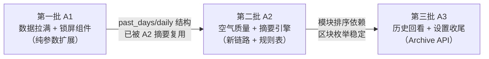

# PRD：枳生天气 · iOS 版（功能对齐增量 · 方向 A）

> 版本：**v1.1**（v1.0 + 勘误）
> 修订记录：
> - **v1.1 勘误**（2026-09-11，架构师裁定·主理人追认）：A1-7 的 AC-A1-21 降级——iOS 17 跨进程链路下 Intent `perform()` 拉起主 App 后即返回，系统按钮 loading 只覆盖毫秒级，**widget 上无法展示主 App 取数进度**；刷新语义改为「`openAppWhenRun` + 深链 `zhisheng://refresh` → 主 App 绕过节流强刷 → `reloadAllTimelines`」，widget 保持零网络零写入纪律。详见 §3 A1-7 行勘误注记。
> - v1.0：初版。
> 作者：许清楚（产品经理）
> 日期：2026-09-11
> 上游输入：team-lead 任务说明 + 用户实测反馈（"一般，确实是 MVP，和 fork 的本体基本没什么联系"）+ 用户拍板（**先 A 功能对齐，后 B UI 打磨**）
> 事实材料：`research/original-README.md`（已全文读完）+ `research/original-tree.txt`（293 路径 / 143 Kotlin 文件）+ `ZhishengWeatherIOS/` 现网源码 + `PRD-zhisheng-ios.md`（v1.0 MVP）+ `PRD-zhisheng-ios-P1.md`（v1.1，F-A/F-B/F-C 已交付）
> 本文档**不写任何代码**，只做需求规划。

---

## 0. 定位与读法

原 Android 本体经 8 个大版本（0.0.1 → 0.1.5-beta3）演化出的能力全景，与 iOS 现状逐项对照，得出差距清单；再按 **iOS 平台可行性** 评估每项差距；最后把"要做"的部分排成**三批独立可交付的增量**。

三个筛选原则（贯穿全文）：

1. **纯 Open-Meteo 能覆盖的优先**——免密钥、零凭据、无地区限制，是 iOS 版既定数据策略（Android 的"小米主导自动优选"在 iOS 上**不照搬**，理由见 §2.2 表格内注）。
2. **国内专有源（和风/彩云/小米、气象预警、分钟级降水、生活指数）标记"依赖外部凭据/数据源"**，统一压到第三批或建议不做。
3. **每批结束 CI 都要出可安装 IPA**——延续现网"每批独立交付"纪律，禁止出现"做了 5 项才能编译"的耦合。

---

## 1. 差距清单：原 Android 本体 vs iOS 现状

> 对照依据：README"能看什么"清单 + 数据源表 + 0.0.6/0.1.0/0.1.3/0.1.5-beta3 更新日志 + 文件树；iOS 现状来自源码实读。

### 1.1 天气数据与展示

| # | 原 Android 能力 | iOS 现状 | 对齐状态 | 差距说明 |
|---|---|---|---|---|
| D1 | 实况温度/天气现象/体感 | 温度/现象/体感 ✅ | **已对齐** | — |
| D2 | 风向风速 + 气压 | 风速风向 ✅；**气压无** | **部分** | Open-Meteo `current.surface_pressure` / `pressure_msl` 免密可得，缺的只是请求字段 + 指标格 |
| D3 | 24h 逐时预报 | 逐时 ✅（≤12 条截窗） | **部分** | 覆盖 12h，非 24h；`forecast_days` 与 hourly 窗口即可拉满，改动小 |
| D4 | 15 天逐日预报 + 降水概率 | 逐日 ✅（7 天 + 降水概率 + 3/7 切换） | **部分** | 天数 7 < 15；Open-Meteo 支持 `forecast_days=16`，扩参即可 |
| D5 | 未来两小时分钟级降水（nowcast） | **无** | **缺失** | Open-Meteo 仅有 **15 分钟粒度** `minutely_15` 降水序列（README 已知限制也承认这一点）；Android 用的是和风/彩云分钟级源 → **依赖专有源才到分钟级** |
| D6 | 气象预警（含分级着色、跨源去重） | **无** | **缺失** | 预警由和风/彩云提供，**依赖外部凭据**；Open-Meteo 无预警产品 |
| D7 | 空气质量六项分测（AQI + PM2.5 等） | **无** | **缺失** | Open-Meteo **Air Quality API** 免密提供 CAMS 六项（PM10/PM2.5/CO/NO2/SO2/O3）+ 欧标/美标 AQI，**纯 Open-Meteo 可做** |
| D8 | 生活指数（紫外线/穿衣/洗车等） | **无** | **缺失** | 官方生活指数属和风账号权限（依赖凭据）；但 UV 指数、湿度、风速等**可由 Open-Meteo 字段 + 本地规则表自算**出一个精简版 |
| D9 | 日出日落 + 昨日天气对比 | 日出日落无；昨日对比无 | **缺失** | Open-Meteo `daily.sunrise/sunset`、`past_days=1` 免密可得，**纯 Open-Meteo 可做** |
| D10 | 月相 + 月出月落 | 月相八相 ✅；月出月落无 | **部分** | 月相已对齐；月出月落 Android 是"本地按坐标补算"（MoonCalc 同源思路），iOS 可用同法自算 |
| D11 | 逐日行展开：日落 + 月相 | 逐日行不可展开 | **缺失** | 纯 UI/自算能力，**可做** |
| D12 | 一句话天气摘要（何时下雨/明天温差） | **无** | **缺失** | Android 0.0.6 起有；可用已有字段本地拼接规则文案，**无需新数据源** |
| D13 | 15 天页 + 天气娘总结 | **无** | **缺失** | 依赖 15 天数据（Open-Meteo 可得）+ 天气娘（属 UI 方向 B，本轮只做数据与页面，不做娘） |

### 1.2 城市与交互

| # | 原 Android 能力 | iOS 现状 | 对齐状态 | 差距说明 |
|---|---|---|---|---|
| D14 | 多城市收藏 + 排序 + 删除 | 多城市 ✅（搜索/排序/删除/切换） | **部分** | 缺**收藏星标**（0.1.5-beta3：收藏置顶、组内保持顺序） |
| D15 | 发牌式卡组切换（底部长按滑选） | 无（列表页切换） | **缺失** | 属重交互/动效，倾向归**方向 B（UI）** |
| D16 | 首页模块自定义排序/隐藏 + 恢复默认 | 无（固定 7 区块） | **缺失** | 纯本地能力，**可做**（设置页范畴） |
| D17 | 城市列表每行天气摘要 | ✅ | 已对齐 | — |
| D18 | 街道级定位 + 回退城市 | 定位 ✅ + 北京回落 ✅ | **部分** | Android 有"精确位置显示街道"档；iOS 反地理编码可做，优先级低 |

### 1.3 桌面小组件

| # | 原 Android 能力 | iOS 现状 | 对齐状态 | 差距说明 |
|---|---|---|---|---|
| D19 | 五种尺寸（4x1/2x2/4x2/2x4/4x4） | Small/Medium/Large 三尺寸 ✅ | **部分** | iOS 对应补 **Accessory（锁屏/灵动岛）族**最划算；"4x1 细条"在 iOS 无精确等价物（可近似 AccessoryRectangular 或大屏 XL） |
| D20 | 大尺寸含逐时趋势 + 生活信息 | Large ✅（当前 + 逐日 + 指标格） | **部分** | 可补逐小时迷你条 |
| D21 | 三档底色（透明/玻璃/不透明） | 无（固定背景） | **缺失** | iOS 17 `containerBackground` 支持，纯 UI |
| D22 | 桌面城市选择（per-instance） | ✅ AppIntentConfiguration | **已对齐** | — |
| D23 | 点击刷新 + 状态提示 | 小组件不可交互 | **缺失** | iOS 17 interactive widget（Button + AppIntent）可做，中等工作量 |

### 1.4 图 / 史 / 源 / 杂项

| # | 原 Android 能力 | iOS 现状 | 对齐状态 | 差距说明 |
|---|---|---|---|---|
| D24 | 雷达图（拖动/缩放/时间轴/播放） | **无** | **缺失** | 🔴 **依赖外部凭据/专有源**：Android 走中国天气网/彩云雷达瓦片；无免密公开等价物。Open-Meteo 有雷达 API 但**仅欧洲** |
| D25 | 台风路径（浙江水利厅源：实况/强度/风圈/多机构预报） | **无** | **缺失** | 🔴 **依赖专有数据源**（非凭据型，但接口无 SLA、无官方文档，随时失效）；GitHub 有镜像项目可参考。独立可做但风险高 |
| D26 | 历史天气（过去 7 日/往年同日/近 5、10 年） | **无** | **缺失** | Open-Meteo **Archive API**（ERA5 再分析）免密支持过去 80 年，**纯 Open-Meteo 可做**；界面量较大 |
| D27 | 多数据源（和风 JWT/彩云 Token/小米/Open-Meteo）+ 自动优选 + 凭据本地保存 + 连接测试 | Open-Meteo 单一源 | **部分** | 🔴 和风/彩云**依赖用户凭据**；小米接口无文档承诺。建议 iOS 保持 Open-Meteo 单源（见 §2.2） |
| D28 | 横屏气象时钟/待机 | 无 | **缺失** | 纯 UI，属**方向 B** 优先级末位 |
| D29 | 天气氛围背景 12+ 种 + 强度可调 | 无（静态深色主题） | **缺失** | 属**方向 B（UI 打磨）**，本轮不做 |
| D30 | 15 枚自绘天气图标 + 应用图标切换 | SF Symbols 映射 | **缺失** | 需设计资产；属**方向 B** |
| D31 | 主题三档（深/浅/跟随） | 固定深色 | **缺失** | 纯 UI，属**方向 B** |
| D32 | 多语言（中/日/英） | 纯中文硬编码 | **缺失** | Localizable + 文案外提，工作量大但无技术风险 |
| D33 | 设置页（单位/模块开关/图标/语言） | 无 | **缺失** | 单位切换（m/s↔km/h、℃↔℉）与模块开关**可做**，属本 PRD 范畴的设置页精简版 |
| D34 | 天气娘简报（按冷热/风雨/空气/湿度/UV 选提醒） | **无** | **缺失** | 形象属方向 B；**规则引擎部分**可归入 D12 摘要系统 |
| D35 | 应用内更新检查（设置页红点） | **无** | **缺失** | ❌ **建议不做**：sideload 自用，直接 GitHub Releases 看；做了反而要引入安装渠道权限心智。见 §6 |
| D36 | 快捷操作（长按图标：刷新/搜索/设置） | 无 | **缺失** | iOS 对应 Home Screen 快捷方式（static shortcuts），小工作量，可做 |
| D37 | 无广告/无账号/无埋点 | ✅ | 已对齐 | 产品红线，保持 |

### 1.5 差距总览（计数）

| 状态 | 数量 | 条目 |
|---|---|---|
| **已对齐** | 4 | D1, D17, D22, D37 |
| **部分** | 9 | D2, D3, D4, D10, D14, D18, D19, D20, D27 |
| **缺失** | 24 | D5–D9, D11–D13, D15–D16, D21, D23–D26, D28–D36 |

---

## 2. iOS 匹配度评估（每个差距能不能在 iOS 上做、代价如何）

### 2.1 可行性分级标记

- 🟢 **纯 Open-Meteo 可直接做**：免密、无凭据、现有 `OpenMeteoEndpoint`/`WeatherService` 骨架直接扩展。
- 🟡 **需简单自算/本地规则**：数据可得或已有，需要本地算法/规则表/持久化设计。
- 🔴 **依赖外部凭据/专有数据源**：需要用户申请凭据，或接口无文档无 SLA，风险自担。

### 2.2 逐项评估

| 差距 | 可行性 | iOS 平台评估 | 关键结论 |
|---|---|---|---|
| D2 气压 | 🟢 | `current=surface_pressure,pressure_msl`，DTO/指标格各加一项，半天级 | **第一批必做** |
| D3 逐时 24h | 🟢 | `forecast_hours` / hourly 窗口放宽；纯参数 + UI 放宽 | **第一批必做** |
| D4 逐日 15 天 | 🟢 | `forecast_days=16` + UI "7/15"分段；模型零改（数组变长） | **第一批必做** |
| D9a 日出日落 | 🟢 | `daily=sunrise,sunset`；⚠️ 这两字段是字符串时间非 epoch，解码路径要与现有 unixtime 纪律隔离 | **第一批必做** |
| D9b 昨日对比 | 🟢 | `past_days=1`，取 daily[0]（昨天）与 today 比温差 | **第一批必做** |
| D7 空气质量 | 🟢 | **独立 API**：`air-quality-api.open-meteo.com/v1/air-quality`，CAMS 六项 + `us_aqi`/`european_aqi`；新 endpoint 三件套（同 geocoding 模式），主屏新增区块 | **第二批（独立链路，值得单批）** |
| D8 生活指数（精简） | 🟡 | `daily=uv_index_max` + 湿度/风速已有 → 本地规则表映射"防晒/穿衣/洗车"3–5 项；⚠️ 与官方生活指数口径不同，须标注"参考" | **第二批** |
| D5 短时降水 | 🟡(部分) | Open-Meteo `minutely_15=precipitation` 仅 15 分钟粒度、未来约 2h 覆盖；**无预警/无回波概念**。做"简版降水卡"可，分钟级达不到 → 标注粒度 | **第二批** |
| D10 月出月落 | 🟡 | 沿 MoonCalculator 路线加月出月落近似算法（与 Android"本地补算"同思路） | **第二批** |
| D11 逐日展开 | 🟡 | 现有 DailyForecastSection 加展开态，数据用 D9a/D10 | **第二批** |
| D12 一句话摘要 | 🟡 | 纯本地规则引擎（预警缺席版）：何时下雨（由 minutely_15/降水概率）/温差/UV；文案模板存本地 | **第二批** |
| D26 历史天气 | 🟡 | Archive API（`archive-api.open-meteo.com`）免密，但时间跨度 5 天前起算、ERA5 网格精度有限；新 endpoint + 新页面，工作量为"页面级" | **第三批** |
| D24 雷达 | 🔴 | 中国天气网/彩云瓦片**均需凭据或地区限定**；Open-Meteo 雷达仅欧洲。全球用户 + 免密前提下**无可用公开源** | **建议不做**（保留：若未来拿到彩云 Token 可作实验特性） |
| D25 台风 | 🔴 | 浙江水利厅接口无文档无 SLA；可参考社区镜像，但"资料过期即整功能失效"风险高，且需地图渲染依赖（MapKit，违反 Core 零依赖纪律的边界要单独裁定） | **建议不做**（P2 观察） |
| D27 多数据源 | 🔴 | 和风（Ed25519 JWT + 凭据管理）/彩云（Token）均为**凭据型**；小米接口无稳定性承诺。iOS 维持 Open-Meteo 单源更符合"无凭据即完整体验"的公共版哲学（Android 公共版默认链路 = 小米+Open-Meteo，其中小米也在退化） | **建议不做**；仅在设置页留"数据来源标注" |
| D6 预警 | 🔴 | 依附和风/彩云账号权限；Open-Meteo 无预警产品 | **建议不做**（同 D27 依赖链） |
| D15 卡组切换 | — | 属方向 B 动效 | 归 B |
| D16 模块排序/隐藏 | 🟡 | 区块枚举 + 排序持久化（UserDefaults 即可，非共享数据）；设置页精简版的一部分 | **第二批** |
| D19 锁屏/灵动岛组件 | 🟡 | `AccessoryCircular/Rectangular/Inline` + 灵动岛，WidgetKit 标准能力；⚠️ `supportedFamilies` 只增不减纪律适用 | **第一批（widget 低垂果实）** |
| D21 组件底色三档 | 🟡 | `containerBackground(for: .widget)` 变体；需在 AppIntent 配置加一项 | **第一批可选 / 第二批** |
| D23 可交互刷新 | 🟡 | iOS 17 `Button(intent:)` in widget + `reloadTimelines`；中等工作量 | **第一批可选** |
| D32 多语言 | 🟡 | 现有纯中文硬编码文案需全量外提；与方向 B 的 UI 改版合并做更省 | **第三批或归 B** |
| D33 设置页 | 🟡 | 单位（℃/℉、m/s↔km/h）+ 模块开关 + 关于页；单位换算影响 Formatter 层，需测 | **第二批** |
| D36 快捷方式 | 🟢 | 静态 Home Screen shortcuts（Info.plist 声明），半天级 | **第一批可选** |
| D14 星标收藏 | 🟡 | City 加 `isFavorite` + 置顶排序规则；共享容器编码向后兼容（沿用可选字段纪律） | **第二批** |
| D13 15 天页 | 🟡 | 依赖 D4 的 16 天数据；页面复用逐日组件 | **第二批** |
| D18 街道定位 | 🟢 | `CLGeocoder` 反查 + 显示街道标签 | P2 |
| D20 Large 加逐时 | 🟢 | Large 已有 MetricGridLayout，加一行逐时条 | **第二批** |

### 2.3 结论

- 🟢🟡 共 **20 项**可做，构成三批增量主体；
- 🔴 4 项（D24 雷达 / D25 台风 / D27 多源 / D6 预警）**全部依赖外部凭据或无 SLA 专有源**，与 iOS 版"免凭据即完整"的定位冲突，**建议不做**（雷达/台风留观察位，见 §6）；
- 1 项（D35 应用内更新检查）**主动放弃**（自用分发无意义）。

---

## 3. 分期排布：三批，批批可交付

> 排布原则：**批内按用户价值排 P0/P1/P2；批与批之间无阻塞依赖；每批结束 CI 出可安装 IPA（现有 `build.yml` 产物流程不动）。**

### 第一批（A1）："数据更满 + 小组件补全" —— 纯 Open-Meteo 参数级扩展

**一句话**：把单一请求能拿到的数据全部拿满、把 iOS 小组件体系补齐，是"对齐感"最强、技术风险最低的一批。

| ID | 需求 | 优先级 | 对齐差距 | 验收标准 |
|---|---|---|---|---|
| A1-1 | **实况气压**（海平面气压 msl 优先，缺则地面气压） | P0 | D2 | AC-A1-1 请求含 `pressure_msl`（fallback `surface_pressure`）；AC-A1-2 指标格新增"气压"格，单位 hPa，保留 1 位小数；AC-A1-3 字段缺失显示 `--`，不用 0 冒充 |
| A1-2 | **逐时预报扩至 24h** | P0 | D3 | AC-A1-4 主屏逐时区可滑动查看 24 条；AC-A1-5 hourly 窗口不足 24 条时按实际数量渲染，不补空；AC-A1-6 Small/Medium 小组件不受影响（仍按现窗口取数） |
| A1-3 | **逐日预报扩至 15 天 + 3/7/15 切换** | P0 | D4 | AC-A1-7 `forecast_days=16`（今天 + 15 天）；AC-A1-8 分段控件 3/7/15 三档，默认 3 天，**展开态不跨启动持久化**（沿用 F-A 决策）；AC-A1-9 逐日数组长度不足 16 时按实际渲染；AC-A1-10 Large 小组件逐日仍正常（取前 5 列） |
| A1-4 | **日出日落**（当日 + 显示在日照卡） | P0 | D9a | AC-A1-11 请求含 `daily=sunrise,sunset`；**AC-A1-12（v1.2 落点修订）日照卡（`DaylightCard`）内显示"日出 HH:mm · 日落 HH:mm"**——⚠️ 原落点"月相区旁"已作废：`ContentView.moonSection` 原 `sunText` 行与紧随其后的 `DaylightCard` **显示完全相同的两个值**（用户可见重复），去重时保留 `DaylightCard`（严格超集：另含昼长、「距日落」倒计时、极昼/极夜文案、L2 逐字段来源标注、第二源交叉校验）；**降级语义逐字保留**——`DaylightCard.riseSetRow` 同样按单侧存在性分别输出，单侧缺失只显示存在的一侧、绝不用另一侧顶替；变更理由见 `PRD-zhisheng-ios-P2-weather-data.md` §3.3.2；AC-A1-13 ⚠️ sunrise/sunset 为 ISO 字符串时间，**必须与现有 unixtime 解码路径隔离**（新解码器 + 独立单测），不得混入 epoch 解析器 |
| A1-5 | **昨日对比**（昨天高低温/现象 vs 今天） | P1 | D9b | AC-A1-14 请求含 `past_days=1`，daily[0] 为昨天；AC-A1-15 主屏新增一行"较昨天 +2° / 高 25°→23°"式文案；AC-A1-16 昨日数据缺失时整行隐藏 |
| A1-6 | **锁屏小组件**（Accessory 族） | P1 | D19 | AC-A1-17 支持 `accessoryCircular`（温度+图标）、`accessoryRectangular`（温度+现象+城市）、`accessoryInline`（温度+现象单行）；AC-A1-18 `supportedFamilies` 追加 accessory 族且**保留现有三 family**（只增不减纪律）；AC-A1-19 锁屏深色环境（Always-On Display）下可读 |
| A1-7 | **可交互刷新按钮**（widget 上直接刷新） | P2 | D23 | AC-A1-20 Medium/Large 右上角刷新 Button(AppIntent)，点击后触发主 App 取数意图并 `reloadTimelines`；AC-A1-21 刷新中显示转圈占位，失败显示"更新于 xx:xx"不变脏数据  ⚠️ **v1.1 勘误（架构师裁定·主理人追认）**：AC-A1-21 原文在 iOS 17 跨进程链路下**技术不可达**——Intent `perform()` 在拉起主 App 后即返回，系统按钮 loading 只覆盖毫秒级，无法跨进程展示主 App 取数进度；若坚持纯组件内转圈，唯一路径是 widget 进程内直接联网，违反零网络零写入纪律，不做。**AC-A1-21 降级为**：点击后主 App 到前台展示刷新过程（`openAppWhenRun` + 深链 `zhisheng://refresh` → 主 App 绕过 15 分钟节流强刷 → 取数完成后 `reloadAllTimelines`）；widget 失败时保持旧数据 + 更新时间戳不变脏 |
| A1-8 | **Home Screen 快捷方式**（刷新/搜索/设置入口） | P2 | D36 | AC-A1-22 长按应用图标出现 3 个静态快捷方式；AC-A1-23 各入口落点正确，App 冷启动直达 |

**第一批交付物**：可安装 IPA + 更新 README 能力清单 + 单测增量（≥ 10 用例：气压字段、字符串时间解码、past_days 边界、accessory 渲染数据源）。

### 第二批（A2）："空气质量 + 智能摘要 + 掌控感" —— 新链路 + 本地规则引擎

**一句话**：接入 Open-Meteo 空气质量 API（第二条免密链路），叠加本地规则表，产出 Android 本体里"遥测与空气"页面的 iOS 等价物，外加一句话摘要与生活指数精简版。

| ID | 需求 | 优先级 | 对齐差距 | 验收标准 |
|---|---|---|---|---|
| A2-1 | **空气质量区块**（AQI + 六项分测） | P0 | D7 | AC-A2-1 新增 endpoint：`air-quality-api.open-meteo.com/v1/air-quality`，参数 `current=pm10,pm2_5,carbon_monoxide,nitrogen_dioxide,sulphur_dioxide,ozone,us_aqi,european_aqi`；AC-A2-2 主屏新增空气卡：AQI 数值 + 等级着色（优/良/轻度/中度/重度/严重六档）+ 主导污染物；AC-A2-3 六项分测以横向格展示，缺项显示 `--`；AC-A2-4 空气 API 失败时**天气区块不受影响**（独立失败收敛，不进同一 Result 管道）；AC-A2-5 endpoint/DTO/mapper 单测 ≥ 5 用例（含无结果键、字段缺失、负值异常） |
| A2-2 | **一句话天气摘要**（本地规则引擎） | P0 | D12/D34(规则部分) | AC-A2-6 Hero 温度下一行摘要，规则覆盖：未来降水（"约 40 分钟后可能下雨"/"两小时内无雨"）、今日温差（"较昨天 +2°"）、UV 提示、大风提示；AC-A2-7 规则触发优先级固定（预警位 > 强降水 > 温差 > 风 > UV），单测覆盖每条规则命中与不命中；AC-A2-8 无数据字段时摘要回退为"暂无摘要"或隐藏，不显示模板空槽 |
| A2-3 | **生活指数（精简版，本地自算）** | P1 | D8 | AC-A2-9 请求补 `daily=uv_index_max`；本地规则表生成 防晒/穿衣/洗车/运动 4 项（如 UV≥8→"防晒必须"）；AC-A2-10 区块标题标注"本地估算·仅供参考"，**不得暗示官方生活指数**；AC-A2-11 每项规则有独立单测 |
| A2-4 | **月出月落**（本地补算） | P1 | D10 | AC-A2-12 MoonCalculator 扩展月出月落近似值（±坐标时区）；AC-A2-13 月相区显示"月出 HH:mm · 月落 HH:mm"；AC-A2-14 极地无月出/月落日期显示"今日无月出"式文案 |
| A2-5 | **逐日行展开**（点开看日落/月出落/该日详情） | P1 | D11 | AC-A2-15 逐日行可点击展开，显示该日日出日落/月出落/UV max；AC-A2-16 展开态逐行独立（不联动其他行）；AC-A2-17 收起恢复紧凑布局 |
| A2-6 | **城市收藏星标** | P1 | D14 | AC-A2-18 城市行可星标；星标城市排前、组内保持原序；AC-A2-19 `City.isFavorite` 为可选字段，旧共享容器 JSON 解码不失败（可选字段纪律）；AC-A2-20 单测覆盖置顶排序稳定性 |
| A2-7 | **首页模块排序/隐藏**（设置页精简版 Part 1） | P2 | D16 | AC-A2-21 设置页可拖动排序主屏 7 区块、可隐藏任一区块（Hero 与页脚除外，始终显示）；AC-A2-22 "恢复默认排列"一键复位；AC-A2-23 排序/隐藏持久化于主 App 本地 UserDefaults（**不放共享容器**，小组件不感知） |
| A2-8 | **Large 小组件补逐时趋势** | P2 | D20 | AC-A2-24 Large 底部加 4–6 小时迷你趋势条；AC-A2-25 超宽截断不溢出 |
| A2-9 | **15 天页**（独立页面） | P2 | D13 | AC-A2-26 逐日区块"查看 15 天"入口进独立页，压暗显示昨天 + 全 15 天；AC-A2-27 页面数据复用同一份快照，不发新请求 |

**第二批交付物**：可安装 IPA + README 更新 + 单测增量（≥ 15 用例）+ **新网络链路的失败路径演练**（飞行模式下打开 App，天气照常、空气卡显示失败态）。

### 第三批（A3）："回看与个性化" —— 历史天气 + 设置收尾

**一句话**：用 Open-Meteo Archive API 免密实现"过去 7 日 / 往年同日 / 近 5、10 年"回看，并把设置页补成完整形态，收拢所有"本地自算/自持"类需求。

| ID | 需求 | 优先级 | 对齐差距 | 验收标准 |
|---|---|---|---|---|
| A3-1 | **历史天气·过去 7 日** | P0 | D26 | AC-A3-1 Archive API 请求近 7 日 `temperature_2m_max/min,weather_code,precipitation_sum`；AC-A3-2 独立"历史"页签展示，含每日高低温条形 + 现象；AC-A3-3 ERA5 网格精度限制在页面脚注声明（"再分析资料，非实况观测"） |
| A3-2 | **历史天气·往年同日**（近 5 年） | P1 | D26 | AC-A3-4 逐年请求"过去每年今日"数据并列展示；AC-A3-5 缺少年份不堆叠"未知"占位行（沿用 Android 0.1.5-beta3 纪律）；AC-A3-6 并发请求有节流，避免一次性 10 连发 |
| A3-3 | **历史天气·近 10 年同日** | P2 | D26 | AC-A3-7 在 A3-2 基础上扩到 10 年，UI 分组展示 |
| A3-4 | **设置页完整版**（单位 + 数据源标注 + 关于） | P0 | D33 | AC-A3-8 单位切换：温度 ℃/℉、风速 m/s↔km/h，切换后主屏/摘要/全部组件即时生效（组件经共享容器同步单位偏好或统一换算）；AC-A3-9 数据源页显示"Open-Meteo"及最近一次请求时间；AC-A3-10 关于页含版本号与开源仓库链接 |
| A3-5 | **组件底色三档**（透明/玻璃/不透明） | P1 | D21 | AC-A3-11 小组件配置新增"底色"项（AppIntent 参数），三档即时生效；AC-A3-12 浅色/深色壁纸下均可读 |
| A3-6 | **多语言骨架**（中/英，日文视进度） | P2 | D32 | AC-A3-13 全部硬编码中文文案外提为 Localizable；AC-A3-14 英文翻译全量就位；日文可延后；AC-A3-15 语言切换后小组件文案同步（共享容器存语言偏好） |
| A3-7 | **15 天 + 天气娘文案位**（预留） | P2 | D13/D34 | AC-A3-16 15 天页预留"简报文案"插槽（本轮纯文本摘要，形象插画归方向 B） |

**第三批交付物**：可安装 IPA + README 全面改写（能力清单对齐声明）+ 单测增量（≥ 10 用例：Archive 解码、年份分组、单位换算、本地化键完整性）。

### 3.x 批间依赖说明

- A1 是 A2 摘要引擎的数据前提（温差/降水/UV 字段都在 A1 落定）。
- A2 的"模块排序"定义了区块枚举，A3 的设置页复用同一套。
- A3 理论上可提前做 A3-4 设置页，但单位换算会触碰 A2 摘要的格式化层，**顺序保持 A1→A2→A3 最稳**。
- ⚠️ 每批共享容器/`WeatherSnapshot` 加字段时，**一律沿用"可选字段 + 合成 Codable"兼容纪律**（`WeatherSnapshot.daily` 先例），并做真机覆盖安装验证（F-A-9 同款死角）。

---

## 4. 优先级汇总（三批 P0 全景）

| 批次 | P0（必须） | P1 | P2 |
|---|---|---|---|
| A1 | 气压 / 24h 逐时 / 15 天逐日 / 日出日落 | 昨日对比 / 锁屏组件 | 交互刷新 / 快捷方式 |
| A2 | 空气质量 / 一句话摘要 | 生活指数(精简) / 月出月落 / 逐日展开 / 星标收藏 | 模块排序隐藏 / Large 逐时 / 15 天页 |
| A3 | 历史近 7 日 / 设置页完整版 | 往年同日 / 组件底色三档 | 近 10 年 / 多语言骨架 / 简报文案位 |

**P0 合计 7 项**：这 7 项做完，iOS 与 Android 本体的"信息密度"差距基本抹平（剩的都是专有源与 UI 氛围层）。

---

## 5. 风险与纪律（跨批次）

| # | 风险 | 缓解 |
|---|---|---|
| R1 | 共享容器 JSON 每批加字段 → 兼容性死角 | 一律可选字段 + 合成 Codable；每批真机覆盖安装验证（不卸载重装） |
| R2 | `supportedFamilies` 每批都在扩 | 只增不减；每批 CI 后真机验证"已有组件不被系统移除" |
| R3 | sunrise/sunset 字符串时间与 unixtime 纪律冲突 | 独立解码器 + 命名区分（`ISOTimeDecoder` 类），禁止混用 |
| R4 | Open-Meteo 免费额度（10k 次/日）随请求字段增多而膨胀 | 每批合并参数（气压/UV/past_days 同一次请求拿），不新增请求次数；A3 历史请求做节流 |
| R5 | 空气/历史两条新链路失败拖垮主屏 | 每条链路独立 Result 收敛，主屏天气永不依赖新链路成功 |
| R6 | 用户是唯一测试者，批批真机验收压力大 | 每批验收清单控制在 10 条以内；沿用 §4.3 时间戳交叉验证法排查 App Group |

---

## 6. 明确不做（及理由）

| 功能 | 结论 | 理由 |
|---|---|---|
| **应用内更新检查**（D35） | ❌ 不做 | sideload 自用分发，无版本广播渠道可查；用户自己就是发布者，红点机制无意义。GitHub Releases 即更新入口 |
| **雷达图**（D24） | ❌ 不做（观察位） | 中国天气网/彩云瓦片需凭据或地区限定；Open-Meteo 雷达仅覆盖欧洲，与产品定位不符。若未来用户拿到彩云 Token 可作实验特性重新评估 |
| **台风路径**（D25） | ❌ 不做（观察位） | 浙江水利厅接口无文档无 SLA，资料断供即功能失效；且需要地图渲染依赖，与 Core 零依赖纪律冲突。收益/风险比最差的一项 |
| **多数据源（和风/彩云/小米）**（D27） | ❌ 不做 | 和风=Ed25519 JWT+凭据管理，彩云=Token，均违背"免凭据即完整体验"；小米接口无稳定性承诺。iOS 保持 Open-Meteo 单源是特性不是缺陷 |
| **气象预警**（D6） | ❌ 不做 | 依附和风/彩云账号权限；Open-Meteo 无预警产品。同 D27 依赖链 |
| **分钟级降水（真·nowcast）**（D5） | ⚠️ 降级做 | 只做 Open-Meteo 15 分钟粒度简版降水卡（A2），并在 UI 明示粒度；不冒充分钟级 |
| **社区/赞赏/交流群**（README 相关） | ❌ 不做 | fork 自用版本，无社区运营场景 |
| **天气娘形象/氛围背景/横屏时钟/卡组动效**（D15/D28/D29/D30/D34 形象部分） | → 归**方向 B** | 属 UI 打磨范畴，等 A 方向数据面收口后统一规划 |
| **App Store 上架 / 账号 / 云同步 / 埋点** | ❌ 永不做 | 产品红线（D37），与本体一致 |

---

## 7. 待确认问题

| # | 问题 | 影响 | 建议默认值 |
|---|---|---|---|
| Q1 | **15 天逐日是否要"多请求一次"**（`forecast_days=16` 单次即可拿到，但 payload 变大）？ | 影响 A1-3 实现与流量 | 单次拿满 16 天，不做二次请求 |
| Q2 | **空气质量 AQI 用美标还是欧标**？ | 影响 A2-1 着色分档与文案 | 默认**美标 us_aqi**（国内用户习惯 PM2.5 口径），欧标数值可同时展示但着色只跟美标 |
| Q3 | **生活指数自算口径**是否接受"仅供参考"降级？ | 影响 A2-3 是否做 | 接受；标注"本地估算"，不做官方生活指数的假象 |
| Q4 | **设置页单位切换的生效范围**：小组件是否跟随？ | 影响 A3-4 实现路径（共享容器多存一项 vs 组件固定 SI 单位） | 组件跟随（偏好写入共享容器），保持"App 和桌面说同一种话" |
| Q5 | **A1 锁屏组件是否需要 iOS 17.0 才可用**（Accessory 族 iOS 16 起支持，但本工程 target 17.0）？ | 无实际影响，仅文档口径 | 按 target 17.0 直接做，不做版本分支 |
| Q6 | **历史天气年份并发策略**：串行还是限并发 3？ | 影响 A3-2 速度与额度 | 限并发 3 + 失败年份静默跳过 |

---

## 附：三批一句话速查

- **A1 数据更满**：气压 + 24h 逐时 + 15 天逐日 + 日出日落 + 昨日对比 + 锁屏组件——一个请求拿满，纯参数扩展。
- **A2 空气与智能**：Open-Meteo 空气质量 API + 六项分测 + 一句话摘要 + 精简生活指数 + 月出月落——第二条免密链路 + 本地规则引擎。
- **A3 回看与掌控**：历史天气（7 日/往年/10 年，Archive API）+ 完整设置页 + 组件底色 + 多语言骨架——收拢所有本地自算自持类需求。

**不做**：雷达 / 台风 / 和风·彩云·小米多源 / 气象预警 / 应用内更新检查 / 社区赞赏 / 天气娘与氛围背景（归方向 B）/ App Store。
