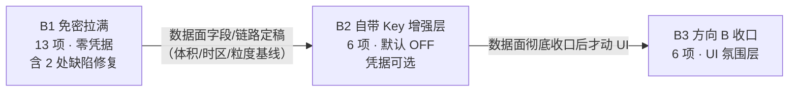

# PRD：枳生天气 iOS · API 扩展与数据面收口

> 版本：**v1.1**（第二轮实测纠偏；v1.0 于 2026-09-17 发布，commit `b653a21`）
> 作者：许清楚（产品经理）
> 日期：2026-09-17
> 上游输入：用户拍板的方向转向（停止镜像 Android 数据源链）+ 2026-09-16 首轮实机 HTTP 探测结论（非读文档）+ **第二轮 LIVE HTTP 探测（本轮，见 §11）** + `PRD-zhisheng-ios-A.md` §1.5/§2.2/§6 + `original-android-README.md` + `feature-parity-zhisheng-ios.md`
> 事实基准：所有端点可用性均以**实机 HTTP 探测的状态码与返回体**为准（首轮 2026-09-16 / 第二轮见 §11）；本文档**不修改任何 Swift 源码**，只做需求规划。
> 关系：本文档是 `PRD-zhisheng-ios-A.md` 的**续作**，复用它建立的全部 ID 体系（D1–D37、A1–A3、AC-*）。凡与 PRD-A 冲突处，以本文档 §3「纠偏记录」为准；**凡 §11「实测纠偏（第二轮）」与正文任何位置冲突处，一律以 §11 为准。**

---

## 0. 结论先行

- **前提已变**：iOS 版**不再镜像 Android 的数据源链**。小米官方渠道是 Android `ContentProvider`（`content://weather/...`，进程内机制），iOS **结构性不存在**；逆向签名接口 `weatherapi.market.xiaomi.com/wtr-v3/...?sign=zUFJoAR2ZVrDy1vF3D07` 依赖硬编码签名、可随时被吊销。**小米 = 不可达**，据此重写数据策略。
- **新定位一句话**：**做一个能自由调用所有可用 API 的天气 App**；原 Android 本体只当**能力菜单**用，不再当**数据链路模板**用。
- **约束降级**：「必须免密」从**产品哲学**降为**工程默认值**——零配置必须开箱完整可用；凡需凭据者，一律进**可选的、默认关闭的「自带免费 Key」增强层**。
- **本轮三批**：B1 免密拉满（13 项）→ B2 自带 Key 增强层（6 项）→ B3 方向 B 收口（6 项，**在数据面收口之后**才做）。批批独立出 IPA。（⚠️ **v1.1**：B1 内 2 项因第二轮实测**降级待裁**——B1-4 卫星辐射、B1-5 洪水，见 §11-2 / §11-3 与 §10 Q7/Q8。）
- **两处已存在的实现缺陷进入 B1 P0**：星标置顶未生效、异地城市时区未生效（`feature-parity` D-1 / D-4，代码已写未接线）。
- **免密的边界已画死**（§2）：免密能拿到**全球网格类**天气/空气/历史/集合/季节数据；**拿不到**中国分钟级降水、官方分级预警、中国雷达回波——这三项要么上凭据、要么不做，**不再承诺**。（⚠️ **v1.1 修正**：**辐射与水文**经第二轮实测**降级**——原「卫星辐射」不是卫星实况、「洪水」数值物理不可能，二者已移出免密档一，见 **§2.4 / §11-2 / §11-3**。）
- **额度纪律是硬约束**：Open-Meteo 免密 **10,000 次/日**，但**复杂请求按倍数计费**（集合 ×4.0、季节 ×1.3、多模式气候 ×1844.5）；**贵端点必须用户触发或默认关闭**（§4）。（⚠️ **v1.1**：和风 QWeather 免费额度实为 **50,000 次/月**（非 1,000/日），且**须项目专属 host**；见 **§11-5**。）
- **第二轮实测新增/更正**（§11）：`minutely_15` 在华**为插值**（非原生）；卫星辐射**非卫星实况**（静默回退模式数据）；`flood` 武汉径流量**物理不可能**（格点串到支流）；`typhoon.nmc.cn` **信封不一致**且**当前无活跃台风**无法端到端验证；`archive` **默认非 ERA5**；`ensemble` **禁止硬编码成员数**。凡与之冲突的正文表述**已在原表就地更正并加脚注**。
- **明确不做**：小米源 / App Store · 账号 · 云同步 · 埋点 / 社区 · 交流群 · 赞赏（§8，逐条给理由）。

---

## 1. 前提变更与读法

### 1.1 为什么重写数据策略

| # | 旧前提（PRD-A） | 新前提（本文档） | 依据 |
|---|---|---|---|
| P-1 | Android 主导链 = 小米天气；iOS 应尽量对齐 | **不照搬**：小米在 iOS 结构性不可达 | 官方渠道是 Android `ContentProvider`；逆向接口靠可吊销签名 |
| P-2 | 「免凭据即完整」= 产品哲学，凭据类一律不做 | 「免密开箱可用」= **工程默认**；凭据类可做，但必须是**可选、默认 OFF** 的增强层 | 用户拍板：约束降级 |
| P-3 | Open-Meteo 单源是特性 | Open-Meteo 仍是**免密主力**，但**允许多源**（QWeather 可选增强） | 用户拍板 |
| P-4 | 雷达 / 台风 / 预警 / 多源 → 备案不做 | 雷达 / 预警 → 迁入 **B2 凭据层**；台风 → 迁入 **B1**（改用官方 nmc.cn 免密源，标注无 SLA）〔v1.1：台风源已**降级**，见 §11-6〕 | 2026-09-16 实测 |
| P-5 | 数据源能力以 README 描述为准 | 能力清单**只认实测 200/UUID**，实测与文档冲突时以实测为准（§3） | 雷达纠偏即为反例 |

### 1.2 读法

- 每个需求一行：`需求 ID` · `优先级` · `原 Android 对应能力` · `验收标准（AC，稳定 ID）`。
- 批次内按用户价值排 P0/P1/P2；批次间**无阻塞依赖**，但 **B3 显式依赖 B1/B2 数据面收口**（用户拍板顺序）。
- 每批**结束即出可安装 IPA**（现有 GitHub Actions macOS CI 产物流程不动，Windows 无 Xcode，CI 是唯一编译门禁）。
- AC ID 规则：`AC-B1-n` / `AC-B2-n` / `AC-B3-n`，**只追加不重排**（与 PRD-A 的 `AC-A*-*` 不冲突）。

---

## 2. 能力上限（先说清边界）

> 目的：**从此不再承诺一个零配置做不到的功能**。三档互相排斥，任何新需求先归到某一档再谈排期。

### 2.1 档一：免密可用（零配置，keyless）

| 能力 | 端点（2026-09-16 实测 200） | 关键限制 |
|---|---|---|
| 实况 / 逐时 / 逐日 / 15 分钟 | `api.open-meteo.com/v1/forecast` | `past_days 0–92`；`forecast_days 0–16`；`forecast_hours`/`past_hours`；`models`；`cell_selection` |
| 15 分钟覆盖（**非原生**） | 同上（`minutely_15`） | ⚠️ **中国为插值**：原生仅北美（HRRR）与中欧（ICON-D2 / AROME），其余地区由 1 小时插值而来；长度由 `forecast_minutely_15=N` 控制（`past_minutely_15`、`start_minutely_15`/`end_minutely_15` 亦可）；**条数无法区分原生与插值**（柏林与杭州 `forecast_days=1` 同为 96 条）。见 §11-1 |
| 空气质量 | `air-quality-api.open-meteo.com/v1/air-quality` | `domains=auto\|cams_europe\|cams_global` |
| 历史再分析 | `archive-api.open-meteo.com/v1/archive` | **`start_date`/`end_date` 必填**（无 `past_days`）；⚠️ **默认混用 IFS，不等于 ERA5**；显式 `models=era5` 时**滞后约 5–6 天**；宽区间可一次取（实测 10 年 → 3654 日行），但**跨 >2 周按分数倍计费**（4 周 ≈ 3.0 次）。见 §11-7 |
| 地理编码 | `geocoding-api.open-meteo.com/v1/search` | ⚠️ **`/v1/geocoding` 路径不存在**，只有 `/v1/search` |
| 海拔 | `api.open-meteo.com/v1/elevation` | — |
| 海洋 | `marine-api.open-meteo.com/v1/marine` | ⚠️ **内陆坐标返回 HTTP 200 且 `wave_height` 全为 null**——**必须判空，不得判状态码**；`cell_selection` 默认 `sea`（`land`/`nearest` 会吸附至陆点并全 null）。见 §11-4 |
| ~~洪水~~ | `flood-api.open-meteo.com/v1/flood` | ⚠️ **v1.1 移出档一**：武汉长江口实测 `river_discharge`=0.05–6.57 m³/s（真实量级 10^4），格点吸附到小支流 → 不得作为"该城市河流"呈现。见 §2.4 / §11-3 |
| 气候预估 | `climate-api.open-meteo.com/v1/climate` | `models` 必填（7 个 CMIP6 HighResMIP）、仅日粒度、1950–2050；**额度 ×1844.5，本轮不接** |
| 集合预报 | `ensemble-api.open-meteo.com/v1/ensemble` | **`models` 可省略**（省略 = Best Match；**不得发空 `models=`**）；`forecast_days` **上限 36**（36→864h OK，40→400）；`past_days` 可用；成员键 `temperature_2m_member01…NN`，**数量随模式变化（30 / 40 / 50 / 1）**；**额度 ×4.0**。见 §11-8 |
| ~~卫星辐射~~ | `satellite-api.open-meteo.com/v1/archive` | ⚠️ **v1.1 移出档一**：`models=satellite_radiation_seamless` 仅**逐小时**（`minutely_15` 为空）、GTI≡GHI、**无卫星覆盖点同样回值**（静默回退模式数据）→ **不是卫星实况**。见 §2.4 / §11-2 |
| 季节预报 | `seasonal-api.open-meteo.com/v1/seasonal` | EC46（46 天）+ SEAS5（7 个月）；**额度 ×1.3** |
| 历史预报 | `historical-forecast-api.open-meteo.com/v1/forecast` | 参数形状同 `forecast`，自 2021 |
| 台风（官方） | `typhoon.nmc.cn/weatherservice/typhoon/jsons/list_default`、`view_{numericID}` | ⚠️ **信封不一致**：`list_default` 双括号、`list_YYYY`/`view_id` 单括号 → 一个解析器无法通吃；详情**必须数字 id**（`view_3326569` OK，`view_2624` → 404）；**无命名字段**（`typhoon` 为位置数组，轨迹点 13 元数组 `[4]`经度/`[5]`纬度/`[6]`气压/`[7]`风速/`[10]`风圈/`[11]`预报点；**预报点有效时间须自算**）；**当前无活跃台风**（27 条全 `status=stop`）无法端到端验证；**无 SLA、无官方文档**。见 §11-6 |
| 台风（辅助） | `www.jma.go.jp/bosai/typhoon/data/targetTc.json`；NASA EONET `eonet.gsfc.nasa.gov/api/v3/events?category=severeStorms` | 辅助校验用 |
| 行政区码 | `www.nmc.cn/f/rest/province` | 34 省/市 code |

> **⚠️ v1.1 移出档一**：原「洪水」与「卫星辐射」两行**不再属于免密可用档**（端点仍返回 200，但语义不成立），已移至 **§2.4** 并说明理由。

### 2.2 档二：需要免费凭据（可选、默认 OFF）

| 能力 | 提供方 | 代价 | 结论 |
|---|---|---|---|
| 中国分钟级降水（2h / 1km，**仅中国**） | 和风 QWeather 免费 key | **50,000 次/月**（2025-04-01 免费订阅并入用量计费）、非商用、**与付费同权**；**项目专属 host 必填** | 推荐 |
| 官方分级预警（蓝/黄/橙/红） | 和风 QWeather | 同上（Warning 属免费"Weather and Essential Services"组；实测**未**标注地区限制） | 推荐 |
| 官方生活指数 | 和风 QWeather | 同上（Weather Indices 属免费组） | 推荐 |
| 雷达回波（中国） | RainViewer 免密瓦片 / 和风·彩云凭据 | **中国上空质量未验证** | 观察位，不承诺 |
| （排除）台风路径 / 太阳辐射 | 和风 QWeather | ❌ **不在免费额度内**：Tropical Cyclone 属"Storm and Ocean"组，**CNY 0.003 起按次，第一次调用即计费**；Solar Radiation **CNY 0.3/次** | **不做**（台风改走 B1-7 官方 nmc.cn，见 §11-5） |
| （对照，不推荐）彩云 Caiyun | Token | 免费 1,000/日，但**分钟级降水与预警属增值服务，不含在免费额度内**（实测 429，`X-RateLimit-Limit-Hour: 6`） | 不推荐 |

**凭据规范**：`X-QW-Api-Key` 头或 Ed25519 JWT；**项目专属 host 必填**：`{random}.{sub}.qweatherapi.com`。旧 host 正在退役——`devapi.qweather.com` **2026-01-01 停**，`api.qweather.com` / `geoapi.qweather.com` **2026-06-01 停**。无 key 实测 **403**。（**UNVERIFIED**：具体路径 `/v7/minutely/5m`、`/v7/warning/now`、`/v7/indices/1d` 与**每分钟速率上限**——官方文档页未渲染字面路径，见 §11-5。）

### 2.3 档三：仍不可达（不得承诺为免密）

| 能力 | 实测证据 | 结论 |
|---|---|---|
| **小米天气（官方渠道）** | Android `ContentProvider`，iOS 无等价机制 | **结构性不可能**，永不做 |
| **小米天气（逆向接口）** | 依赖硬编码 `sign`，可随时吊销 | **不承诺可用**，永不做 |
| **中国雷达影像（免密）** | `weather.com.cn` 主动拦截：301 → `contacts_api.html`，响应头 `X-CCDN-FORBID-CODE: 020200`；`www.nmc.cn/rest/weather?stationid=...` 三次尝试均返回 `{"data":""}` | **免密不可达**；只能走档二（凭据/第三方） |
| **官方分级预警（免密）** | 需和风免费凭据，或付费聚合（华为云 AppCode / 聚合数据） | **免密不可达**；只能走档二 |

### 2.4 实测后移出档一（端点仍返回 200，但**不得按原语义承诺**）

> **v1.1 新增**。下列能力在 v1.0 曾列档一；第二轮实测证明其**返回值不能支撑原有承诺**，故移出免密档。二者**是否进入本轮 B1 待裁**（见 §10 Q7 / Q8）。

| 能力 | 原档一说法（v1.0） | 第二轮实测（§11） | 处置 |
|---|---|---|---|
| 卫星辐射 | 「Himawari-9 覆盖亚洲含中国，0.05° / 10 分钟，2015 起」（暗示**卫星实况**） | 仅**逐小时**（`minutely_15` 返回空）；**GTI 与 GHI 逐点相同**（无独立信息）；**太平洋 (0,−150) 与南极 (−75,0) 同样返回 24 个非空值**（当地无静止卫星）→ 端点**静默回退模式数据**，返回值**不可断言为卫星观测**；`models=satellite_radiation_himawari` → **400** | **移出档一**：要么**不进 B1**；要么**如实标注为「模式重构辐射（非卫星观测）」**。见 §11-2 |
| 洪水 | 「`river_discharge` + 分位，GloFAS 5km」 | 武汉（30.59,114.30）格点吸附 **30.575/114.325**，长江武汉段报 **0.05–6.57 m³/s**（真实量级 10^4）→ 格点**吸附到小支流** | **移出档一**：不得把该数值当作"该城市河流"呈现；建议**弃用**。见 §11-3 |

---

## 3. 纠偏记录（对 PRD-A §2.2 与旧缺口登记册）

### 3.1 对 PRD-A §2.2 的勘误

| # | PRD-A 位置 | 原文说法 | 实测结论（2026-09-16） | 处置 |
|---|---|---|---|---|
| K-1 | §1.4 D24 / §2.2 D24 | 「Open-Meteo **有雷达 API 但仅欧洲**」 | ❌ **错误**。`open-meteo.com/en/docs/radar-api` 返回 **404**——Open-Meteo **根本没有雷达产品**（不是"覆盖欧洲"，是"不存在"） | 改写：免密雷达**无源**；RainViewer 免密全球瓦片**存在但中国质量未验证** → 降级入 **B2-6 观察位** |
| K-2 | §2.2 D6 | 「Open-Meteo 无预警产品」 | ✅ **成立**，实测无误 | 结论保留；**处置变更**：由"备案永不做"改为 **B2-3 凭据层可选做**（官方分级预警） |
| K-3 | §2.2 D5 备注 | 「`minutely_15` 未来约 2h 覆盖」 | ✅ 成立，且**更正**（v1.1）：15 分钟粒度**原生仅北美 / 中欧**；**中国为插值**（v1.0 曾误写"原生含中国"，见 §11-1） | 落实为 **B1-2**：中国区标「15 分钟粒度 · 插值」，禁止暗示逐分钟 |
| K-4 | §2.2 D24 备注 | 「中国天气网/彩云瓦片需凭据或地区限定」 | ✅ 成立并**强化**：中国天气网为**主动封禁**（`X-CCDN-FORBID-CODE: 020200`），非仅"需凭据" | 归入 §2.3 档三 |
| K-5 | §2.2 D25 备注 | 台风源「浙江水利厅接口无文档无 SLA」 | ✅ 成立 | **源已更换**：改用官方 `typhoon.nmc.cn`（同样无 SLA，但属官方公开资料）→ **B1-7**。**v1.1 补**：该源比首轮判断更脆（信封不一致 / 位置数组 / 无活跃台风），见 §11-6 |

### 3.2 补登：旧缺口登记册漏账项

> 下列能力在原 Android README / 更新日志中**明确存在**，但 `PRD-zhisheng-ios-A.md` §1 的缺口登记册**从未登记**。本册**一律补登并给号**，避免继续漏账。

| # | 补登项 | 原版出处 | 旧册状态 | 本册归属 |
|---|---|---|---|---|
| Z-1 | **遥测四字段**（`visibility` / `dew_point_2m` / `cloud_cover` / `wind_gusts_10m`） | 0.1.1「补齐可获取的能见度、露点、云量和阵风」 | **未登记**（`Core/` grep 零命中） | **B1-1** |
| Z-2 | **纯文字 Tips**（播报样式的一种） | 0.1.5-beta3「也可换成纯文字 Tips」 | **未登记** | **B1-8** |
| Z-3 | **开发者模式**（天气效果预览 · 遥测/生活指数逐项选择） | 0.1.0 / 0.1.3 | **未登记** | **B1-9** |
| Z-4 | **更新说明页**（首次启动三页 + 设置→关于→版本 可复看） | 0.1.0 | **未登记** | **B1-10** |
| Z-5 | **离线缓存兜底 / 逐源熔断** | 0.0.4 | **未登记** | **B1-13**（兜底）+ **B2-5**（逐源熔断） |
| Z-6 | **按城市当地时区渲染** | 0.1.1 / 0.1.3 | **仅作缺陷登记**（parity D-4），**从未作需求登记** | **B1-12** |

### 3.3 登记册状态澄清（避免重复立项）

| 项 | 旧册状态 | 本册动作 |
|---|---|---|
| **短时降水卡** | **已登记**（PRD-A:254，§6「降级做」） | **仅未落地** → 立项 **B1-2**，不重新讨论做不做 |
| **月出月落** | **已登记且已实现**（D10 / A2-4） | **无动作** |
| **街道级定位** | **已登记**（D18） | 立项 **B1-11**（P2），无新增决策 |

---

## 4. 额度预算（Open-Meteo 免密纪律）

### 4.1 免费额度与计费规则

| 项 | 值 | 说明 |
|---|---|---|
| 免费额度 | **< 10,000 次/日** | 非商用 |
| 普通请求 | **×1** | 单次端点调用 |
| **集合预报 `ensemble`** | **×4.0** | 多成员展开 |
| **季节预报 `seasonal`** | **×1.3** | 双模型 |
| **多模式长程气候 `climate`** | **×1844.5** | ⚠️ 单次请求即吃掉日额度 18.4% |
| **`archive` 跨 >2 周** | **分数倍**（4 周 ≈ **3.0 次**） | v1.1 新增：宽区间**省请求条数，不省加权额度**（§11-7） |
| 计费口径 | **按等价调用次数** | 一次"看起来很小"的请求可能等于上千次调用 |

> **v1.1 和风（QWeather）额度更正**：免费额度实为 **50,000 次/月**（2025-04-01 起，非 1,000/日），且**须项目专属 host**；台风路径 / 太阳辐射**不在免费额度内**（§11-5）。本节以下为 Open-Meteo 口径。

### 4.2 分端点预算表（含默认策略）

| 端点 | 计费倍数 | 触发方式 | 节流策略 |
|---|---|---|---|
| `forecast`（current + hourly + daily + minutely_15 合并） | ×1 | 主屏刷新（随附） | **参数合并为单次请求**，不因加字段增加请求数 |
| `air-quality` | ×1 | 主屏刷新（随附） | 独立链路、独立节流 |
| `archive`（往年同日，5/10 年） | ×1 / 年；**跨 >2 周按分数倍**（4 周 ≈ 3.0 次） | **用户触发** | **限并发 ≤3 + 逐年串行 + 失败年份静默跳过**；不预取；**宽区间省请求数但不省加权额度**（§11-7） |
| `historical-forecast` | ×1 | 用户触发 | 与 archive 复用同一节流器 |
| `geocoding` / `elevation` | ×1 | 按需（新增城市/海拔） | 结果本地缓存 |
| `marine` | ×1 | 按需 | 仅对沿海坐标发起；⚠️ **内陆也返回 200 + null**，须判空（§11-4） |
| ~~`flood`~~ | — | **降级（本轮不接）** | 见 §2.4 / §11-3 |
| ~~`satellite`~~ | — | **降级**（非卫星实况） | 见 §2.4 / §11-2 |
| `ensemble` | **×4.0** | **默认关闭 · 用户手动开** | 单次点击一次请求，不做定时刷新 |
| `seasonal` | **×1.3** | **默认关闭 · 用户手动开** | 同上 |
| `climate` | **×1844.5** | **本轮不接**（§8） | — |

### 4.3 硬规则（写入实现纪律）

- **R-Q1**：贵端点（×>1）**必须由用户主动触发，或默认 OFF**；禁止随主屏轮询、禁止后台定时拉取。
- **R-Q2**：**加字段不加剧请求**——新字段一律并入既有 `forecast` 请求（气压/UV/遥测/past_days 同请求拿满）。
- **R-Q3**：历年回看**逐年限并发 ≤3**，串行节流；**禁一次性 5–10 连发**。
- **R-Q4**：`past_days` 封顶 **92 天**——超 92 天的回看**必须改走 `archive` 显式 `start_date`/`end_date`**，不得靠 `past_days` 硬撑。
- **R-Q5**：**真 ERA5 滞后约 5–6 天**（v1.1 实测：`models=era5` 下近 5–6 日全为 null），且 `archive` **默认并非 ERA5**（混用 IFS，见 §11-7）——"往年今日"落在滞后窗口时，取**最近可用日**并在 UI 标注实际日期，不得静默显示过期数据。
- **R-Q6**：任何新端点接入前**先算倍数**，写入本表；未入表不得上线。
- **R-Q7（v1.1 新增）**：**和风 QWeather 额度按 50,000 次/月计**（非 1,000/日），并**必须用项目专属 host**；台风路径 / 太阳辐射**不在免费额度内**，**不得**作为免密或"免费增强"承诺（§11-5）。

---

## 5. 批次一（B1）：免密拉满 —— 零凭据，把能力菜单吃干净

> **一句话**：在**不含任何凭据**的前提下，把 Open-Meteo 全部可用子 API + 国内官方免密源（nmc.cn 台风）拉满，补齐 6 项历史漏登能力，并修掉 2 处已写未接线的缺陷。
> **本批原则**：能免密的全做；拿不到的（中国雷达/官方预警）**明确不做，不假装**。

| ID | 需求 | 优先级 | 原 Android 对应 | 验收标准（AC） |
|---|---|---|---|---|
| **B1-1** | **遥测四字段补全**（能见度 / 露点 / 云量 / 阵风）〔补登 Z-1〕 | **P0** | 0.1.1「补齐可获取的能见度、露点、云量和阵风」+ 遥测页 | AC-B1-1 `current` 请求含 `visibility,dew_point_2m,cloud_cover,wind_gusts_10m`；AC-B1-2 遥测区新增四格，**缺项显示 `--`，不用 0 冒充**；AC-B1-3 四格随单位偏好换算（露点 ℃/℉、阵风 m/s↔km/h、能见度 m/km）；AC-B1-4 单测覆盖四字段解码 + 缺失 + 异常值（负数 / 超界） |
| **B1-2** | **短时降水卡（15 分钟 · 中国为插值）**〔旧册已登记「降级做」，未落地〕 | **P0** | D5 / 0.0.6「分钟降水卡」/ 0.1.3「标明真实粒度，不伪造逐分钟」 | AC-B1-5 请求含 `minutely_15=precipitation,precipitation_probability`，并用 `forecast_minutely_15=N` 控制长度（`past_minutely_15` 可取历史）；AC-B1-6 主屏短时降水卡展示未来 2h 柱状序列 + 开始/停止时间 + 峰值雨势 + 30 分钟刻度；AC-B1-7 **中国显式标注「15 分钟粒度 · 插值」**（**原生仅北美 / 中欧；中国为插值；条数无法区分原生与插值**，见 §11-1），禁止任何"逐分钟/雷达临近"措辞；AC-B1-8 无雨时显示完整两小时晴窗；**正在下雨时不显示晴窗**（沿用 0.0.8 纪律）；AC-B1-9 数据缺失**整卡隐藏**，不显示空槽 |
| **B1-3** | **历史 · 往年同日多年回看**（按年循环 + 节流） | **P1** | A3-2 / A3-3（未落地）+ D26 | AC-B1-10 逐年请求 `archive-api`，**`start_date`/`end_date` 显式必填**（⚠️ **archive 默认非 ERA5、混用 IFS，见 §11-7**；如需 ERA5 须显式 `models=era5`）；近 5 年（P1）、近 10 年（P2）；AC-B1-11 年份循环**限并发 ≤3**，失败年份**静默跳过**（R-Q3）；AC-B1-12 **真 ERA5 滞后约 5–6 天**，滞后窗口按 R-Q5 取最近可用日并标注实际日期；AC-B1-13 每条记录标出具体年份；**缺有效温度的年份不堆叠「未知」占位**（沿用 0.1.5-beta3 纪律） |
| **B1-4** | **辐射（原「卫星辐射」，v1.1 降级为「模式重构辐射」）**〔**待裁 §10 Q7 / 见 §11-2**〕 | P2 | 原版无对应（**新增能力**） | AC-B1-14 接 `satellite-api.open-meteo.com/v1/archive`，`models=satellite_radiation_seamless`（⚠️ **仅逐小时**，`minutely_15` 为空）；AC-B1-15 **禁止标「卫星实况」**——如保留，须如实标注**「模式重构辐射（非卫星观测）」**，且因 **GTI 与 GHI 逐点相同**故**不单列 GTI**，DNI/DHI 系短波经分离模型导出；AC-B1-16 端点对**无卫星覆盖点（太平洋/南极）同样返回非空值** → **不得据此推断"覆盖"**；单测覆盖参数构造 + 4 字段解码。**建议直接移出本轮** |
| **B1-5** | **海洋（原「洪水 + 海洋」，v1.1 移除洪水）** | **P1** | 原版无对应（**新增能力**） | AC-B1-17 ~~洪水~~ **本轮不做**（见 §2.4 / §11-3 / §10 Q8）：`flood` 武汉长江口径流量 **0.05–6.57 m³/s** 物理不可能（格点吸附小支流），**不得作为"该城市河流"呈现**；AC-B1-18 海洋：`marine-api` 仅对沿海坐标展示，⚠️ **内陆请求返回 200 + `wave_height` 全 null → 必须判空而非判状态码**；`cell_selection` 默认 `sea`；AC-B1-19 链路独立 Result 收敛，失败**不影响主屏天气**（沿用 A2-1 纪律） |
| **B1-6** | **集合概率 + 季节预报** | **P1** | 原版无对应（**新增能力**） | AC-B1-20 `ensemble`：**`models` 可省略**（省略 = Best Match；**禁止传空 `models=`**，否则 400）、`forecast_days` **上限 36**，**成员解析用 `_member\d{2}` 正则、绝不硬编码 30**（张数随模式 30 / 40 / 50 / 1，见 §11-8），展示降水/温度**概率分位**；AC-B1-21 `seasonal`：EC46（46 天）+ SEAS5（7 个月），展示**趋势**并标注「季节尺度 · 非逐日预报」；AC-B1-22 **两者默认 OFF，仅用户主动开关后请求**（额度 ×4.0 / ×1.3，R-Q1）；AC-B1-23 文案统一用「概率 / 趋势」措辞，**不做确定性承诺** |
| **B1-7** | **台风路径（官方 nmc.cn，实验特性）**〔v1.1 降级，见 §11-6〕 | P2 | D25 / 0.1.5-beta3「台风路径」 | AC-B1-24 接入 `typhoon.nmc.cn` `list_default` + `view_{numericID}`，**解析器须兼容不一致信封**（`list_default` 双括号、`list_YYYY`/`view_id` 单括号），**详情必须用数字 id**（`view_{年号}` → 404）；AC-B1-25 从**位置数组**取值（`typhoon` 位置数组；轨迹点 `[4]`经度/`[5]`纬度/`[6]`气压/`[7]`风速/`[10]`风圈/`[11]`预报点），**预报点有效时间须自算**；AC-B1-26 **显式标注「实验特性 · 来源无 SLA · 不作为预警发布依据」**，来源不可用或资料超时效**显式提示**（沿用 0.1.5-beta3）；AC-B1-27 **无活跃台风时整入口隐藏**（当前 27 条全 `status=stop`，**端到端不可验**）；单测覆盖**两种信封**去包裹 + 数字/年号 id + 空列表 + 字段缺失 |
| **B1-8** | **纯文字 Tips（播报样式）**〔补登 Z-2〕 | **P1** | 0.1.5-beta3「天气娘简报…也可换成纯文字 Tips」 | AC-B1-28 摘要提供**两种样式**：简报 / 纯文字 Tips，设置页可切换；AC-B1-29 纯文字 Tips **复用 A2-2 规则引擎输出**，纯文本、无形象占位；AC-B1-30 无数据字段时回退「暂无 Tips」或隐藏，**不显示模板空槽** |
| **B1-9** | **开发者模式**〔补登 Z-3〕 | P2 | 0.1.0「开发者模式新增天气效果预览」/ 0.1.3「遥测与生活指数均可在开发者模式中逐项选择」 | AC-B1-31 设置内隐藏开关开启开发者模式；AC-B1-32 天气效果预览（用模拟天气检查氛围；**氛围本体归 B3，本轮只留预览位与开关**）；AC-B1-33 遥测项/生活指数项**逐项选择**，卡片按实际数量自适应排满；AC-B1-34 开发者模式**不影响主页真实天气** |
| **B1-10** | **更新说明页**〔补登 Z-4〕 | P2 | 0.1.0「首次打开显示三页更新说明；设置 → 关于 → 版本 可再次查看」 | AC-B1-35 新版本首次启动显示更新说明，**可跳过**；AC-B1-36 设置 → 关于 → 版本 可再次查看；AC-B1-37 说明文案**外提为可维护结构**（不硬编码在视图里） |
| **B1-11** | **街道级定位** | P2 | D18 / 0.1.3「定位可选择精确位置并尽量显示街道」 | AC-B1-38 定位授权为「精确」时 `CLGeocoder` 反查并显示**街道标签**；AC-B1-39 反查失败回退城市名（**保留现有北京回落不破坏**）；AC-B1-40 **仅在用户主动开关时申请**，不后台持续定位 |
| **B1-12** | **两处「已写未接线」缺陷**（星标置顶 / 异地时区） | **P0** | A2-6（星标）/ D-4（异地时区） | AC-B1-41 **星标置顶**：`CityListView` 改为遍历 `directory.displayCities`（现遍历 `directory.cities`，故星标不置顶）→ 闭合 **AC-A2-18**；AC-B1-42 **异地时区**：`timeFormatter` 接入 `City.timeZoneIdentifier`（现仅作标签兜底）→ 查看外埠城市时时间/日期/更新时刻**按城市当地时区渲染**；AC-B1-43 两处各配单测（置顶排序稳定性 / 时区渲染边界） |
| **B1-13** | **离线缓存兜底 + 逐源熔断**〔补登 Z-5〕 | **P1** | 0.0.4「离线缓存兜底、小组件后台刷新、数据源熔断」 | AC-B1-44 断网/超时显示**最近一次有效缓存**并标注时间戳，**不用 0 或估算值冒充**；AC-B1-45 **逐源独立熔断**：单端点连续失败不影响其他端点与主屏天气；AC-B1-46 熔断状态在源标注处**显式可见** |

**B1 交付物**：可安装 IPA（现有 CI macOS 流程不变）+ README 能力清单更新 + **单测增量 ≥ 25 用例**（遥测四字段、minutely_15 边界 + `forecast_minutely_15`、Archive 按年循环与节流 + 默认非 ERA5、ensemble 可变成员数与 `forecast_days=36` 边界、**marine 内陆判空**、台风**双信封**与数字/年号 id、displayCities 排序、时区渲染、缓存兜底）。**注（v1.1）**：B1-4 卫星辐射、B1-5 洪水**待裁**，若移出则相应单测一并移出（见 §10 Q7/Q8）。

---

## 6. 批次二（B2）：自带 Key 增强层 —— 可选、默认 OFF

> **一句话**：把所有"免密做不到"的国内专有能力，收进一个**默认关闭**的设置区；用户填**和风项目专属 host + 免费 key**即解锁，不填则完全退回 B1 体验。
> **本批原则**：不填 key = 零配置完整可用；填 key = 增强，**失败即优雅回退，绝不阻塞主流程**。
> **v1.1 更正（§11-5）**：和风免费额度为 **50,000 次/月**（非 1,000/日）；**须项目专属 host**；**台风路径 / 太阳辐射不在免费额度内**。

| ID | 需求 | 优先级 | 原 Android 对应 | 验收标准（AC） |
|---|---|---|---|---|
| **B2-1** | **BYO-Key 设置区**（和风**项目专属 host + key**） | **P1** | D27「实验室接入，凭据只存本机」 | AC-B2-1 设置页新增「增强层（可选）」区，**默认 OFF**；AC-B2-2 需填**两项**——**项目专属 host**（`{random}.{sub}.qweatherapi.com`）+ key，**仅存本机**（Keychain），**不进备份、不上传**，界面明示；AC-B2-3 提供**连接测试**按钮；AC-B2-4 key 无效/403 时明确提示，且**不阻塞免密体验**；AC-B2-5 未填 key 时该区仅显示说明，**主流程零配置可用**；AC-B2-6 源标注显示当前城市**实际使用的源**；**不得内置旧 host**（`devapi`/`api`/`geoapi` 将退役，见 §11-5） |
| **B2-2** | **中国分钟级 nowcast（仅中国）** | **P1** | D5 真·分钟级 / 0.1.3「短时降水优先显示开始/停止时间、峰值」 | AC-B2-7 启用后短时降水**升级为分钟级**（2h / 1km，⚠️ **和风分钟级降水仅中国可用**），粒度标注改为「分钟」；AC-B2-8 **未启用时自动回退 B1-2 的 15 分钟插值卡**；AC-B2-9 升级/回退切换时**不闪空、不混用两源时间点** |
| **B2-3** | **官方分级预警（四档着色）** | **P1** | D6 / 0.0.5「修复和风预警不按国标四档着色」（清一色红） | AC-B2-10 展示官方预警，按**蓝/黄/橙/红**四档着色（**修正 0.0.5 老问题**）；AC-B2-11 预警位接入 A2-2 摘要——`WeatherSummaryEngine.alertSummary` 由**恒 `nil`（空实现）改为真实取值**；AC-B2-12 跨源**按标题去重**（标题不同的同一条可能重复，沿用 README 已知限制）；AC-B2-13 **无 key 时预警区块隐藏，不留空槽** |
| **B2-4** | **官方生活指数替换本地估算** | P2 | D8 / 0.1.3「优先请求账号套餐支持的生活指数，未返回的不显示」 | AC-B2-14 启用后展示**官方生活指数**；**本地 4 项估算保留为无 key 回退**；AC-B2-15 区块标题按来源切换（「官方」/「本地估算 · 仅供参考」）；AC-B2-16 官方未返回的项**不显示**，**不用本地估算冒充官方** |
| **B2-5** | **多源选择**（QWeather 主 + Open-Meteo 补缺） | **P1** | D27「自动优选 / 固定某源 / 显示实际来源」 | AC-B2-17 默认仍为 **Open-Meteo 单源**；启用增强层后可固定 QWeather 或「QWeather 主 + Open-Meteo 补缺」；AC-B2-18 **QWeather 失败时逐字段回退 Open-Meteo，不整屏失败**；AC-B2-19 **每源独立熔断**（沿用 0.0.4），熔断态显式提示；AC-B2-20 源标注显示**实际返回源** |
| **B2-6** | **雷达（凭据或第三方依赖 · 观察位）** | P2 | D24 | AC-B2-21 雷达入驻**观察位**，**不承诺免密可用**；若做，走 **RainViewer 免密瓦片**；AC-B2-22 **中国上空质量标注「未验证」**，区分「无明显回波」与「当地暂缺覆盖」两态（沿用 0.1.5-beta3）；AC-B2-23 若改用 QWeather/彩云雷达，**归凭据层并明示地区限制**；AC-B2-24 不可用时**整入口隐藏，绝不做假图** |

**B2 交付物**：可安装 IPA（CI）+ README 能力清单更新（新增「增强层」章节与凭据说明）+ **单测增量 ≥ 15 用例**（key 存取与不落备份、403 提示、分钟级/15 分钟切换、四档着色映射、预警去重、逐字段回退、逐源熔断）+ **失败路径演练**（填错 key / 断网开启增强层，主流程不受影响）。

---

## 7. 批次三（B3）：方向 B 收口 —— UI 氛围层

> **一句话**：数据面收口**之后**才动 UI，把 `PRD-A` §6 划归「方向 B」的氛围与形象一次做完。
> **前置依赖**：**B1、B2 数据面完成**（用户拍板顺序）；B3 不新增任何数据源。

| ID | 需求 | 优先级 | 原 Android 对应 | 验收标准（AC） |
|---|---|---|---|---|
| **B3-1** | **主题三档**（深/浅/跟随系统） | **P1** | D31 / 0.0.5「主题三档，切换即时生效」 | AC-B3-1 深色 / 浅色 / 跟随系统三档，切换即时生效；AC-B3-2 小组件同步（沿用 **0.0.5.1「组件只跟系统深浅」**纪律）；AC-B3-3 **「跟随系统」方向正确**（修 0.0.5 反向老问题） |
| **B3-2** | **天气氛围背景** | **P1** | D29 / 0.1.0 / 0.1.3「强烈档 + 夜间可见度」 | AC-B3-4 覆盖 晴昼/晴夜/多云/阴/雨/雨夹雪/雪/雷暴/雾/霾/沙尘/大风 **12+ 套**，天气变化平滑过渡；AC-B3-5 氛围**在读数之下**，强度可调（克制/明显/强烈），**可完全关闭**；AC-B3-6 夜间可见度达标 |
| **B3-3** | **15 枚自绘天气图标 + 应用图标切换** | **P1** | D30 / 0.1.3 天气娘图标 ↔ 经典图标 | AC-B3-7 **15 枚自绘图标**覆盖 晴/多云/阴/雾/雨/雷暴/雪/风/霰 等（不拼通用图标库）；AC-B3-8 应用图标可在**天气娘头像 ↔ 经典图标**间切换；AC-B3-9 **浅色模式下图标按语义着色**（修 0.1.0「浅色仍显示荧光绿」老问题） |
| **B3-4** | **横屏气象中枢 / 待机时钟** | P2 | D28 / 0.1.3 | AC-B3-10 横屏默认「气象中枢」样式，**保留经典样式开关**，关闭则保持竖屏；AC-B3-11 横屏内可打开**完整设置**，一键回竖屏 |
| **B3-5** | **发牌式卡组切换** | P2 | D15 / 0.1.0「底部长按滑选 / 上推固定卡组」 | AC-B3-12 保存 **≥2 城市**后，底部长按呼吸光打开卡组；保持按住左右滑动、松手切换；AC-B3-13 上推固定卡组后可点选城市 |
| **B3-6** | **天气娘形象** | P2 | D34（形象部分） | AC-B3-14 天气娘简报**形象插画**（规则引擎已在 A2-2 / B1-8）；AC-B3-15 顺带补 **A3-7「15 天页简报文案位」**作为其文本载体（`feature-parity` C 类未落地项） |

**B3 交付物**：可安装 IPA（CI）+ README 能力清单更新（视觉资产与新截图）+ **单测增量 ≥ 8 用例**（主题选择与系统跟随、图标语义映射、更新说明页文案加载）+ 真机视觉验收清单（浅色/深色/横竖屏三向）。

---

## 8. 明确不做（逐条给理由）

> ⚠️ 说明：下表「社区 / Tips / 交流群」中的 **Tips 指社区运营类内容**；**播报样式「纯文字 Tips」是显示形态，已在 B1-8 立项**，两者不是同一件事，勿混。

| 功能 | 结论 | 理由 |
|---|---|---|
| **小米天气源**（官方 + 逆向） | ❌ **永不做** | 官方渠道是 Android `ContentProvider`（进程内机制），**iOS 结构性不存在**；逆向接口依赖硬编码 `sign`，**可随时吊销** → 承诺即欠债 |
| **App Store 上架 / 账号 / 云同步 / 埋点** | ❌ **永不做** | 产品红线（D37），与本体一致：sideload 自用、无广告、无账号、无统计 |
| **社区 / 用户 Tips 投稿 / 交流群 / 赞赏** | ❌ **不做** | fork 自用版本，无社区运营场景；README 的交流群与赞赏码无 iOS 对应物 |
| **多模式长程气候预估**（`climate-api`） | ❌ **不做** | 单次请求**等价 1844.5 次调用**（R-Q6），违反免密额度纪律；且非天气 App 核心场景 |
| **应用内更新检查**（D35） | ❌ **不做**（沿用 PRD-A §6） | sideload 自用分发，无版本广播渠道；GitHub Releases 即入口 |
| **彩云 Caiyun 凭据** | ❌ **不推荐接入** | 免费 1,000/日**不含**分钟级降水与预警（增值服务）；实测 429、`X-RateLimit-Limit-Hour: 6` → 免费档无法兑现承诺 |
| **中国免密雷达影像** | ❌ **免密不做** | 中国天气网主动封禁（`X-CCDN-FORBID-CODE: 020200`）、`nmc.cn/rest/weather` 返回空 → 归 §2.3 档三；只能走 B2-6 凭据/第三方观察位 |
| **免密官方分级预警** | ❌ **免密不做** | 需和风免费凭据或付费聚合 → 归 §2.3 档三；已由 B2-3 承接 |
| **QWeather 台风路径 / 太阳辐射** | ❌ **不做**（v1.1 新增） | **不在和风免费额度内**：Tropical Cyclone 属"Storm and Ocean"组，**CNY 0.003 起按次，第一次调用即计费**；Solar Radiation **CNY 0.3/次** → 台风改走 B1-7 官方 nmc.cn（§11-5） |
| **`flood` 河流径流（免密）** | ❌ **不做**（v1.1 新增） | 武汉长江口径流量 **0.05–6.57 m³/s** 物理不可能（GloFAS 格点吸附小支流）→ 归 §2.4 档外，**不得作为"该城市河流"呈现**（§11-3） |
| **`satellite` 卫星实况** | ❌ **不做**（v1.1 新增；如保留须改标"模式重构辐射"） | 仅逐小时、GTI≡GHI、**无卫星覆盖点同样回值**（静默回退模式数据）→ **不是卫星观测**（§11-2） |

---

## 9. 风险与纪律（跨批次）

| # | 风险 | 缓解 |
|---|---|---|
| R-1 | 免密端点「今天 200、明天 404」（无 SLA 官方源） | 台风（B1-7）等无 SLA 源**显式标注实验性**，不可用即**隐藏入口**，不阻断主屏。⚠️ **v1.1**：台风源另有**信封不一致 / 位置数组 / 当前无活跃台风不可端到端验证**风险（§11-6） |
| R-2 | 免密额度被贵端点吃穿（×4.0 / ×1.3 / ×1844.5） | 执行 §4.3 硬规则 R-Q1（贵端点用户触发/默认 OFF）、R-Q2（加字段不加剧请求）、R-Q6（未算清倍数不上线）、**R-Q7（和风 50,000/月 + host）** |
| R-3 | 按年回看并发过高 | R-Q3 限并发 ≤3 + 逐年串行 + 失败静默跳过 |
| R-4 | ERA5 滞后导致「往年今日」显示过期数据 | R-Q5 取**最近可用日**并标注实际日期；⚠️ **v1.1**：滞后窗口由约 5 天更正为 **5–6 天**，且 `archive` **默认非 ERA5**（§11-7） |
| R-5 | 多源/多端点失败拖垮主屏 | **逐源独立 Result 收敛 + 独立熔断**（B1-13 / AC-B2-19）；主屏天气永不依赖新链路成功 |
| R-6 | 凭据泄漏（用户 key） | 仅存本机、不进备份、不进日志、不上传（AC-B2-2） |
| R-7 | 新增端点导致「零配置不可用」回潮 | 任何新需求先归 §2 三档；**档二/档三不得作为免密默认路径** |
| R-8 | 共享容器 / 快照加字段破坏旧数据 | 沿用 PRD-A「可选字段 + 合成 Codable」兼容纪律 + 覆盖安装验证 |
| R-9 | 无 Xcode，本地无法编译 | **唯一编译门禁 = GitHub Actions macOS CI**；每批结束必须 CI 出可安装 IPA |

### 9.1 批间依赖

- B1 修掉 `displayCities` 与 `timeFormatter` 两处接线缺陷，是 B2「源标注」与逐源渲染的**显示前提**。
- B2 的 B2-2 / B2-3 是**同一张降水卡 / 同一摘要位**的增强分支，必须先有 B1-2 / A2-2 的降级形态。
- B3 **不新增数据源**，只消费 B1/B2 已定稿的数据面。

---

## 10. 待确认问题

| # | 问题 | 影响 | 建议默认值 |
|---|---|---|---|
| Q1 | 免密短时降水卡在**中国以外**是否也显示（**插值**数据）？ | B1-2 UI 分支 | 显示，但**「15 分钟粒度 · 插值」标注恒显**（§11-1） |
| Q2 | B1-4 辐射入口形态（独立页 / 主屏区块）？ | B1-4 工作量 | 独立「辐照/辐射」区块，默认折叠；**前提见 Q7** |
| Q3 | B1-6 集合/季节预报开关放**设置页**还是**页面内**？ | 交互路径 | 设置页总开关 + 页面内"本次查看"按钮 |
| Q4 | B2-6 雷达是否**本轮就做** RainViewer 瓦片？ | B2 范围 | **本轮只留观察位**；中国质量未验证前不投入 |
| Q5 | B3-6 天气娘插画资产从何而来（无设计资源）？ | B3 排期 | 先用现有启动图标资产复用；插画另立资产任务 |
| Q6 | 凭据存放用 Keychain 还是 `UserDefaults`？ | B2-1 实现 | **Keychain**（`UserDefaults` 不足以承载凭据纪律） |
| **Q7** | **B1-4 辐射**（原卫星辐射）：**直接移出本轮**，还是**降级保留**（如实标注「模式重构辐射（非卫星观测）」、不单列 GTI）？ | B1 范围 / 数据诚信 | **建议：移出本轮**（端点会静默回退模式数据，价值低且有误导风险；§11-2） |
| **Q8** | **B1-5 洪水**：**彻底删除**，还是**保留但仅限"小流域参考"并强标注**、禁用干流城市？ | B1 范围 / 数据诚信 | **建议：彻底删除**（不呈现 `river_discharge`；§11-3） |
| **Q9** | **B1-7 台风**在**无活跃台风**时如何验收（当前 27 条全 `status=stop`，端到端不可验）？ | B1-7 验收 | 用**历史 id fixture** 做解析单测；**真机端到端推迟**到出现活跃台风时人工冒烟（§11-6） |
| **Q10** | 和风 B2 是否**要求用户同时填 host**（项目专属 host + key），还是允许仅 key 的兼容模式？ | B2-1 交互 | **要求填 host**（旧 host 将退役；§11-5） |

---

## 附录：三批一句话速查

- **B1 免密拉满**（13 项）：遥测四字段 + 短时降水卡（**标「15 分钟 · 插值」**）+ 往年同日多年回看 + ~~卫星辐射~~（**降级待裁**，§11-2）+ 海洋（**洪水降级移除**，§11-3）+ 集合/季节概率 + 官方台风（**标实验，§11-6 降级**）+ 纯文字 Tips + 开发者模式 + 更新说明页 + 街道定位 + 两处接线缺陷 + 离线兜底/熔断——**零凭据**。
- **B2 自带 Key 增强层**（6 项）：BYO-Key 设置区（**项目专属 host + key**）+ 中国分钟级 nowcast（**仅中国**）+ 官方分级预警（四档着色）+ 官方生活指数 + 多源选择（QWeather 主 / Open-Meteo 补缺）+ 雷达观察位——**默认 OFF，失败即回退**。
- **B3 方向 B 收口**（6 项）：主题三档 + 氛围背景 12+ + 15 枚自绘图标与图标切换 + 横屏气象中枢 + 发牌式卡组 + 天气娘形象——**数据面收口之后**才动。

**不做**：小米源（结构性不可能）/ App Store·账号·云同步·埋点（产品红线）/ 社区·交流群·赞赏 / 长程气候预估（额度 ×1844.5）/ 彩云凭据 / 免密中国雷达与免密官方预警（档三不可达）/ **QWeather 台风路径·太阳辐射（付费，§11-5）** / **`flood` 河流径流（数值物理不可能，§11-3）** / **`satellite` 卫星实况（实为模式重构，§11-2）**。

---

## 11. 实测纠偏（第二轮）

> **背景**：第二轮 LIVE HTTP 探测（中文坐标语境基准：**杭州 30.27, 120.16**）**证伪了**正文若干事实声明。本节**逐条记录**「原文档声明 → 实测返回 → 更正决定」，**正文对应表格已就地更正并加脚注指回本节**。
> **效力**：**凡本节与正文任何位置冲突，一律以本节为准。** 编号 `§11-n` 与 §3 的 `K-*`、`P-*` 互不冲突。
> **复核范围**：§11-1 ~ §11-8 为逐项纠偏；**§11-9 复检额度预算（§4）**；**§11-10 复检三档能力表（§2）**。

### 11-1 `minutely_15` 在中国是**插值**（证伪"原生含中国"）

| | 内容 |
|---|---|
| **原文档声明** | §2.1「15 分钟原生覆盖…**原生仅美国 / 中国 / 欧洲**」；§3.1 K-3 同；暗示中国区可拿原生分钟级。 |
| **实测返回** | 杭州 `minutely_15` 返回 **HTTP 200**，含 `minutely_15_units` 与 `minutely_15`（`time`/`precipitation`/`precipitation_probability`）。但 Open-Meteo 文档原文：15 分钟数据**原生仅北美（NOAA HRRR）与中欧（DWD ICON-D2 / Météo-France AROME）**；"If 15-minutely data is requested for other regions data is **interpolated** from 1-hourly to 15-minutely" → **中国属插值区**。**条数无法区分原生与插值**：柏林（原生）与杭州（插值）在 `forecast_days=1` 下**同为 96 条**。长度由 `forecast_minutely_15=N` 控制（实测 `forecast_minutely_15=4` → 4 条；`past_minutely_15=8` + `forecast_minutely_15=4` → 12 条）；`start_minutely_15`/`end_minutely_15` 亦存在。 |
| **更正决定** | 正文所有「中国=原生 15 分钟 / 分钟级精度 / nowcast」表述**一律删除**，改为**「15 分钟粒度 · 插值」**。B1-2 用 `forecast_minutely_15=N` 控长；**禁止暗示逐分钟或雷达临近**。真正的分钟级只能走 **B2-2（和风，中国区）**。 |
| **受影响位置** | §2.1 行「15 分钟覆盖」；§3.1 K-3；§5 B1-2 / AC-B1-5、AC-B1-7。 |

### 11-2 卫星辐射**必须降级**（不是卫星实况）

| | 内容 |
|---|---|
| **原文档声明** | §2.1「卫星辐射…**Himawari-9 覆盖亚洲含中国，0.05° / 10 分钟，2015 起**」；§5 B1-4「Himawari-9 卫星辐射」。 |
| **实测返回** | `satellite-api.open-meteo.com/v1/archive`，`models=satellite_radiation_seamless`，杭州 **200**，含 `shortwave_radiation`(GHI)/`direct_normal_irradiance`(DNI)/`diffuse_radiation`(DHI)/`global_tilted_irradiance`(GTI)。但：①**仅逐小时**（`minutely_15` **返回空**；`temporal_resolution=native` 仍逐小时）；②**GTI 与 GHI 逐点数值完全相同**（默认倾角下不携带独立信息）；③**决定性**——太平洋点 (0,−150) 与南极 (−75,0) **同日各返回 24 个非空值**，而这些位置**不存在静止气象卫星** → 端点**静默回退模式数据**，返回值**不可断言为卫星观测**；④`models=satellite_radiation_himawari` → **400**（无效值）；⑤喜马拉雅告警：Himawari 仅提供短波辐射，**DNI/DHI 系 Open-Meteo 用分离模型导出**。 |
| **更正决定** | **不得称为「卫星实况」**。**建议直接从 B1 移出本轮**；若保留，**必须如实标注为「模式重构辐射（非卫星观测）」**，且不单列与 GHI 相同的 GTI。**待裁**：见 §10 Q7。 |
| **受影响位置** | §2.1 行「卫星辐射」→ **移出至 §2.4**；§4.2 预算表；§5 B1-4；§8 不做；附录。 |

### 11-3 `flood` **降级/移除**（数值物理不可能）

| | 内容 |
|---|---|
| **原文档声明** | §2.1「洪水…`river_discharge` + `_mean/_median/_max/_min/_p25/_p75`，GloFAS 5km」；§5 B1-5。 |
| **实测返回** | 武汉（30.59,114.30）**200**，含 `river_discharge` 及分位，格点吸附到 **30.575/114.325**；但长江武汉段报 **0.05–6.57 m³/s**——**物理不可能**（真实量级 10^4）。GloFAS 格点**吸附到小支流**。 |
| **更正决定** | **不得把该数值当作"该城市河流"呈现**。**建议移除**；若保留，仅可作**「小流域参考」**并强标注，**禁止用于长江/黄河等干流城市**。**待裁**：见 §10 Q8。 |
| **受影响位置** | §2.1 行「洪水」→ **移出至 §2.4**；§4.2 预算表；§5 B1-5；§8 不做。 |

### 11-4 `marine` **须判空、非判状态码**

| | 内容 |
|---|---|
| **原文档声明** | §2.1「海洋…仅海域坐标有效」；§5 B1-5「仅对沿海/海域坐标展示」。 |
| **实测返回** | 宁波（29.87,121.9）附近 `wave_height=0.26 m`；但**内陆点武汉、上海（31.23,121.47）返回 HTTP 200 且 `wave_height` 全为 null**。`cell_selection` 实测（29.9,121.7）：`sea` 吸附 30.04/121.79，值 0.42；`land` 与 `nearest` 吸附 29.875/121.708 且**全 null**。**默认 = `sea`**。 |
| **更正决定** | 文档须写明：**内陆请求返回 200 + null**；实现**必须判空（null）而非判非 200 状态码**。 |
| **受影响位置** | §2.1 行「海洋」；§4.2 预算表；§5 B1-5 / AC-B1-18。 |

### 11-5 和风 QWeather 数字**全面更正**

| | 内容 |
|---|---|
| **原文档声明** | §2.2「**1,000 次/日**、非商用、与付费同权」；§2.2 凭据规范「免费域 `devapi`、付费域 `api`、项目专属域 `xxx.re.qweatherapi.com`」。 |
| **实测/官方返回** | 2025-04-01 免费订阅并入**用量计费**：免费额度改为 **50,000 次/月**（非 1,000/日）。免费组（"Weather and Essential Services"）**含**：Weather、**Minutely Forecast**、**Warning**、**Weather Indices**、Air Quality、Time Machine、GeoAPI、Astronomy、Console API。**Tropical Cyclone 不在免费组**（属"Storm and Ocean"，**CNY 0.003 起/次，第一次调用即计费**）；**Solar Radiation 付费**（CNY 0.3/次）。分钟级降水与台风**仅中国**（官方 help 页）。**项目专属 host 必填**：`{random}.{sub}.qweatherapi.com`；旧 host 退役——`devapi.qweather.com` **2026-01-01 停**，`api.qweather.com` / `geoapi.qweather.com` **2026-06-01 停**。**UNVERIFIED**（文档页未渲染字面路径）：`/v7/minutely/5m`、`/v7/warning/now`、`/v7/indices/1d`，以及**每分钟速率上限**。 |
| **更正决定** | 额度、免费清单、host、退役时间**全部按上文更正**。**B2 设计须向用户索取「项目专属 host + key」两项**（不是只要 key）。**台风路径不得经和风承诺**（第一次调用即计费）→ 台风仍走 B1-7 官方 nmc.cn。 |
| **受影响位置** | §2.2 表与凭据规范；§4.1 / §4.3；§6 B2-1、B2-2；§8 不做；§10。 |

### 11-6 `typhoon.nmc.cn` **降级**（比首轮判断更脆）

| | 内容 |
|---|---|
| **原文档声明** | §2.1「**JSONP 双括号包裹**，需自定义解析」；§5 B1-7「`list_default` + `view_{longID}`，双括号剥离」。 |
| **实测返回** | `list_default` **200**，包裹为**双括号** `typhoon_jsons_list_default(({...}))`；但 `list_2026`/`list_2025`/`view_{id}` 用**单括号** → **信封不一致，一个解析器无法通吃**。详情**必须数字 id**（`view_3326569` → 200，22KB；`view_2624`（年号） → **404**）。**无命名字段**：`typhoon` 为**位置数组** `[id, name_en, name_cn, ...]`，`status` 为 `stop`/`start`；轨迹点为 **13 元位置数组**——`[4]`=经度、`[5]`=纬度、`[6]`=中心气压 hPa、`[7]`=最大风速 m/s、`[10]`=风圈（如 `[["30KTS",250,300,300,220,...]]`，**象限顺序 UNVERIFIED**）、`[11]`=预报点 `[lead_hours, init_time, lon, lat, pressure, wind, agency, level]` → **每个预报点的有效时间必须自算，接口不直接给**。**当前无活跃台风**：`list_default` 27 条**全部 `status="stop"`**（非 stop 计数 = 0），**今天无法端到端验证**。 |
| **更正决定** | **降级**：解析器须兼容**两种信封**、按**数字 id** 取详情、按**位置下标**取值、**自算预报点有效时间**。**无活跃台风时整入口隐藏**；**端到端验收推迟**到出现活跃台风（先用历史 id fixture 测解析）。 |
| **受影响位置** | §2.1 行「台风（官方）」；§5 B1-7；§3.1 K-5；§9 R-1；§10 Q9；附录。 |

### 11-7 `archive` **默认非 ERA5**，宽区间不省额度

| | 内容 |
|---|---|
| **原文档声明** | §2.1「ERA5 1940–、ERA5-Land 1950–、IFS 9km 2017–；**ERA5 滞后约 5 天**」；§4.2「archive ×1 / 年」；§4.3 R-Q5；§5 B1-3。 |
| **实测返回** | 单请求跨 **2015-09-16..2025-09-16** 返回 **200**（**3654 日行**）→ **宽区间可行**。但**默认 archive 混用 IFS**（未指定 `models` 时 2026-09-15 仍有值）；**真 ERA5 滞后约 5–6 天**（`models=era5` 下 2026-09-11..16 **全 null**，2026-09-10 起有值）。按定价页，**跨 >2 周按分数倍调用计费**（4 周 ≈ **3.0 次**）→ 单次 10 年请求**省的是请求条数，不省加权额度**。 |
| **更正决定** | **删除任何"archive == ERA5"的说法**；默认档须注明**混用 IFS**，需要 ERA5 时显式 `models=era5`；滞后窗口改为 **5–6 天**；预算口径补**分数倍计费**。 |
| **受影响位置** | §2.1 行「历史再分析」；§4.1 / §4.2 / §4.3 R-Q5；§5 B1-3；§9 R-4。 |

### 11-8 `ensemble` **禁止硬编码成员数**

| | 内容 |
|---|---|
| **原文档声明** | §2.1「`models` 必填、`forecast_days 0–35`」；§5 B1-6 / AC-B1-20 同。 |
| **实测返回** | 杭州 **200**。**`models` 非必填**（省略 = Best Match）；成员为 `temperature_2m`（控制）+ `temperature_2m_member01`…`member30`——**默认 30 成员，即 31 个键**。**数量随模式变化**：`icon_seamless`→40、`gfs025`/`gfs05`→30、`ecmwf_ifs025`→50、`bom_access_global`→1。**无效模式 → 400**；**空 `models=` → 400 "No data is available for this location"**（**绝不可发空**）。`forecast_days` **上限 36**（36 → 864h OK；40 → 400 "Allowed range 0 to 36"）。`past_days=3` 可用。文档化成本倍数 **4.0**。 |
| **更正决定** | 成员解析**必须用 `_member\d{2}` 正则匹配、绝不硬编码 30**；`forecast_days` 上限改 **36**；`models` 视为**可选**（但**不得发空 `models=`**）；保留 ×4.0。 |
| **受影响位置** | §2.1 行「集合预报」；§5 B1-6 / AC-B1-20。 |

### 11-9 额度预算复检（§4）结论

- **和风（QWeather）**：额度由「1,000/日」更正为 **50,000/月**；台风/太阳辐射**不在免费额度内** → **删去任何"免密/免费台风"假设**（正文台风已走 nmc.cn，B2 不再承诺）。新增硬规则 **R-Q7**（§4.3）。
- **Open-Meteo**：日额度 10,000 与倍数（ensemble ×4.0、seasonal ×1.3、climate ×1844.5）**不变**；**新增** archive 跨 >2 周的**分数倍**计费口径（§4.1 / §4.2）。
- **移出的端点**：`flood`（§11-3）与 `satellite`（§11-2）不再计入常规预算表（保留占位说明）。

### 11-10 三档能力表（§2）复检结论

- **档一（免密）**：删去**「原生 15 分钟含中国」**（改插值）、**洪水**、**卫星辐射**（后两者移至 **§2.4** 并说明理由）；**海洋**行补**判空**要求；**archive** 行补**默认非 ERA5 / 滞后 5–6 天**；**集合**行补**可省 `models` / 上限 36 / 成员数可变**；**台风**行补**信封不一致 / 数字 id / 位置数组 / 无活跃台风**。
- **档二（凭据）**：和风额度与 host 更正（§11-5）；**B2 索取 host + key**；**分钟级降水与台风仅中国**（Warning 未标注地区限制）；新增"排除"行（台风/太阳辐射付费）。
- **档三（不可达）**：**不变**（小米、免密中国雷达、免密官方预警）。
