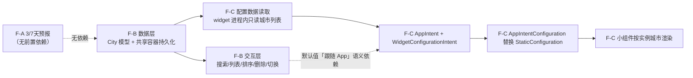

# PRD：枳生天气 · iOS 版（P1 增量 · 第二里程碑）

> 版本：**v1.1**（P1 增量 PRD · 修订版）
> 作者：许清楚（产品经理）
> 日期：2026-09-11
> 上游输入：team-lead 任务说明 + `PRD-zhisheng-ios.md`（v1.0 MVP 已交付）+ 现网源码（`ZhishengWeatherIOS/`）+ `ARCH-zhisheng-ios-signing.md`（v1.1，签名与真机部署补章）
> 前置里程碑状态：MVP 已实现并测试通过 —— Open-Meteo 取数、单城市、当前位置/回落北京、主屏（当前 + 逐小时 + 月相）、Small/Medium 小组件、App Group 共享、CI 出未签名 IPA、6 个测试文件 77 个用例。

### v1.1 修订摘要（相对 v1.0）

| # | 修订项 | 依据 |
|---|---|---|
| 1 | **Large 小组件由"不做（P2）"改为"做（P1 正式需求）"**，3/7 天预报上 Large；共改 4 处（§2.4(d)、§2.5、§4.6、交付边界速查） | 主理人裁决：Large family 已随任务 A 落地（`supportedFamilies` 含 `.systemLarge`） |
| 2 | **F-C 的 "Large 城市选择" 由 Out-of-Scope 转为支持**（配置层机制与 family 无关，无需单独开发） | 同上；原否决前提"Large 尚未实现"已失效 |
| 3 | **补入真机验收交叉引用**（§4.5.2 / §4.5.3 / §4.5.4 / §4.5.5 / §4.6），判据编号由架构师冻结 | `ARCH-zhisheng-ios-signing.md` v1.1 |
| 4 | **AC-C7 措辞修正**：由"数秒内刷新"改为"数秒至数十秒内（时机由系统决定）"，并明确**不作硬性判据** | 架构师 F-C-7 提醒（WidgetKit 刷新由系统决定） |
| 5 | **F-A 兼容性补"真机覆盖安装验证"**（F-A-9）：旧缓存 → 新版本解码，单测覆盖不到 | 架构师指出 |
| 6 | **Q1 已确认**：多城市走 Geocoding API 搜索；**新增 §3.5.1 排期影响 + §3.5.2 失败态验收（AC-B17~B21）** | 用户拍板 |
| 7 | **Q6 已确认**：用户无 Mac、只有 Windows → 真机部署走 §4.6；§5 收尾阶段引用该路径 | 用户拍板 |
| 8 | **补 `supportedFamilies` 只增不减** 硬约束（F-C §4.4(a) 与 §2.4(d)） | 架构师 §4.5.5 |
| 9 | **§7 拆分为"已确认"与"仍待确认"**；新增 Q7（F-C 自动刷新不作硬判据） | 本轮沟通结论 |

---

## 0. 本增量 PRD 的定位

MVP 交付后，用户明确提出三个缺口：**看不到未来几天**、**只能看一个城市**、**小组件不能选城市**。本 PRD 只覆盖这三件事，其余 P1（多数据源融合、多语言、生活指数、后台刷新、签名 IPA、设置页、锁屏组件）**不在本轮**。

| 特性 | 名称 | 优先级 | 依赖 |
|---|---|---|---|
| **F-A** | 未来 3/7 天预报 | P1 | 无（可独立交付） |
| **F-B** | 多城市管理 | P1 | 无（可独立交付） |
| **F-C** | iOS 17 桌面小组件城市选择（AppIntentConfiguration） | P1 | **强依赖 F-B** |

> 一句话边界：**F-A 是"看得更远"，F-B 是"看得更多地方"，F-C 是"在桌面直接选地方"。**

---

## 1. 现状盘点（写 PRD 的事实基础）

以下均为对 `ZhishengWeatherIOS/` 现网源码的实读结论，不是推测。

| 能力 | 现状 | 与本轮的关系 |
|---|---|---|
| 请求 URL 构造 | `Core/Networking/OpenMeteoEndpoint.swift`：`current`（7 字段）+ `hourly`（`temperature_2m,weather_code`）+ `daily`（**仅** `temperature_2m_max,temperature_2m_min`） | **F-A 必须改此处** |
| DTO | `Core/Models/OpenMeteoResponse.swift`：`Current` / `Hourly` / `Daily` 三个嵌套 struct，`daily` 为可选 | **F-A 必须改此处** |
| 领域模型 | `WeatherSnapshot.swift`：已含 `dailyHigh` / `dailyLow`（仅第 0 项），`hourly` 截窗 ≤ 12 条；`moonPhase` 为派生计算属性 | **F-A 需扩展** |
| 位置模型 | `Core/Models/LocationInfo.swift`：`name` / `latitude` / `longitude` / `isFallback` 四字段，`static let beijing` 为硬编码回落 | **F-B 的基础**，需扩展 |
| 共享容器 | `Core/Storage/AppGroup.swift`：`identifier` = `group.com.zhisheng.weather`；`payloadKey` = `zs.weather.payload`；**`locationKey` = `zs.weather.location` 已预留但当前未被使用** | F-B / F-C 复用，**新增 city 相关 key** |
| 落盘结构 | `SharedWeatherPayload`：`{ snapshot, updatedAt }`，**单城市单载荷** | **F-B 必须重构为多城市容器** |
| 写盘者 | `WeatherViewModel`（主 App）唯一写；Widget 只读（`WeatherProvider`） | F-B 需定义"何时写哪些城市" |
| 小组件 | `ZhishengWeatherWidget.swift` 用 **`StaticConfiguration`**（无用户配置）；`supportedFamilies` = **`.systemSmall, .systemMedium, .systemLarge`** | **F-C 必须改为 `AppIntentConfiguration`**；Large 已支持 |
| **Large 小组件** | ✅ **已落地**：`LargeWeatherView.swift` + `MetricGridLayout.swift` 存在，`supportedFamilies` 已含 `.systemLarge` | **v1.1：F-A 的逐日预报上 Large**（见 §2.4(d)）；Large 的城市选择由 F-C 的配置层自动覆盖 |
| 刷新 | Timeline `.after(now + 45min)`；主 App 每次成功取数 `reloadAllTimelines()` | F-A/F-B 沿用，不新增机制 |
| 部署目标 | `project.yml`：`iOS 17.0`（`IPHONEOS_DEPLOYMENT_TARGET = 17.0`） | **F-C 的 iOS 16 降级为"方案上要说明、工程上不需要兼容"** |
| 测试 | 6 文件 77 用例（Endpoint / Decoding / Mapper / AppGroup / Moon / WMO） | 三特性均需补测 |
| 第三方依赖 | **0 个** | 建议继续保持 0（见 F-B 决策） |

---

## 2. 特性 F-A：未来 3/7 天预报

### 2.1 产品定义

**目标**：让用户在主屏一眼看到"明天/后天/大后天会不会下雨、冷不冷"，并可选看到一周。

| # | 目标 | 衡量方式 |
|---|---|---|
| A-G1 | **可读**：主屏新增预报区，不破坏现有"一屏读完当前天气"的信息层级 | 新增区块位于逐小时之下、月相之上；Hero 温度区仍在首屏 |
| A-G2 | **准**：预报的日期、高低温、现象与实际服务端返回严格一致 | 单测覆盖"数组长度不齐 / 缺字段 / 跨月边界"三类边界 |
| A-G3 | **稳**：`daily` 字段缺失或长度不足时不崩溃、不显示脏数据 | 逐日数组长度校验 + 逐项兜底；无数据时区块整体隐藏而非显示占位行 |

### 2.2 用户故事

| ID | 用户故事 |
|---|---|
| US-A1 | **As a** 每天出门前看天的用户，**I want** 在主屏看到未来 3 天每天的最高/最低温和天气现象，**so that** 我能提前决定这周要不要带伞、加衣服 |
| US-A2 | **As a** 计划周末出行的用户，**I want** 能切换到 7 天视图看到一整周，**so that** 我能挑一个天气好的日子安排活动 |
| US-A3 | **As a** 关心"温差"的用户，**I want** 逐日行里同时看到最高温和最低温，**so that** 我知道早晚温差大不大 |
| US-A4 | **As a** 关心"会不会下雨"的用户，**I want** 看到每天的降水概率百分比，**so that** 我能判断要不要带伞 |
| US-A5 | **As a** 不想被过多信息干扰的用户，**I want** 默认只看 3 天、需要时才展开 7 天，**so that** 主屏保持清爽 |

### 2.3 验收标准

| # | Given | When | Then |
|---|---|---|---|
| AC-A1 | 一次成功取数 | 解析 `daily` 数组 | 取到逐日 `time` / `temperature_2m_max` / `temperature_2m_min` / `weather_code` / `precipitation_probability_max` 五个并行数组，且长度一致 |
| AC-A2 | 逐日数组长度 = 7 | 渲染默认（3 天）视图 | 只显示前 3 天（今天 / 明天 / 后天），DOM 中不多渲染隐藏行 |
| AC-A3 | 用户点击"7 天" | — | 区块展开显示 7 天；点击"收起"回到 3 天；状态在当前会话内保持 |
| AC-A4 | 某天 `weather_code` 为 61 | 渲染该行 | 显示"小雨"文案 + `cloud.rain.fill` 图标（复用现有 `WMOCodeMapper`，**不新增映射表**） |
| AC-A5 | 某天 `precipitation_probability_max` 为 null | 渲染该行 | 该行降水概率位显示 `--`，不显示 `0%`（**不可把 null 当 0 误导用户**） |
| AC-A6 | 逐日 `weather_code` 数组比 `time` 短 | 解析 | 按最短长度对齐，多余日期行不显示，不 crash |
| AC-A7 | `daily` 整块缺失（旧缓存 / 服务端异常） | 渲染 | 逐日区块**整块隐藏**，主屏其余部分正常，无空行、无崩溃 |
| AC-A8 | 首行 | 渲染 | 首行标签为"今天"而非具体日期；其余行显示"周三 / 周四"式周几 |
| AC-A9 | iPhone SE（375pt） | 展开 7 天 | 无横向溢出；纵向滚动自然延伸，不遮挡月相与页脚 |
| AC-A10 | 单元测试 | 运行 | 覆盖：正常 7 天、长度不齐、`daily` 为 nil、降水概率含 null、跨月日期格式，共 ≥ 5 个新用例 |
| **AC-A11**（v1.1 新增） | Large 小组件已添加 | 查看 | 展示逐日预报（横向 3–5 列 + 左栏当前天气）；城市/温度/现象与同屏 Small/Medium **完全一致**（同一份共享容器数据） |
| **AC-A12**（v1.1 新增） | iOS「文字大小」调到最大 | 查看 Large | 文字不溢出、不重叠（对应 `§4.5.1` **L-6**） |
| **AC-A13**（v1.1 新增） | iOS 开「增大对比度」 | 查看 Large | 深色磷光主题下文字仍可读（对应 `§4.5.1` **L-7**） |

> 🔗 **真机验收路径**：`ARCH-zhisheng-ios-signing.md §4.5.2`（判据 **F-A-1 ~ F-A-9**），编号已冻结、不随实现进度改动。
> ⚠️ 其中 **F-A-9** 是单测**覆盖不到**的一条：**旧版本已装机的缓存 → 新版本解码必须在真机上做「覆盖安装」验证**（不能先卸载），见 §2.4(c)。

### 2.4 关键技术约束（**必须写入实现前约束**）

> 以下字段名均为 Open-Meteo `/v1/forecast` 的真实参数名，架构师据此改造 `Core/Networking/` 与 `Core/Models/`。**本 PRD 不写任何 Swift 代码。**

**(a) 需在 `daily` 参数中追加的请求字段**

| 状态 | 字段名 | 用途 | 说明 |
|---|---|---|---|
| 已有 | `daily=temperature_2m_max` | 每日最高温 | 现网已请求 |
| 已有 | `daily=temperature_2m_min` | 每日最低温 | 现网已请求 |
| **新增** | `daily=weather_code` | 每日现象码 | 驱动图标与中文文案 |
| **新增** | `daily=precipitation_probability_max` | 每日最大降水概率（%） | 用户明确关心的"会不会下雨" |
| **可选（建议一并加）** | `daily=sunrise` / `daily=sunset` | 日出日落 | 若本轮不做则不加，避免浪费字节 |

> 必须同时显式声明 `forecast_days=7`。**不要依赖默认值**：Open-Meteo 的 `forecast_days` 默认虽为 7，但显式声明可避免服务端策略变更导致长度漂移 —— 这是 A-G3 的前提。
> 现有 `timezone=auto` 与 `timeformat=unixtime` **保持不变**；`daily.time` 也是 epoch 秒，解析方式与 `hourly.time` 一致（**不要**引入字符串日期解析，会破坏现有解码纪律）。

**(b) 需要扩展的 Codable 模型**

| 层 | 文件 | 变化 |
|---|---|---|
| DTO | `Core/Models/OpenMeteoResponse.swift` | `Daily` 追加 `weather_code: [Int]`、`precipitation_probability_max: [Int?]`（**必须可选元素**，服务端可能返回 null）。`daily` 本身保持可选 |
| 领域模型 | `Core/Models/WeatherSnapshot.swift` | 新增 `daily: [DailyForecast]`（逐日点数组），与现有 `dailyHigh`/`dailyLow` **并存**（后者被主屏 Hero 区使用，不可删） |
| 新模型 | `Core/Models/`（新增文件） | `DailyForecast`：`date: Date` / `high: Double` / `low: Double` / `weatherCode: Int` / `precipitationProbability: Int?`；需 `Codable + Equatable + Identifiable + Sendable`，与 `HourlyPoint` 保持同一风格 |
| 映射器 | `Core/Networking/OpenMeteoMapper.swift` | 新增逐日映射：五数组求最短长度对齐、逐项构造、`daily` 为 nil 时返回空数组。**继续保持 `now` 参数注入、禁止内部 `Date()`** 的现有纪律 |
| 兼容性 | `SharedWeatherPayload` | 结构不变；`WeatherSnapshot` 新增字段使共享容器 JSON **向后不兼容** —— 见下方 (c) |

**(c) 共享容器兼容性（重要，易漏）**

`WeatherSnapshot` 新增非可选 `daily` 字段后，**小组件读取旧版 JSON 会解码失败**（`AppGroupStore.load()` 会返回 nil → 小组件显示"暂无数据"）。
必须二选一，建议选 **方案 1**：

| 方案 | 做法 | 代价 |
|---|---|---|
| **1（推荐）** | `daily` 声明为**可选** `[DailyForecast]?`，解码失败时映射为 `[]`；UI 层无数据即隐藏区块 | 模型多一层可选判断，但与现有 `daily: Daily?` 的处理风格一致 |
| 2 | 引入 `payloadVersion` 字段；版本不符时丢弃旧载荷重新取数 | 需新增版本字段与迁移逻辑，本轮收益低于成本 |

> 🔴 **这条兼容性有一个单元测试覆盖不到的死角（必须在真机验证）**：单测只能覆盖"给定旧 JSON 字符串 → 解码"，**覆盖不到"上一版本真机已写入的共享容器缓存 → 新版本读取"** 这条路径。
> 因此 **F-A 落地后必须做一次真机「覆盖安装」验证**（**直接升级安装，不可先卸载 App**，否则缓存被清空、问题不会复现）：
> - 先装**改动前**的版本并成功取数一次（写入旧结构缓存）；
> - 直接覆盖安装**改动后**的版本，打开 App；
> - **期望**：不出现"暂无数据"，主屏与小组件均正常（旧缓存被安全丢弃或按方案 1 兜底）。
>
> 对应判据：`ARCH-zhisheng-ios-signing.md §4.5.2` 的 **F-A-9**。

**(d) 展示形态（决策）**

| 展示位置 | 是否做 | 理由 |
|---|---|---|
| **App 内逐日列表** | **做（P1 必做）** | 这是本特性的核心价值，无此则特性无意义 |
| **Medium 小组件** | **不做** | 现网 Medium 右栏已被逐小时占满（未来 4–6 小时），再塞 3 天会挤压左栏主体，违反 MVP 的"空间不足先保左栏"纪律 |
| **Large（大号）小组件** | **做（P1 正式需求）** | **修订（v1.1）**：Large family 已随任务 A 交付落地（`ZhishengWidgetBundle.swift` 的 `supportedFamilies` 已含 `.systemLarge`，`LargeWeatherView.swift` + `MetricGridLayout.swift` 已存在），原先"新增 family 成本高"的否决理由已归零。Large 是逐日预报最自然的展示位（横向 3–5 列 + 左栏当前天气），故 **3/7 天预报上 Large，作为正式需求**（主理人已拍板，非"待决策"）。<br>⚠️ 但 Large 的布局适配与高对比度可读性**必须在真机验收**（`ARCH-zhisheng-ios-signing.md §4.5.1` 的 **L-6 动态字体 / L-7 增大对比度**），且需遵守 **§4.5.5「`supportedFamilies` 只增不减」** 的硬约束 |

**(e) 3 天 / 7 天是否做成用户可切换（决策 + 理由）**

**建议：做，但只用"区块内轻量展开/收起"，不做设置项。** 理由是三天足够覆盖"明天穿什么"，而七天是低频但真实存在的需求（周末计划）；把它做成设置里的一个开关会增加认知负担且需要在 `UserDefaults` 里持久化，而一个"3 天 / 7 天"的胶囊分段控件既零学习成本，又能让主屏默认保持 MVP 的清爽高度。**默认值取 3 天**，且**展开状态不做跨启动持久化**（每次冷启动回到 3 天）—— 避免"用户半年前点过一次 7 天，之后每次打开主屏都被一周预报挤下去"这种常见体验倒退。

### 2.5 Out of Scope（明确不做）

- ❌ 逐日预报的**详情页/下钻**（点某天进入该天逐小时）—— 列为 P2。
- ❌ 温度**趋势折线图** —— 原 PRD 已列 P2-5。
- ❌ 日出日落 / 紫外线 / 风 / 湿度的逐日展示 —— 只用 `temperature_2m_max/min` + `weather_code` + `precipitation_probability_max` 四个字段。
- ~~❌ Large 小组件展示 3/7 天预报 —— 列 P2~~ → **修订（v1.1）：已改为"做"**，Large 上逐日预报进 P1，见 2.4(d)。
- ❌ Medium 小组件展示 3/7 天预报 —— 右栏已被逐小时占满，见 2.4(d)。
- ❌ 多数据源交叉校验逐日结果 —— 属 PRD 中的 P1-1，本轮不涉及。
- ❌ 历史预报比对 / 准确率统计。

---

## 3. 特性 F-B：多城市管理

### 3.1 产品定义

**目标**：用户可保存多个城市，在 App 内快速切换查看，且所选城市同步到桌面小组件。

| # | 目标 | 衡量方式 |
|---|---|---|
| B-G1 | **能加**：30 秒内完成"搜索 → 选中 → 出现在列表" | 从点开搜索到列表出现新城市 ≤ 3 次点击 |
| B-G2 | **能切**：切换城市后主屏数据在 2s 内更新 | 点击城市行 → 数据刷新完成 ≤ 2s（有网） |
| B-G3 | **不丢**：重启 App 后城市列表与当前选中城市不变 | 杀进程冷启动后，列表与选中项与退出前完全一致 |
| B-G4 | **不崩**：任何城市相关操作都不影响小组件可用性 | 删除当前城市时自动切换到相邻城市，小组件继续有数据 |

### 3.2 用户故事

| ID | 用户故事 |
|---|---|
| US-B1 | **As a** 经常出差或家人在外地的用户，**I want** 保存多个城市并在它们之间快速切换，**so that** 我不用每次手动改坐标 |
| US-B2 | **As a** 想新增城市的用户，**I want** 输入城市名就能搜到并选中，**so that** 我不用知道经纬度 |
| US-B3 | **As a** 关心两个城市温差的用户，**I want** 城市列表里每行直接显示该城市的当前温度和现象，**so that** 我一瞥就能比较 |
| US-B4 | **As a** 手滑加错城市的用户，**I want** 能左滑删除城市，**so that** 列表保持干净 |
| US-B5 | **As a** 加了多个城市的用户，**I want** 桌面小组件显示我刚在 App 里选中的那个城市，**so that** App 和小组件不会各说各话 |
| US-B6 | **As a** 没授权定位的用户，**I want** 有一个可用的默认城市，**so that** 首次打开不是空白 |

### 3.3 验收标准

| # | Given | When | Then |
|---|---|---|---|
| AC-B1 | 首次安装（无任何持久化） | 冷启动 | 城市列表 = `[北京]`（沿用现有 `LocationInfo.beijing` 回落坐标），选中项 = 北京 |
| AC-B2 | 已授权定位 | 冷启动首次取数 | 新增/更新一个"当前位置"城市项（`isFallback = false`），**不覆盖**用户手动添加的城市 |
| AC-B3 | 已拒绝定位 | 冷启动 | 不新增"当前位置"，使用默认北京，无任何阻断式弹窗 |
| AC-B4 | 城市列表为空或只有默认项 | 打开搜索 | 搜索框可输入，输入 ≥ 1 个字符后展示候选结果（带 300ms 防抖） |
| AC-B5 | 输入"杭州" | 拿到搜索结果 | 每行显示"城市名 + 省份/国家 + 经纬度"；点选后加入列表并**立即切换为当前城市**并触发取数 |
| AC-B6 | 输入乱码"asdkjh" | 搜索返回空 | 显示"未找到匹配城市"空态，不报错、不崩溃 |
| AC-B7 | 搜索时断网 | 请求失败 | 显示"网络不可用，搜索失败" + 重试按钮；**已有城市列表不受影响** |
| AC-B8 | 用户添加同名城市两次 | 第二次添加 | 列表不出现重复项（按坐标去重，容差 ~0.01°）；若已存在则直接切换选中 |
| AC-B9 | 列表有 3 个城市 | 长按拖动 | 可重新排序；排序结果持久化 |
| AC-B10 | 列表有 2 个城市 | 左滑删除第 1 个（当前选中） | 删除后自动选中剩余城市并触发取数；小组件数据随之更新 |
| AC-B11 | 列表仅有 1 个城市 | 尝试删除 | 删除按钮置灰或给出提示"至少保留一个城市" |
| AC-B12 | 任意时刻切换城市 | — | 主屏顶部栏城市名立即变化，Hero 区与预报区随之刷新；切换过程中不显示全屏 loading（保留旧内容直至新数据到达） |
| AC-B13 | 城市列表已持久化 | 杀进程后冷启动 | 列表顺序 + 选中城市与退出前一致 |
| AC-B14 | 已选中"上海" | 冷启动 | 小组件显示"上海"（跟随主 App 选中城市，经 App Group 同步） |
| AC-B15 | 单元测试 | 运行 | 覆盖：增 / 删 / 排序 / 去重 / 删除当前项后回退 / 存储编解码往返 / 空列表兜底，≥ 7 个新用例 |
| AC-B16 | 列表非空 | 进入城市列表页 | 每行展示该城市最近一次已知温度与现象（无数据时显示 `--`，不阻塞列表渲染） |

> 🔗 **真机验收路径**：`ARCH-zhisheng-ios-signing.md §4.5.3`（判据 **F-B-1 ~ F-B-11**）。
> ⚠️ **F-B-8 / F-B-11 是 App Group 的第二次大考**：F-B 引入了**新的共享 key**（城市列表 + 选中 id）。落地后**建议重跑一次 §4.3 的时间戳交叉验证法**，因为它验证的正是"主 App 写 → widget 读"这条链路的整体连通性。

### 3.4 数据模型（描述，非代码）

**`City` 对象字段**

| 字段 | 类型 | 必填 | 说明 |
|---|---|---|---|
| `id` | 稳定标识 | ✅ | 建议由 `latitude`/`longitude` 规范化生成（如保留 2 位小数拼接），保证跨启动稳定 —— 城市列表用 `Identifiable` 渲染、拖动排序都依赖它 |
| `name` | String | ✅ | 展示名（"杭州"） |
| `latitude` | Double | ✅ | WGS84 |
| `longitude` | Double | ✅ | WGS84 |
| `timeZoneIdentifier` | String | ⭕ 建议 | IANA 时区（如 `Asia/Shanghai`）。**理由**：现网请求用 `timezone=auto` 让服务端按坐标推断，但城市列表里显示"当地现在几点 / 今天/明天"的判定需要客户端时区。首轮可先依赖服务端返回的 `timezone` 字符串回填 |
| `country` / `admin1` | String? | ⭕ 建议 | 搜索结果的省份/国家，用于同城去歧义（"朝阳" 可能指辽宁或北京） |
| `isCurrentLocation` | Bool | ✅ | 区分"当前位置"与"手动添加城市"，决定是否随定位更新坐标 |
| `sortOrder` | Int | ✅ | 持久化的列表顺序 |

**持久化方案**

| 项 | 内容 |
|---|---|
| 存储位置 | App Group 共享容器（`UserDefaults(suiteName:)`），**沿用现有 `AppGroupStore` 的注入式设计** |
| 新增 key | 城市列表一个 key（如 `zs.weather.cities`）、当前选中城市 id 一个 key（如 `zs.weather.selectedCityId`）。**必须在 `AppGroup.swift` 里集中定义常量**，遵守现网"禁止散落字符串字面量"的纪律 |
| 为什么放共享容器 | 小组件必须知道"当前选中城市"才能显示正确城市 → 该信息天然属于共享数据；且 `AppGroup.swift` 里已预留 `locationKey`，说明架构师原本就为此留了位 |
| 编码 | `Codable` → JSON，与 `SharedWeatherPayload` 同风格 |
| 写入时机 | 仅在用户显式操作（添加/删除/排序/切换）时写城市列表；每次**成功取数后**写"当前选中城市 + 其快照" |
| 默认城市 | **北京**（复用现有 `LocationInfo.beijing`，不引入第二套默认坐标），`isFallback = true` |
| 兼容性 | 首启时共享容器无城市列表 → 视作"未初始化"，按 AC-B1 初始化；**不要**因解码失败而清空用户数据 |

**多城市与现有单载荷结构的关系（关键约束）**

现网 `SharedWeatherPayload` 是**单快照**结构。F-B 有两条路：

| 方案 | 做法 | 评价 |
|---|---|---|
| **A：只同步"当前选中城市"** | 共享容器仍只存一份快照，即"主 App 当前选中城市"的快照；城市列表本身也存共享容器但小组件不逐个取数 | ✅ **推荐**。小组件只展示一个城市，无需多份快照；改造量最小；不引入"后台批量取数"这种 iOS 上不靠谱的机制 |
| B：同步所有城市快照 | 共享容器存 `{城市id: 快照}` 字典，主 App 切换城市时把所有城市都拉一遍 | ❌ 请求量 ×N；iOS 对 App 后台执行无保证；小组件其实只显示一个城市，收益为零 |

**结论：采方案 A。** 明确写入约束：**小组件永远只读"当前选中城市"那一份快照**，不新增多城市批量取数逻辑。

### 3.5 城市搜索：决策（geocoding API vs 本地预置列表）

| 维度 | 方案 1：Open-Meteo Geocoding API | 方案 2：本地预置城市列表（JSON 内置） |
|---|---|---|
| 接口 | `https://geocoding-api.open-meteo.com/v1/search?name=杭州&count=10&language=zh&format=json` | 随包内置一份中国主要城市 + 少数海外城市（约 300–500 条） |
| **建议** | ✅ **首选（主路径）** | ⭕ 作为**离线兜底**（可选，第二轮） |
| 成本 | 低 —— 免费、无密钥、与现有 Open-Meteo 同源；需要新增一个 endpoint 构造器 + 一个 DTO + 一个 mapper；**必须遵守 Core 层"禁用 UIKit、零第三方依赖"纪律** | 中 —— 需要人工准备并维护中文城市名 / 经纬度 / 时区数据集，且**永远不全**（用户想加"米兰"就是加不了）；但零网络、零失败路径 |
| 风险 | ① 免费额度与稳定性不承诺（自用场景可接受）；② 中文搜索命中率依赖其语料，需实测；③ 搜索是**新增的网络调用**，必须走现有 `WeatherError` 错误收敛，并保持"失败不影响已有列表" | ① 数据维护成本落在个人开发者身上；② 匹配逻辑（拼音/别名）自己做反而更复杂 |
| 理由 | **能搜到任意城市**对"多城市管理"是核心体验；用本地列表会把产品退化成"只能选我预置的城市"，用户第一次想搜"老家小城"搜不到就会认为功能是半成品。且 Open-Meteo geocoding 与本项目已有数据源同厂、免密钥、零依赖，接入成本最低 | | 
| 代价 | 新增网络路径 + 新增 DTO + 新增空态/错误态测试（≥ 3 个用例）；搜索页需处理防抖与竞态（连续输入时丢弃过期响应） | |

**建议落地顺序**：先只做方案 1（API 搜索），并把失败路径做成"网络不可用，搜索失败 + 重试"。**本地预置列表本轮不做**（列 P2），理由是它会让 DTO/UI 复杂度翻倍而只覆盖离线场景 —— 而加城市本身就是个低频在线操作。

> ✅ **决策已定（v1.1）**：**采用方案 1（Open-Meteo Geocoding API 搜索）**，本地预置城市列表**不做**。

#### 3.5.1 对 F-B 排期的显式影响（**必须计入工作量**）

选方案 1 意味着 F-B **新增一条完整的网络数据链路**，不是"顺手加个搜索框"。架构师排期时需按下列清单计入：

| # | 新增物 | 位置 | 说明 |
|---|---|---|---|
| 1 | **Geocoding endpoint 构造器** | `Core/Networking/` | `https://geocoding-api.open-meteo.com/v1/search?name=…&count=…&language=zh&format=json`；须与现有 `OpenMeteoEndpoint` 同风格（静态拼装、失败返回 nil 由调用方收敛） |
| 2 | **Geocoding DTO** | `Core/Models/` | 需 `Codable + Sendable`；字段含 `name` / `latitude` / `longitude` / `country` / `admin1` / `timezone`。⚠️ **搜索结果可能不含 `results` 键**（无命中时）→ 该字段必须可选 |
| 3 | **Geocoding mapper** | `Core/Networking/` | DTO → `City` 候选（纯函数）；与 `OpenMeteoMapper` 保持"禁止内部 `Date()`"的纪律 |
| 4 | **搜索服务 / 协议** | `Core/Networking/` | 建议与 `WeatherProviding` 同风格抽协议（便于单测注入 Fake）；需复用现有 `WeatherError` 错误收敛 |
| 5 | **搜索页 UI + 防抖** | 主 App target | 300ms 防抖 + **竞态处理（连续输入时丢弃过期响应）** |
| 6 | **新增测试** | `ZhishengWeatherTests/` | endpoint / DTO 解码（含无 `results`、字段缺失）/ mapper / 失败态，**≥ 3~5 个新用例** |

> 🔴 **排期提醒**：第 1~4 项属 `Core/`，会被**主 App 与 Widget 两个 target 同时编译**，因此**同样禁止 `import UIKit`**（现网纪律）。第 4 项的协议抽象不是可选项 —— 没有它，搜索的失败态无法单测。

#### 3.5.2 搜索失败态验收标准（补）

| # | Given | When | Then |
|---|---|---|---|
| AC-B17 | 搜索请求发出 | 网络超时 / DNS 失败 / 非 2xx | 显示"网络不可用，搜索失败" + **重试按钮**；**已在列表中的城市不受任何影响**；不 crash、不卡死、不清空输入框 |
| AC-B18 | 连打"杭州湾"（连续输入） | 前序请求返回晚于后序 | **只渲染最后一次输入的结果**（丢弃过期响应）；不出现"结果闪回上一个关键词" |
| AC-B19 | 服务端返回 `results` 缺失或无命中 | 输入"asdkjh" | 显示"未找到匹配城市"空态（**与网络失败态区分显示**，措辞不同） |
| AC-B20 | 搜索结果某条缺 `admin1`（省份） | 渲染该行 | 省份位留空或显示 `country`，**不显示 `null` / 崩溃** |
| AC-B21 | 输入 1 个字符 | 触发搜索 | **不立即请求**（防抖生效）；待停顿 300ms 后再发一次请求 |

### 3.6 交互流程与 ASCII 线框

**主流程**：主屏顶部栏城市名 →（点击/右滑）→ 城市列表页 →（右上"+"）→ 搜索页 → 选中 → 回到列表（新城市成为当前选中）→ 主屏刷新 → 小组件刷新。

**城市列表页**

```
┌──────────────────────────────────────────┐
│  ‹ 返回            城市            ＋    │  ← 导航栏：返回 / 标题 / 添加
├──────────────────────────────────────────┤
│  ≡  北京            位置       23° 多云  │  ← 当前选中行：≡ 拖动柄
│     ─────────────────────────────────── │     右侧：温/现象（无数据为 --）
│  ≡  杭州               ✓        27° 晴   │  ← ✓ = 当前选中；整行可点切换
│     ─────────────────────────────────── │
│  ≡  哈尔滨             ❄        -8° 小雪│
│     ─────────────────────────────────── │     左滑 →「删除」
│  ≡  伦敦               ☁        11° 阴   │
│                                          │
│                                          │
│  ↑ 长按拖动可排序 · 左滑删除              │  ← 底部操作提示（14pt 弱化色）
└──────────────────────────────────────────┘
```

**搜索页**

```
┌──────────────────────────────────────────┐
│  ‹ 返回          添加城市                 │
├──────────────────────────────────────────┤
│  ┌────────────────────────────────────┐  │
│  │ 🔍  输入城市名（如：杭州）          │  │  ← 300ms 防抖
│  └────────────────────────────────────┘  │
├──────────────────────────────────────────┤
│  杭州   中国 · 浙江        30.27,120.15  │  ← 结果行：名称/省份/坐标
│  ──────────────────────────────────────  │     点选 = 添加 + 切换 + 返回
│  杭州湾 中国 · 浙江        30.40,121.00  │
│  ──────────────────────────────────────  │
│  余杭   中国 · 浙江        30.42,120.30  │
├──────────────────────────────────────────┤
│  （无结果）  未找到匹配城市               │
│  （失败）    网络不可用，搜索失败  [重试]  │
└──────────────────────────────────────────┘
```

**主屏顶部栏（改动点）**

```
┌──────────────────────────────┐
│  北京  ⌄                 ⟳   │  ← 城市名后加 ⌄ 指示可切换；
│  9月11日 00:31               │     点击或右滑 → 城市列表页
└──────────────────────────────┘
```

### 3.7 与小组件的关系（决策）

**建议：小组件显示"主 App 当前选中城市"，通过 App Group 同步。**

理由：① 逻辑单一，用户心智一致（App 里看哪个，桌面就是哪个）；② 无需为小组件建立独立的城市选择逻辑（那正是 F-C 要解决的，且是**显式配置**而非隐式默认）；③ 方案 A 的共享结构天然支持。

同步时机：**仅在用户切换城市并成功取数后**写入共享容器并 `reloadAllTimelines()`，避免无意义的刷新。

### 3.8 Out of Scope（明确不做）

- ❌ 城市搜索的**拼音/英文/别名**匹配 —— 依赖 geocoding API 自身语料，不做本地补全。
- ❌ 城市**分组 / 标签 / 收藏置顶**。
- ❌ **逐个城市独立刷新**（批量取数）—— 见 3.4 方案 A。
- ❌ 城市列表的**云同步 / 多设备同步**（无账号体系）。
- ❌ 城市地理矩形的**自定义命名**（用户给城市改名）。
- ❌ 本地预置城市列表（列 P2）。
- ❌ 城市详情页（地图、生活指数等）。

---

## 4. 特性 F-C：iOS 17 桌面小组件城市选择（AppIntentConfiguration）

### 4.1 产品定义

**目标**：用户**不打开 App**、直接在桌面长按小组件就能选择该小组件显示哪个城市，且不同小组件实例可显示不同城市。

| # | 目标 | 衡量方式 |
|---|---|---|
| C-G1 | **桌面可配**：长按小组件 → 编辑小组件 → 城市下拉可选 | 配置界面能列出用户所有已保存城市 |
| C-G2 | **实例独立**：桌面放两个小组件，可分别显示"北京"和"杭州" | 两个 widget 实例的配置互不影响 |
| C-G3 | **不降级不崩**：配置缺失 / 城市被删 / 无数据时仍有合理展示 | 三种异常路径均可读、无崩溃 |

### 4.2 用户故事

| ID | 用户故事 |
|---|---|
| US-C1 | **As a** 同时关心两个城市的用户，**I want** 在桌面放两个小组件、分别配置成不同城市，**so that** 我一屏看到两地的天气 |
| US-C2 | **As a** 常用小组件但懒得开 App 的用户，**I want** 长按小组件就能改城市，**so that** 我不用先打开 App 切换城市再回桌面 |
| US-C3 | **As a** 在 App 里删掉了某城市的用户，**I want** 小组件自动回退到可用城市，**so that** 它不会一直显示一个已经不存在的城市 |
| US-C4 | **As a** 新装 App 的用户，**I want** 小组件默认显示我 App 里当前选中的城市，**so that** 我不用先做任何配置 |

### 4.3 验收标准

| # | Given | When | Then |
|---|---|---|---|
| AC-C1 | 城市列表有 3 个城市 | 长按小组件 → 编辑小组件 | 配置项出现，城市候选 = 3 个已保存城市（按 App 内排序），另含一个"跟随 App"选项 |
| AC-C2 | 配置界面 | 未做任何选择 | 默认值 = "跟随 App 当前选中城市"（**不是**硬编码北京），小组件显示与主 App 一致 |
| AC-C3 | 配置为"杭州" | 生效 | 该 widget 实例只显示杭州数据，与主 App 当前选中城市无关 |
| AC-C4 | 两个 widget 实例分别配为"北京"/"杭州" | — | 两实例各自正确显示，互不干扰（配置按实例隔离） |
| AC-C5 | 配置的城市被用户在 App 中删除 | 小组件下次刷新 | 自动回退到"跟随 App"，并显示 App 当前选中城市；**不显示已删除城市名** |
| AC-C6 | 配置的城市**尚无**缓存快照 | 小组件渲染 | 显示该城市名 + `--°` + "暂无数据"（与现网 Small 空态一致），**不显示北京的数据冒充** |
| AC-C7 | 用户改配置后 | 小组件刷新 | 在**数秒至数十秒内**刷新（**时机由系统决定**），无需打开 App。⚠️ **本条不作为硬性验收判据**（见下方说明），验收以 AC-C3/AC-C4/AC-C5 为准 |
| AC-C8 | 配置解析代码在 widget 进程执行 | 无网络 / 无 App Group | 不崩溃、不阻塞渲染（配置解析必须是纯本地读，**禁止在配置解析里发起网络请求**） |
| AC-C9 | 单元测试 | 运行 | 覆盖：配置→城市解析、配置为"跟随 App"、配置城市不存在回退、空城市列表兜底，≥ 4 个新用例 |
| **AC-C10**（v1.1 新增） | 桌面有 Small/Medium/Large 各一个 | 分别编辑各自的小组件配置为不同城市 | **三个 family 均出现配置项**且各自按实例生效（配置层与 family 无关，**Large 无需单独开发**） |

> 🔗 **真机验收路径**：`ARCH-zhisheng-ios-signing.md §4.5.4`（判据 **F-C-1 ~ F-C-8**，🔴 **仅 iOS 17+ 真机有效**）。
> - **AC-C7 措辞修订（v1.1）**：原写"数秒内刷新"易被误读为硬指标。WidgetKit 刷新时机由系统决定，真机可能延迟到数十秒，**故不作硬性判据**（对应架构师在 F-C-7 的提醒）。
> - **AC-C8 与 `§3`（P1 起为硬禁止）直接挂钩** → 对应判据 **F-C-8**：飞行模式 + 断 App Group 下，「编辑小组件」界面仍能打开、不卡死。
> - ⚠️ **§4.5.5 强制回归动作**（F-C③ 是唯一改动用户已放置组件的改动）：删除全部组件 → 重新添加 Small/Medium/Large 各一个 → 逐个执行 F-C-1~F-C-6 → 再走一次"不删除、直接编辑已有组件"路径，**两条路径结果必须一致**。
> - ⚠️ **`supportedFamilies` 只增不减**（`§4.5.5`）：删减 family 会令已用该尺寸的组件被系统移除。

### 4.4 关键技术约束

**(a) 配置机制**

- 现网小组件使用 `StaticConfiguration`（`ZhishengWeatherWidget.swift`），**无法承载用户配置**，必须改为 `AppIntentConfiguration`。
- 需要新增：一个 `AppIntent` + 一个实现 `WidgetConfigurationIntent` 的 Intent，其配置参数用于表达"显示哪个城市"。
- **关键点（决定架构，必须写清）**：Intent 的 `perform()` 与**配置解析代码会被 widget extension 进程调用**，而非主 App。因此：
  - 配置解析所依赖的城市列表必须能**在 widget 进程内独立读取**（即必须放在 App Group 共享容器里，与 F-B 的持久化位置**同一份**）。
  - 这些代码若放在 `Core/`，会自然被主 App 与 Widget 两个 target 同时编译 —— 与现网纪律一致。**但 `Core/` 内禁止 `import UIKit`、禁止 `UIApplication`**，这一点在 F-C 里是硬约束（widget 进程里没有 UIApplication）。
  - 配置解析是**纯本地读 + 纯函数映射**，不允许任何网络请求：widget 的配置解析有严格的执行预算，联网必然超时。
  - 🔗 **对应验收判据**：`ARCH-zhisheng-ios-signing.md §4.5.4` 的 **F-C-8**（飞行模式 + 断 App Group 下，编辑小组件界面仍能打开、不卡死）；该约束的成因见 `same §3`「widget 自己联网」已由"不采纳"升级为 **P1 起为硬禁止**。
  - ⚠️ **`supportedFamilies` 只增不减**（`§4.5.5`）：F-C 改动配置类型时**必须保留 `kind = "ZhishengWeatherWidget"` 不变**，改 `kind` 会令所有已放置组件**必然失效**；删除 family 会令已用该尺寸的组件被系统移除。

**(b) 前置依赖（硬性）**

> **F-C 不可以先于 F-B 实现。** 它必须消费 F-B 定义的：
> 1. 城市列表数据结构（城市对象字段）；
> 2. 城市列表在 App Group 共享容器中的**存储 key 与编码格式**；
> 3. 城市列表的**读取接口**（widget 进程内可用的只读入口）。
>
> 若先做 F-C，就必须临时发明一套城市列表结构，之后 F-B 再推翻 — 纯浪费。**排序上 F-B 必须先于 F-C 完成。**

**(c) 配置项设计**

| 配置项 | 类型（表述） | 选项 | 默认值 |
|---|---|---|---|
| **城市** | 单选（下拉 / 列表选择） | ①「跟随 App」；② 用户已保存的每个城市（名称 + 省份消歧） | **「跟随 App」** |
| 显示名 | 固定 | 配置项标题"城市" | — |
| 是否显示更新时间 | **本轮不做** | 现网 Small/Medium 已固定显示更新时间，无需开放配置 | — |
| 温度单位 | **本轮不做** | 属 P1-7 设置页，与城市选择无关 | — |

**为什么默认值是"跟随 App"而不是"北京"**：新装用户、以及大多数只有一个城市的用户，打开桌面看到的必须和 App 里一致。若默认硬编码北京，杭州用户装完会以为小组件坏了（这类"看起来像 bug 的默认值"是最该避免的）。

**去重与排序**：配置候选列表必须与 App 内城市列表**同序同源**（都从同一份共享数据读），否则用户会发现"App 里排在第一个的，在配置里排第三"。

**(d) iOS 16 降级行为**

**说明**：本工程 `project.yml` 的 `IPHONEOS_DEPLOYMENT_TARGET` = **17.0**，即**实际不发布 iOS 16 版本**，所以这一节是**方案层面的降级说明 + 未来若下调部署目标时的设计预留**，本轮不引入任何版本判断分支（避免为不存在的路径增加死代码）。

| 场景 | 行为 |
|---|---|
| iOS 16 设备（假设未来下调到 iOS 16） | `AppIntentConfiguration` 不可用 → 小组件**不提供配置界面**，显示"主 App 当前选中城市" |
| 具体建议 | 显示 App 当前选中城市（即"跟随 App"）—— 与 C-G1 的默认值语义完全一致，因此**无需为 iOS 16 单独写一套视图**，只需在配置层退化 |
| iOS 17+ | 提供完整配置界面 |
| 本轮落地 | **不做** `if #available` 分支；仅在配置层的设计中保证"未配置 == 跟随 App"这一条语义，使未来下调部署目标时降级是零成本的 |

**(e) 其他约束**

- 小组件刷新机制**不变**（`.after(now + 45min)` + 主 App `reloadAllTimelines()`）。
- 配置改变时系统会自行刷新受影响的时间线，**不需要**额外注册监听。
- **`kind` 字符串与 `supportedFamilies` 均按"只增不减"处理**（`ARCH-zhisheng-ios-signing.md §4.5.5`）：
  - `kind = "ZhishengWeatherWidget"` **必须保持不变** —— 改 `kind` 会令所有已放置的小组件**必然失效**；
  - `supportedFamilies` 现为 `.systemSmall, .systemMedium, .systemLarge`（**v1.1 修订**，原 PRD 误写为仅前两者），**不得删减任何 family**（删减会令已用该尺寸的组件被系统移除）。
- **配置层机制与 family 无关**：`AppIntentConfiguration` 对 Small/Medium/Large 同时生效，**无需为 Large 单独开发城市选择**（v1.1 澄清）。
- Widget 的 `WidgetEntry`/`TimelineProvider` 需能拿到"本次实例请求的城市"—— 这是本次改造的核心改动点，由架构师设计。

### 4.5 依赖关系图

**F-C 的内部依赖链**



**文字依赖链（简版）**

```
F-A（独立）
F-B 数据层（City 模型 + 共享容器 key/编码）
   ├─→ F-B 交互层（搜索 / 列表 / 排序 / 删除 / 切换）
   └─→ F-C① 配置数据读取（widget 进程只读同一份城市列表）
          └─→ F-C② AppIntent + WidgetConfigurationIntent
                 └─→ F-C③ 用 AppIntentConfiguration 替换 StaticConfiguration
                        └─→ F-C④ 小组件按"实例配置的城市"渲染
                              ↑ 默认值「跟随 App」依赖 F-B② 的"当前选中城市"语义
```

**结论**：F-A 与 F-B 可并行；**F-C 必须整体排在 F-B 数据层之后**，且 F-C③ 是三个特性里唯一会改动用户已放置小组件行为的改动（有回归风险，需重点回归）。

### 4.6 Out of Scope（明确不做）

- ❌ 在小组件**上**直接切换城市（AppIntent 按钮/交互式 widget）—— 本轮只做配置界面选城市。
- ❌ 小组件配置里**新增城市**（配置界面只能选已保存城市；加城市必须在 App 里做）。
- ❌ 小组件里配置**温度单位 / 时间格式 / 主题**。
- ❌ 配置项的**跨设备同步**（无账号体系）。
- ❌ iOS 16 的 `#available` 分支实现（本轮部署目标为 17.0）。
- ✅ **修订（v1.1）**：~~❌ Large 小组件的城市选择（Large 本身尚未实现）~~ —— Large **已落地**（`supportedFamilies` 含 `.systemLarge`），故原否决前提失效。**Large 也支持城市选择**：`AppIntentConfiguration` 是配置层机制，与 family 无关，Small/Medium/Large 共享同一份配置，**无需为 Large 单独开发**。真机验收见 `ARCH-zhisheng-ios-signing.md §4.5.4`。
- ❌ Large 里**额外**展示逐小时趋势（Large 只做逐日预报，见 2.4(d)）。

---

## 5. 三特性实施建议顺序

| 阶段 | 内容 | 依赖 | 可并行 | 主要风险 |
|---|---|---|---|---|
| **①** | **F-B 数据层**：`City` 模型、共享容器持久化（新 key + 编码）、`AppGroup.swift` 常量、默认城市初始化 | 无 | 与 ② 并行 | **共享容器 JSON 结构变更 → 必须做向后兼容，否则小组件立刻失效** |
| **②** | **F-A 逐日预报**：`daily` 参数扩字段 + DTO/领域模型扩展 + Mapper + 主屏逐日区块（3/7 切换）+ **Large 小组件逐日视图** | 无 | 与 ① 并行 | `WeatherSnapshot` 加字段同样冲击共享容器解码 → **与 ① 统一走"可选字段 + 兜底"策略**；**旧缓存兼容必须真机覆盖安装验证**（F-A-9） |
| **③** | **F-B 交互层**：城市列表页、搜索页（Open-Meteo geocoding **三件套：endpoint + DTO + mapper**）、排序、删除、切换、小组件跟随选中城市 | ① | 否 | 搜索的网络失败路径与防抖竞态（AC-B17~B21）；**新增网络链路需计入排期**，见 §3.5.1；删除当前城市的回退 |
| **④** | **F-C 桌面城市选择**：配置数据读取 → Intent → `AppIntentConfiguration` 替换 → 按实例渲染 + 异常回退 | ①（③ 的"当前选中城市"语义） | 否 | 🔴 唯一会改变用户已有 widget 行为的改动；widget 进程内不得联网（F-C-8）；`kind` 不可改、`supportedFamilies` 只增不减；强制回归动作 §4.5.5 |
| **⑤** | **收尾**：全量回归（77 旧用例 + 新增 ≈ 21+ 用例，含搜索失败态 5 条）、**真机自签验证**、README 与 known-limitations 更新 | 全部 | 否 | 自签环境下 App Group 常被剥离（README §6.1 已有排查清单）；**用户无 Mac，真机验证须走 `ARCH-zhisheng-ios-signing.md §4.6`（Windows + Sideloadly）**，该路径**无法在安装前校验签名后 entitlement**，故 §4.3 时间戳交叉验证法为必经环节 |

**一句话总结**：**F-A 和 F-B 的数据层可以并行先动（二者都只碰"共享容器 JSON 兼容性"这一共同风险点），F-B 的交互层紧随其后，F-C 必须等 F-B 的城市列表结构与"当前选中城市"语义稳定后再做。**

> 之所以把 F-A 排在 F-B **之前或与之并行**：F-A 只依赖 Open-Meteo 的 `daily` 字段，改动面集中在 `Core/Networking` + `Core/Models`，是三个特性里最独立、最快能看到成果的；而 F-C 是整个链条的末端，也是唯一"做错了会让用户桌面小组件失灵"的改动，应当最后做、做前留足回归时间。
>
> 🔗 **真机验收统一入口**：`ARCH-zhisheng-ios-signing.md §4.5`（判据编号 F-A-n / F-B-n / F-C-n 已冻结）。**注意 §4.5.0 的前置判定表**：F-A/F-B/F-C **当前均未落地、暂不可验收**，只有 **Large 已落地**（见 §4.5.1 L-1~L-7）。**用户环境为 Windows 且无 Mac**，部署路径属 **§4.6**，其三条硬边界（无法本地生成工程 / 无法 `xcodebuild` / 无法在安装前校验签名后 entitlement）已在该节列明。

---

## 6. 本轮新增需求汇总

| ID | 需求 | 优先级 | 关联特性 |
|---|---|---|---|
| P1-A1 | `daily` 参数扩字段（`weather_code`、`precipitation_probability_max`）+ 显式 `forecast_days=7` | P1 | F-A |
| P1-A2 | 逐日 DTO / 领域模型 / 映射器扩展（含长度不齐与 null 兜底） | P1 | F-A |
| P1-A3 | 主屏逐日预报区块（默认 3 天，可展开 7 天；今天/周几标签；降水概率） | P1 | F-A |
| **P1-A4** | **Large 小组件逐日预报视图**（v1.1 新增：Large 已落地，3/7 天预报上 Large） | P1 | F-A |
| **P1-A5** | **共享容器旧缓存兼容 + 真机覆盖安装验证**（F-A-9；单测覆盖不到） | P1 | F-A |
| P1-B1 | `City` 数据模型 + 共享容器持久化（列表 + 选中 id + 排序） | P1 | F-B |
| P1-B2 | 城市列表页（增 / 删 / 排序 / 切换 / 每行天气摘要） | P1 | F-B |
| P1-B3 | 城市搜索页（**Open-Meteo Geocoding API 三件套：endpoint + DTO + mapper** + 防抖 + 空态/错误态） | P1 | F-B |
| **P1-B5** | **搜索失败态验收（AC-B17 ~ AC-B21：网络失败 / 竞态 / 无命中 / 字段缺失 / 防抖）** | P1 | F-B |
| P1-B4 | 小组件跟随"主 App 当前选中城市" | P1 | F-B |
| P1-C1 | 城市配置数据在 widget 进程内的只读入口 | P1 | F-C |
| P1-C2 | `AppIntent` + `WidgetConfigurationIntent`（城市单选，默认"跟随 App"） | P1 | F-C |
| P1-C3 | `AppIntentConfiguration` 替换 `StaticConfiguration`（**`kind` 不可改；`supportedFamilies` 只增不减**） | P1 | F-C |
| P1-C4 | 配置异常回退（城市被删 / 无缓存 / 空列表）+ 单元测试 | P1 | F-C |
| **P1-C5** | **F-C③ 上线前强制回归动作**（删组件 → 重加 Small/Medium/Large → 逐个验收 → 再走"直接编辑"路径，两路径结果一致） | P1 | F-C |

---

## 7. 待确认问题

> **状态说明（v1.1）**：Q1、Q6 已由用户拍板，见下方"已确认"区；Q2~Q5 仍为待确认，是我建议的默认值。

### 7.1 已确认（用户已拍板，无需再问）

| # | 问题 | **最终结论** |
|---|---|---|
| **Q1** | **多城市输入：搜索（Open-Meteo geocoding API）还是本地预设列表？** | ✅ **走 Open-Meteo Geocoding API 搜索**；本地预置城市列表**不做**（P2）。⚠️ **新增网络链路的工作量已单列**，见 §3.5.1（endpoint + DTO + mapper + 协议 + 搜索页防抖 + 测试）；失败态验收见 §3.5.2（AC-B17 ~ AC-B21） |
| **Q6** | **用户能否借到 Mac？**（决定签名/部署走路线 A 还是 B） | ✅ **没有 Mac，只有 Windows。** 因此真机部署**必须走 `ARCH-zhisheng-ios-signing.md §4.6`（Windows + Sideloadly）**。⚠️ 该路径有**三条硬边界**：无法本地生成工程、无法 `xcodebuild`、**无法在安装前校验签名后 entitlement**（故 §4.3 时间戳交叉验证法为必经环节）；且 Sideloadly 存在"两个 profile"限制（§4.6.4 坑 4），若工具版本不支持需改用 AltStore |

### 7.2 仍待确认（我给出的建议默认值）

| # | 问题 | 影响 | 我的建议默认值 |
|---|---|---|---|
| **Q2** | **3 天 / 7 天：默认 3 天还是 7 天？展开状态要不要跨启动记忆？** | 决定主屏首屏高度与信息密度；也决定是否要引入一个新的持久化项 | **默认 3 天 + 会话内记忆，不跨启动**（避免"半年前点过一次 7 天，之后每次开 App 都被一周预报挤下去"） |
| **Q3** | **小组件默认显示"跟随 App"还是固定某个城市？** | 决定新装用户体验，也决定 F-C 的默认配置语义 | **默认"跟随 App 当前选中城市"**（与 iOS 16 降级语义一致，零额外视图） |
| **Q4** | **`WeatherSnapshot` 加 `daily` 字段后，共享容器 JSON 向后不兼容 —— 接受"旧载荷解码失败即丢弃重取"，还是要做 payload 版本号？** | 决定小组件在升级后**首次刷新前**是否会出现"暂无数据"；也决定是否引入 `payloadVersion`；**且单测覆盖不到，必须真机覆盖安装验证（F-A-9）** | **把 `daily` 设计为可选 `[DailyForecast]?`**，解码失败映射为 `[]`，不做版本号（沿用现网 `daily: Daily?` 的可选风格） |
| **Q5** | **"当前位置"与手动添加城市如何共存？** 用户加了"当前位置"后又手动加了"北京"，而当前就在北京 —— 是否要去重/合并？ | 决定 AC-B2/AC-B8 的判定逻辑，以及城市列表是否会出现两个"看起来一样"的条目 | **按坐标去重（容差 ~0.01°）**：定位得到的坐标若与已有城市几乎重合，则更新该城市坐标而不是新增一项 |
| **Q7**（v1.1 新增） | **F-C 的"改配置后自动刷新"是否作为验收项？** | 决定 AC-C7 的判定严格度 | **不作硬性判据**：WidgetKit 刷新时机由系统决定，真机可能延迟数十秒。验收以 AC-C3/AC-C4/AC-C5 为准（采纳架构师 F-C-7 的提醒） |

> **额外提醒（不是问题，是风险清单）**：① 自签环境下 App Group entitlement 极易被剥离，本轮任何"小组件读不到数据"的现象都要先按 README §6.1 排查，而不是当成新特性 bug；② F-C 是唯一会改动用户已放置小组件行为的改动，上线前需在真机上删除并重新添加小组件各验证一次（§4.5.5 强制回归动作）；③ **用户无 Mac**，任何"本地编译一下看看"的思路都不可行，一切真机验证都依赖 CI 产物 + Sideloadly 重签（§4.6）。

---

## 附：本增量交付边界速查

**做**：3/7 天逐日预报（含降水概率，**App 内列表 + Large 小组件**）· 多城市增删排序切换（geocoding 搜索）· 小组件跟随 App 选中城市 · iOS 17 桌面配置 widget 城市（Small/Medium/Large 共享）· 三特性各自单元测试与回归。

**不做**：Medium 小组件的逐日预报 · 逐日详情页 · 温度趋势图 · 多数据源融合 · 多语言 · 生活指数 · 后台批量取数 · 本地预设城市库 · 锁屏/灵动岛组件 · 设置页（单位/默认城市）· 云同步 · 在小组件上直接切换城市 · iOS 16 版本分支 · App Store 上架 · Android。
